##  **Financial Market Data Analysis**

####     **In this project, i'm going to be looking at some stocks from six american banks, on the time period of 2006 to 2016, so what we're aiming for is a deep analysis of the 2008 financial crisis.**


```python
import pandas_datareader.data as web
import pandas as pd
import numpy as np
import warnings
warnings.filterwarnings('ignore')

#import and set up facebook's prophet
from fbprophet import Prophet
import logging
logging.getLogger().setLevel(logging.ERROR)

import matplotlib.pyplot as plt
import datetime
import plotly.graph_objects as go
%matplotlib inline
```


```python
start = datetime.datetime(2006, 1, 1)
end = datetime.datetime(2016, 1, 1)
BAC = web.DataReader(name='BAC', data_source="yahoo", start=start, end=end)
C = web.DataReader(name='C', data_source="yahoo", start=start, end=end)
GS = web.DataReader(name='GS', data_source="yahoo", start=start, end=end)
JPM = web.DataReader(name='JPM', data_source="yahoo", start=start, end=end)
MS = web.DataReader(name='MS', data_source="yahoo", start=start, end=end)
WFC = web.DataReader(name='WFC', data_source="yahoo", start=start, end=end)
```


```python
BAC.to_csv('BAC.csv')
```


```python
WFC.to_csv('WFC.csv')
C.to_csv('C.csv')
GS.to_csv('GS.csv')
JPM.to_csv('JPM.csv')
MS.to_csv('MS.csv')
```


```python
MS['Close'].plot(figsize=(16, 6))
```


    <matplotlib.axes._subplots.AxesSubplot at 0x7fbe6618d2d0>


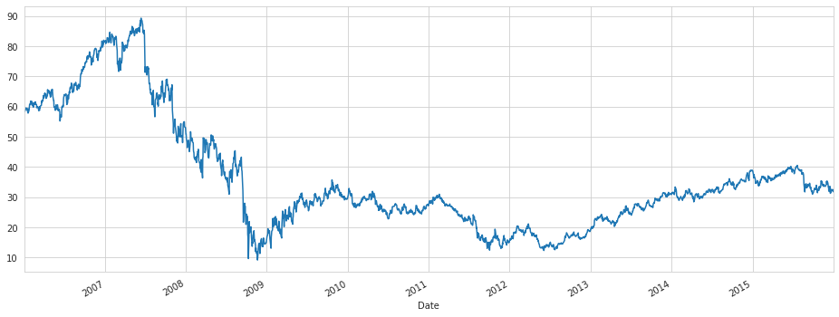


```python
ticker_names = ['BAC','C','GS','JPM','MS','WFC'] 
tickers = [BAC,C,GS,JPM,MS,WFC] 
```


```python
bank_stocks = pd.concat(tickers, axis=1, keys=ticker_names)
```


```python
bank_stocks.columns.names = ['Bank Ticker','Stock Info']
```


```python
bank_stocks.head()
```


<div>
<style scoped>
    .dataframe tbody tr th:only-of-type {
        vertical-align: middle;
    }

    .dataframe tbody tr th {
        vertical-align: top;
    }

    .dataframe thead tr th {
        text-align: left;
    }

    .dataframe thead tr:last-of-type th {
        text-align: right;
    }
</style>
<table border="1" class="dataframe">
  <thead>
    <tr>
      <th>Bank Ticker</th>
      <th colspan="6" halign="left">BAC</th>
      <th colspan="4" halign="left">C</th>
      <th>...</th>
      <th colspan="4" halign="left">MS</th>
      <th colspan="6" halign="left">WFC</th>
    </tr>
    <tr>
      <th>Stock Info</th>
      <th>High</th>
      <th>Low</th>
      <th>Open</th>
      <th>Close</th>
      <th>Volume</th>
      <th>Adj Close</th>
      <th>High</th>
      <th>Low</th>
      <th>Open</th>
      <th>Close</th>
      <th>...</th>
      <th>Open</th>
      <th>Close</th>
      <th>Volume</th>
      <th>Adj Close</th>
      <th>High</th>
      <th>Low</th>
      <th>Open</th>
      <th>Close</th>
      <th>Volume</th>
      <th>Adj Close</th>
    </tr>
    <tr>
      <th>Date</th>
      <th></th>
      <th></th>
      <th></th>
      <th></th>
      <th></th>
      <th></th>
      <th></th>
      <th></th>
      <th></th>
      <th></th>
      <th></th>
      <th></th>
      <th></th>
      <th></th>
      <th></th>
      <th></th>
      <th></th>
      <th></th>
      <th></th>
      <th></th>
      <th></th>
    </tr>
  </thead>
  <tbody>
    <tr>
      <th>2006-01-03</th>
      <td>47.180000</td>
      <td>46.150002</td>
      <td>46.919998</td>
      <td>47.080002</td>
      <td>16296700.0</td>
      <td>35.298687</td>
      <td>493.799988</td>
      <td>481.100006</td>
      <td>490.000000</td>
      <td>492.899994</td>
      <td>...</td>
      <td>57.169998</td>
      <td>58.310001</td>
      <td>5377000.0</td>
      <td>37.758644</td>
      <td>31.975000</td>
      <td>31.195000</td>
      <td>31.600000</td>
      <td>31.900000</td>
      <td>11016400.0</td>
      <td>20.823185</td>
    </tr>
    <tr>
      <th>2006-01-04</th>
      <td>47.240002</td>
      <td>46.450001</td>
      <td>47.000000</td>
      <td>46.580002</td>
      <td>17757900.0</td>
      <td>34.923801</td>
      <td>491.000000</td>
      <td>483.500000</td>
      <td>488.600006</td>
      <td>483.799988</td>
      <td>...</td>
      <td>58.700001</td>
      <td>58.349998</td>
      <td>7977800.0</td>
      <td>37.784546</td>
      <td>31.820000</td>
      <td>31.365000</td>
      <td>31.799999</td>
      <td>31.530001</td>
      <td>10870000.0</td>
      <td>20.581659</td>
    </tr>
    <tr>
      <th>2006-01-05</th>
      <td>46.830002</td>
      <td>46.320000</td>
      <td>46.580002</td>
      <td>46.639999</td>
      <td>14970700.0</td>
      <td>34.968796</td>
      <td>487.799988</td>
      <td>484.000000</td>
      <td>484.399994</td>
      <td>486.200012</td>
      <td>...</td>
      <td>58.549999</td>
      <td>58.509998</td>
      <td>5778000.0</td>
      <td>37.888165</td>
      <td>31.555000</td>
      <td>31.309999</td>
      <td>31.500000</td>
      <td>31.495001</td>
      <td>10158000.0</td>
      <td>20.558811</td>
    </tr>
    <tr>
      <th>2006-01-06</th>
      <td>46.910000</td>
      <td>46.349998</td>
      <td>46.799999</td>
      <td>46.570000</td>
      <td>12599800.0</td>
      <td>34.916302</td>
      <td>489.000000</td>
      <td>482.000000</td>
      <td>488.799988</td>
      <td>486.200012</td>
      <td>...</td>
      <td>58.770000</td>
      <td>58.570000</td>
      <td>6889800.0</td>
      <td>37.927017</td>
      <td>31.775000</td>
      <td>31.385000</td>
      <td>31.580000</td>
      <td>31.680000</td>
      <td>8403800.0</td>
      <td>20.679575</td>
    </tr>
    <tr>
      <th>2006-01-09</th>
      <td>46.970001</td>
      <td>46.360001</td>
      <td>46.720001</td>
      <td>46.599998</td>
      <td>15619400.0</td>
      <td>34.938789</td>
      <td>487.399994</td>
      <td>483.000000</td>
      <td>486.000000</td>
      <td>483.899994</td>
      <td>...</td>
      <td>58.630001</td>
      <td>59.189999</td>
      <td>4144500.0</td>
      <td>38.328484</td>
      <td>31.825001</td>
      <td>31.555000</td>
      <td>31.674999</td>
      <td>31.674999</td>
      <td>5619600.0</td>
      <td>20.676311</td>
    </tr>
  </tbody>
</table>
<p>5 rows × 36 columns</p>
</div>


#### **Exploratory Data Analysis**


```python
bank_stocks.xs('Close', level=1, axis=1).max()
```


    Bank Ticker
    BAC     54.900002
    C      564.099976
    GS     247.919998
    JPM     70.080002
    MS      89.300003
    WFC     58.520000
    dtype: float64


```python
returns = pd.DataFrame()
```


```python
returns['BAC Return'] = bank_stocks['BAC', 'Close'].pct_change()
```


```python
returns['C Return'] = bank_stocks['C', 'Close'].pct_change()
returns['GS Return'] = bank_stocks['GS', 'Close'].pct_change()
returns['JPM Return'] = bank_stocks['JPM', 'Close'].pct_change()
returns['MS Return'] = bank_stocks['MS', 'Close'].pct_change()
returns['WFC Return'] = bank_stocks['WFC', 'Close'].pct_change()
```


```python
returns.tail()
```


<div>
<style scoped>
    .dataframe tbody tr th:only-of-type {
        vertical-align: middle;
    }

    .dataframe tbody tr th {
        vertical-align: top;
    }

    .dataframe thead th {
        text-align: right;
    }
</style>
<table border="1" class="dataframe">
  <thead>
    <tr style="text-align: right;">
      <th></th>
      <th>BAC Return</th>
      <th>C Return</th>
      <th>GS Return</th>
      <th>JPM Return</th>
      <th>MS Return</th>
      <th>WFC Return</th>
    </tr>
    <tr>
      <th>Date</th>
      <th></th>
      <th></th>
      <th></th>
      <th></th>
      <th></th>
      <th></th>
    </tr>
  </thead>
  <tbody>
    <tr>
      <th>2015-12-24</th>
      <td>-0.004037</td>
      <td>0.001520</td>
      <td>-0.002624</td>
      <td>-0.001948</td>
      <td>-0.003681</td>
      <td>-0.003997</td>
    </tr>
    <tr>
      <th>2015-12-28</th>
      <td>-0.008107</td>
      <td>-0.006261</td>
      <td>-0.004658</td>
      <td>-0.003303</td>
      <td>-0.009544</td>
      <td>-0.002554</td>
    </tr>
    <tr>
      <th>2015-12-29</th>
      <td>0.008757</td>
      <td>0.011455</td>
      <td>0.010516</td>
      <td>0.010395</td>
      <td>0.011812</td>
      <td>0.011156</td>
    </tr>
    <tr>
      <th>2015-12-30</th>
      <td>-0.013310</td>
      <td>-0.012835</td>
      <td>-0.008282</td>
      <td>-0.007157</td>
      <td>-0.009831</td>
      <td>-0.007235</td>
    </tr>
    <tr>
      <th>2015-12-31</th>
      <td>-0.012903</td>
      <td>-0.010516</td>
      <td>-0.009780</td>
      <td>-0.008410</td>
      <td>-0.013031</td>
      <td>-0.009656</td>
    </tr>
  </tbody>
</table>
</div>


```python
import seaborn as sns
sns.pairplot(data=returns[1:], palette='inferno')
```


    <seaborn.axisgrid.PairGrid at 0x7fbe6223bc50>


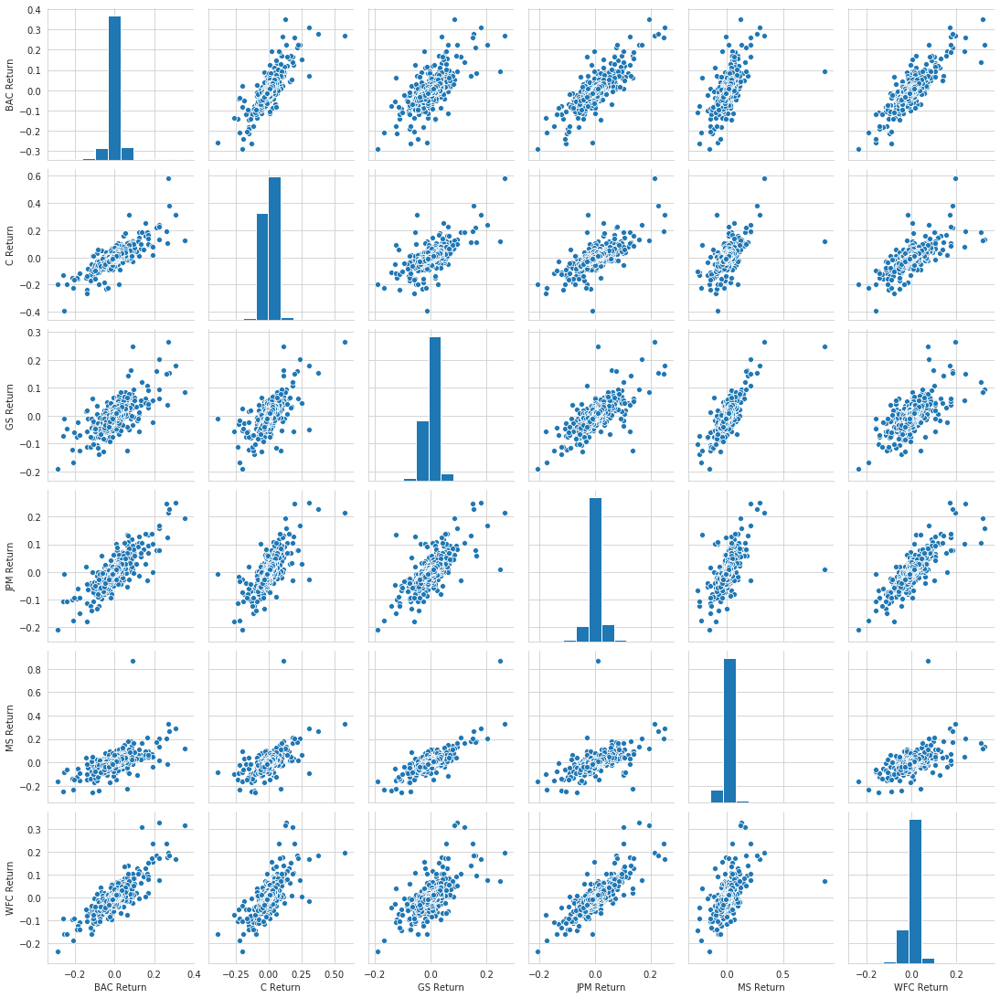


```python
returns.idxmin()
```


    BAC Return   2009-01-20
    C Return     2009-02-27
    GS Return    2009-01-20
    JPM Return   2009-01-20
    MS Return    2008-10-09
    WFC Return   2009-01-20
    dtype: datetime64[ns]


```python
returns.idxmax()
```


    BAC Return   2009-04-09
    C Return     2008-11-24
    GS Return    2008-11-24
    JPM Return   2009-01-21
    MS Return    2008-10-13
    WFC Return   2008-07-16
    dtype: datetime64[ns]


```python
returns.head()
```


<div>
<style scoped>
    .dataframe tbody tr th:only-of-type {
        vertical-align: middle;
    }

    .dataframe tbody tr th {
        vertical-align: top;
    }

    .dataframe thead th {
        text-align: right;
    }
</style>
<table border="1" class="dataframe">
  <thead>
    <tr style="text-align: right;">
      <th></th>
      <th>BAC Return</th>
      <th>C Return</th>
      <th>GS Return</th>
      <th>JPM Return</th>
      <th>MS Return</th>
      <th>WFC Return</th>
    </tr>
    <tr>
      <th>Date</th>
      <th></th>
      <th></th>
      <th></th>
      <th></th>
      <th></th>
      <th></th>
    </tr>
  </thead>
  <tbody>
    <tr>
      <th>2006-01-03</th>
      <td>NaN</td>
      <td>NaN</td>
      <td>NaN</td>
      <td>NaN</td>
      <td>NaN</td>
      <td>NaN</td>
    </tr>
    <tr>
      <th>2006-01-04</th>
      <td>-0.010620</td>
      <td>-0.018462</td>
      <td>-0.013812</td>
      <td>-0.014183</td>
      <td>0.000686</td>
      <td>-0.011599</td>
    </tr>
    <tr>
      <th>2006-01-05</th>
      <td>0.001288</td>
      <td>0.004961</td>
      <td>-0.000393</td>
      <td>0.003029</td>
      <td>0.002742</td>
      <td>-0.001110</td>
    </tr>
    <tr>
      <th>2006-01-06</th>
      <td>-0.001501</td>
      <td>0.000000</td>
      <td>0.014169</td>
      <td>0.007046</td>
      <td>0.001025</td>
      <td>0.005874</td>
    </tr>
    <tr>
      <th>2006-01-09</th>
      <td>0.000644</td>
      <td>-0.004731</td>
      <td>0.012030</td>
      <td>0.016242</td>
      <td>0.010586</td>
      <td>-0.000158</td>
    </tr>
  </tbody>
</table>
</div>


```python
returns.std()
```


    BAC Return    0.036647
    C Return      0.038672
    GS Return     0.025390
    JPM Return    0.027667
    MS Return     0.037819
    WFC Return    0.030238
    dtype: float64


```python
returns[(returns.index.date >= datetime.date(2015, 1, 1)) & 
       (returns.index.date <= datetime.date(2016, 1, 1))].std()
```


    BAC Return    0.016163
    C Return      0.015289
    GS Return     0.014046
    JPM Return    0.014017
    MS Return     0.016249
    WFC Return    0.012591
    dtype: float64


```python
sns.distplot(returns[(returns.index.date >= datetime.date(2015, 1, 1)) & 
       (returns.index.date <= datetime.date(2016, 1, 1))]['MS Return'], bins=75, color='red')
```


    <matplotlib.axes._subplots.AxesSubplot at 0x7fbe615ff690>


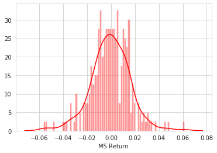


```python
sns.distplot(returns[(returns.index.date >= datetime.date(2008, 1, 1)) & 
       (returns.index.date < datetime.date(2009, 1, 1))]['C Return'], bins=70)
                    
```


    <matplotlib.axes._subplots.AxesSubplot at 0x7fbe6150f610>


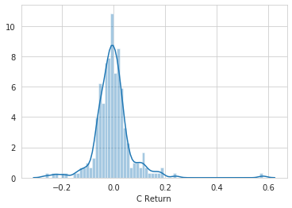


```python
import matplotlib.pyplot as plt
import seaborn as sns
sns.set_style('whitegrid')
%matplotlib inline
```


```python
bank_stocks.xs(key='Close', axis=1, level=1).plot(figsize=(12,3))
plt.legend(bbox_to_anchor=(1.05, 1), loc=2, borderaxespad=0)
```


    <matplotlib.legend.Legend at 0x7fbe617ddc10>


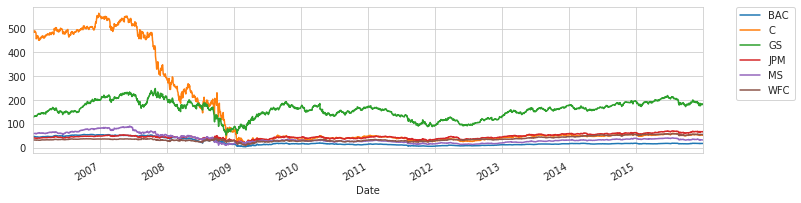


```python
BAC2008 = BAC['Close'][BAC.index.year == 2008]
```


```python
BAC2008_roll = BAC2008.rolling(window=30).mean()
BAC2008_roll.plot()
```


    <matplotlib.axes._subplots.AxesSubplot at 0x7fbe6139bd50>


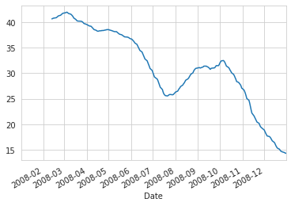


```python
BAC['Close'][BAC.index.year == 2008].plot(figsize=(12, 5), label='Media Movel 30 dias')
BAC2008_roll.plot(label='BAC Close')
plt.legend()
```


    <matplotlib.legend.Legend at 0x7fbe61318c90>


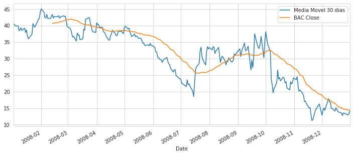


```python
matrix = bank_stocks.xs(key='Close', level=1, axis=1).corr()
matrix.head()
```


<div>
<style scoped>
    .dataframe tbody tr th:only-of-type {
        vertical-align: middle;
    }

    .dataframe tbody tr th {
        vertical-align: top;
    }

    .dataframe thead th {
        text-align: right;
    }
</style>
<table border="1" class="dataframe">
  <thead>
    <tr style="text-align: right;">
      <th>Bank Ticker</th>
      <th>BAC</th>
      <th>C</th>
      <th>GS</th>
      <th>JPM</th>
      <th>MS</th>
      <th>WFC</th>
    </tr>
    <tr>
      <th>Bank Ticker</th>
      <th></th>
      <th></th>
      <th></th>
      <th></th>
      <th></th>
      <th></th>
    </tr>
  </thead>
  <tbody>
    <tr>
      <th>BAC</th>
      <td>1.000000</td>
      <td>0.971516</td>
      <td>0.550898</td>
      <td>0.103874</td>
      <td>0.944218</td>
      <td>0.008542</td>
    </tr>
    <tr>
      <th>C</th>
      <td>0.971516</td>
      <td>1.000000</td>
      <td>0.434123</td>
      <td>0.003515</td>
      <td>0.933609</td>
      <td>-0.068536</td>
    </tr>
    <tr>
      <th>GS</th>
      <td>0.550898</td>
      <td>0.434123</td>
      <td>1.000000</td>
      <td>0.685286</td>
      <td>0.683792</td>
      <td>0.499897</td>
    </tr>
    <tr>
      <th>JPM</th>
      <td>0.103874</td>
      <td>0.003515</td>
      <td>0.685286</td>
      <td>1.000000</td>
      <td>0.250427</td>
      <td>0.940269</td>
    </tr>
    <tr>
      <th>MS</th>
      <td>0.944218</td>
      <td>0.933609</td>
      <td>0.683792</td>
      <td>0.250427</td>
      <td>1.000000</td>
      <td>0.131835</td>
    </tr>
  </tbody>
</table>
</div>


```python
sns.heatmap(matrix, cmap='twilight', annot=True)
```


    <matplotlib.axes._subplots.AxesSubplot at 0x7fbe611e6210>


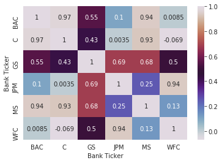


```python
sns.clustermap(matrix, cmap='twilight', annot=True)
```


    <seaborn.matrix.ClusterGrid at 0x7fbe61148b90>


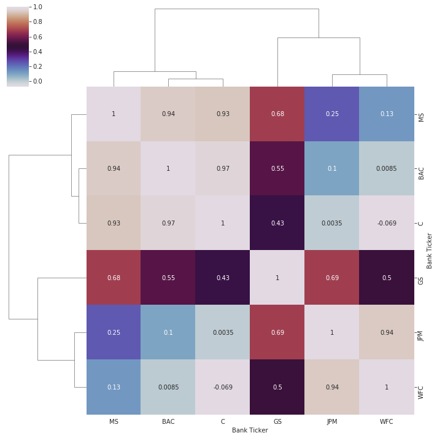


```python
BAC.reset_index(inplace=True)
```


```python
BAC.head()
```


<div>
<style scoped>
    .dataframe tbody tr th:only-of-type {
        vertical-align: middle;
    }

    .dataframe tbody tr th {
        vertical-align: top;
    }

    .dataframe thead th {
        text-align: right;
    }
</style>
<table border="1" class="dataframe">
  <thead>
    <tr style="text-align: right;">
      <th></th>
      <th>Date</th>
      <th>High</th>
      <th>Low</th>
      <th>Open</th>
      <th>Close</th>
      <th>Volume</th>
      <th>Adj Close</th>
    </tr>
  </thead>
  <tbody>
    <tr>
      <th>0</th>
      <td>2006-01-03</td>
      <td>47.180000</td>
      <td>46.150002</td>
      <td>46.919998</td>
      <td>47.080002</td>
      <td>16296700.0</td>
      <td>35.298687</td>
    </tr>
    <tr>
      <th>1</th>
      <td>2006-01-04</td>
      <td>47.240002</td>
      <td>46.450001</td>
      <td>47.000000</td>
      <td>46.580002</td>
      <td>17757900.0</td>
      <td>34.923801</td>
    </tr>
    <tr>
      <th>2</th>
      <td>2006-01-05</td>
      <td>46.830002</td>
      <td>46.320000</td>
      <td>46.580002</td>
      <td>46.639999</td>
      <td>14970700.0</td>
      <td>34.968796</td>
    </tr>
    <tr>
      <th>3</th>
      <td>2006-01-06</td>
      <td>46.910000</td>
      <td>46.349998</td>
      <td>46.799999</td>
      <td>46.570000</td>
      <td>12599800.0</td>
      <td>34.916302</td>
    </tr>
    <tr>
      <th>4</th>
      <td>2006-01-09</td>
      <td>46.970001</td>
      <td>46.360001</td>
      <td>46.720001</td>
      <td>46.599998</td>
      <td>15619400.0</td>
      <td>34.938789</td>
    </tr>
  </tbody>
</table>
</div>


```python
fig = go.Figure(data=[go.Candlestick(x=BAC['Date'],
                open=BAC['Open'], high=BAC['High'],
                low=BAC['Low'], close=BAC['Close'])
                      ])


fig.update_layout(
    title='The Subprime Mortgage Crisis',
    yaxis_title='BAC Stock',
    shapes = [dict(
        x0='2008-01-01', x1='2016-12-09', y0=0, y1=1, xref='x', yref='paper',
        line_width=2)],
    annotations=[dict(
        x='2008-01-01', y=0.05, xref='x', yref='paper',
        showarrow=False, xanchor='left', text='Decrease Period Begins')]
)

```


<div>


            <div id="5e787ae6-4e98-475f-bffe-4b8c99811e50" class="plotly-graph-div" style="height:525px; width:100%;"></div>
            <script type="text/javascript">
                require(["plotly"], function(Plotly) {
                    window.PLOTLYENV=window.PLOTLYENV || {};

                if (document.getElementById("5e787ae6-4e98-475f-bffe-4b8c99811e50")) {
                    Plotly.newPlot(
                        '5e787ae6-4e98-475f-bffe-4b8c99811e50',
                        [{"close": [47.08000183105469, 46.58000183105469, 46.63999938964844, 46.56999969482422, 46.599998474121094, 46.209999084472656, 46.099998474121094, 45.79999923706055, 45.79999923706055, 45.310001373291016, 45.2599983215332, 45.13999938964844, 44.189998626708984, 43.959999084472656, 44.2400016784668, 44.630001068115234, 44.900001525878906, 44.79999923706055, 44.47999954223633, 44.22999954223633, 43.95000076293945, 43.439998626708984, 43.09000015258789, 43.369998931884766, 43.4900016784668, 43.66999816894531, 43.83000183105469, 43.91999816894531, 43.70000076293945, 44.15999984741211, 44.36000061035156, 44.689998626708984, 44.65999984741211, 44.54999923706055, 45.08000183105469, 45.369998931884766, 45.720001220703125, 45.97999954223633, 45.849998474121094, 45.599998474121094, 45.150001525878906, 45.189998626708984, 45.209999084472656, 45.619998931884766, 45.709999084472656, 45.54999923706055, 45.95000076293945, 45.939998626708984, 46.2599983215332, 46.400001525878906, 46.7599983215332, 46.900001525878906, 46.900001525878906, 46.56999969482422, 46.9900016784668, 46.70000076293945, 46.900001525878906, 46.81999969482422, 46.060001373291016, 45.970001220703125, 45.61000061035156, 45.540000915527344, 45.68000030517578, 46.290000915527344, 46.54999923706055, 46.20000076293945, 45.7400016784668, 45.68000030517578, 45.560001373291016, 45.720001220703125, 45.72999954223633, 45.47999954223633, 45.959999084472656, 46.04999923706055, 46.279998779296875, 46.869998931884766, 47.06999969482422, 47.09000015258789, 47.709999084472656, 49.040000915527344, 49.91999816894531, 49.18000030517578, 49.459999084472656, 49.29999923706055, 49.939998626708984, 50.470001220703125, 50.11000061035156, 50.189998626708984, 50.16999816894531, 49.689998626708984, 49.20000076293945, 49.54999923706055, 49.63999938964844, 48.560001373291016, 48.119998931884766, 48.27000045776367, 48.2599983215332, 48.22999954223633, 48.47999954223633, 48.90999984741211, 49.380001068115234, 48.70000076293945, 48.400001525878906, 48.70000076293945, 49.2599983215332, 48.7400016784668, 48.529998779296875, 48.849998474121094, 49.029998779296875, 48.790000915527344, 48.40999984741211, 47.06999969482422, 46.63999938964844, 47.90999984741211, 47.41999816894531, 47.13999938964844, 47.08000183105469, 47.310001373291016, 47.540000915527344, 47.40999984741211, 47.459999084472656, 47.29999923706055, 47.650001525878906, 48.599998474121094, 48.099998474121094, 48.810001373291016, 48.869998931884766, 49.060001373291016, 48.79999923706055, 49.13999938964844, 49.150001525878906, 48.56999969482422, 47.97999954223633, 48.310001373291016, 48.220001220703125, 48.439998626708984, 49.95000076293945, 49.650001525878906, 50.13999938964844, 50.56999969482422, 50.810001373291016, 50.9900016784668, 51.02000045776367, 51.65999984741211, 51.529998779296875, 51.529998779296875, 51.959999084472656, 51.970001220703125, 52.31999969482422, 52.15999984741211, 52.060001373291016, 51.540000915527344, 51.52000045776367, 51.400001525878906, 51.130001068115234, 52.150001525878906, 52.29999923706055, 52.13999938964844, 52.4900016784668, 52.459999084472656, 52.5, 52.4900016784668, 52.5099983215332, 52.130001068115234, 52.189998626708984, 52.290000915527344, 51.70000076293945, 51.470001220703125, 51.65999984741211, 51.75, 51.650001525878906, 51.5099983215332, 51.65999984741211, 51.18000030517578, 51.70000076293945, 51.900001525878906, 51.93000030517578, 51.45000076293945, 51.779998779296875, 52.029998779296875, 52.4900016784668, 52.2400016784668, 52.43000030517578, 52.970001220703125, 53.47999954223633, 53.2400016784668, 53.52000045776367, 53.56999969482422, 53.619998931884766, 54.40999984741211, 54.81999969482422, 54.52000045776367, 54.2400016784668, 54.5099983215332, 54.630001068115234, 54.040000915527344, 54.2599983215332, 54.38999938964844, 53.709999084472656, 53.68000030517578, 53.810001373291016, 53.2599983215332, 53.619998931884766, 53.65999984741211, 53.43000030517578, 54.0, 54.18000030517578, 53.70000076293945, 53.91999816894531, 53.869998931884766, 53.58000183105469, 53.54999923706055, 53.43000030517578, 54.209999084472656, 54.41999816894531, 54.61000061035156, 54.5099983215332, 54.77000045776367, 54.459999084472656, 54.83000183105469, 54.47999954223633, 54.900001525878906, 54.849998474121094, 54.900001525878906, 54.720001220703125, 54.630001068115234, 54.560001373291016, 53.91999816894531, 54.27000045776367, 54.02000045776367, 53.849998474121094, 53.5, 52.650001525878906, 52.790000915527344, 52.689998626708984, 52.4900016784668, 51.65999984741211, 52.54999923706055, 52.79999923706055, 53.09000015258789, 53.16999816894531, 53.31999969482422, 53.630001068115234, 53.58000183105469, 53.65999984741211, 53.5099983215332, 53.349998474121094, 53.70000076293945, 53.77000045776367, 53.650001525878906, 53.38999938964844, 53.33000183105469, 53.66999816894531, 53.2400016784668, 53.45000076293945, 53.5, 53.58000183105469, 53.2599983215332, 53.380001068115234, 53.439998626708984, 53.31999969482422, 53.290000915527344, 53.59000015258789, 53.650001525878906, 53.31999969482422, 53.20000076293945, 52.400001525878906, 52.040000915527344, 51.459999084472656, 52.119998931884766, 52.58000183105469, 52.84000015258789, 52.7400016784668, 52.880001068115234, 53.209999084472656, 53.36000061035156, 53.31999969482422, 52.9900016784668, 53.040000915527344, 53.72999954223633, 54.04999923706055, 53.849998474121094, 54.04999923706055, 54.04999923706055, 53.90999984741211, 53.70000076293945, 52.86000061035156, 52.790000915527344, 50.79999923706055, 50.83000183105469, 50.380001068115234, 50.0099983215332, 49.63999938964844, 50.939998626708984, 50.59000015258789, 50.77000045776367, 50.95000076293945, 51.09000015258789, 49.459999084472656, 49.77000045776367, 50.099998474121094, 49.619998931884766, 50.369998931884766, 50.7599983215332, 51.86000061035156, 51.63999938964844, 51.689998626708984, 51.560001373291016, 51.84000015258789, 50.77000045776367, 51.189998626708984, 51.02000045776367, 50.43000030517578, 50.86000061035156, 50.88999938964844, 50.849998474121094, 50.86000061035156, 51.06999969482422, 50.5099983215332, 50.279998779296875, 50.41999816894531, 51.22999954223633, 51.29999923706055, 51.81999969482422, 50.90999984741211, 51.040000915527344, 50.5099983215332, 50.619998931884766, 51.22999954223633, 50.720001220703125, 50.77000045776367, 50.900001525878906, 50.93000030517578, 51.0099983215332, 51.22999954223633, 51.2400016784668, 51.41999816894531, 51.400001525878906, 51.45000076293945, 50.58000183105469, 50.95000076293945, 50.779998779296875, 50.939998626708984, 51.119998931884766, 51.130001068115234, 51.279998779296875, 51.22999954223633, 51.5, 51.349998474121094, 51.04999923706055, 51.20000076293945, 51.189998626708984, 50.810001373291016, 50.709999084472656, 50.779998779296875, 50.849998474121094, 50.65999984741211, 50.33000183105469, 49.790000915527344, 50.2599983215332, 50.04999923706055, 49.65999984741211, 50.36000061035156, 50.08000183105469, 50.08000183105469, 49.90999984741211, 50.54999923706055, 49.97999954223633, 49.88999938964844, 48.95000076293945, 48.849998474121094, 48.79999923706055, 49.189998626708984, 49.09000015258789, 48.88999938964844, 49.31999969482422, 49.54999923706055, 49.369998931884766, 49.150001525878906, 48.810001373291016, 48.36000061035156, 48.5099983215332, 49.529998779296875, 49.5, 49.619998931884766, 49.79999923706055, 49.36000061035156, 49.27000045776367, 48.310001373291016, 48.150001525878906, 47.150001525878906, 47.93000030517578, 47.22999954223633, 47.40999984741211, 47.70000076293945, 47.41999816894531, 47.630001068115234, 47.779998779296875, 47.0, 48.15999984741211, 48.66999816894531, 49.70000076293945, 48.349998474121094, 48.59000015258789, 48.5, 47.86000061035156, 48.22999954223633, 49.849998474121094, 51.7599983215332, 51.349998474121094, 51.29999923706055, 51.650001525878906, 51.83000183105469, 51.869998931884766, 50.869998931884766, 49.65999984741211, 50.54999923706055, 50.209999084472656, 50.68000030517578, 51.08000183105469, 49.95000076293945, 49.790000915527344, 49.02000045776367, 48.959999084472656, 49.45000076293945, 49.38999938964844, 49.86000061035156, 49.95000076293945, 49.5099983215332, 51.209999084472656, 51.06999969482422, 50.790000915527344, 51.2400016784668, 50.59000015258789, 50.220001220703125, 50.40999984741211, 50.599998474121094, 50.27000045776367, 50.63999938964844, 51.720001220703125, 51.93000030517578, 52.400001525878906, 52.709999084472656, 52.43000030517578, 52.56999969482422, 52.29999923706055, 52.41999816894531, 52.06999969482422, 51.41999816894531, 50.20000076293945, 50.029998779296875, 48.849998474121094, 47.56999969482422, 47.779998779296875, 47.779998779296875, 47.47999954223633, 47.0, 48.029998779296875, 47.97999954223633, 47.9900016784668, 48.279998779296875, 45.709999084472656, 45.11000061035156, 44.45000076293945, 45.560001373291016, 43.310001373291016, 43.5, 43.97999954223633, 43.97999954223633, 46.27000045776367, 45.72999954223633, 44.08000183105469, 44.369998931884766, 42.81999969482422, 42.77000045776367, 42.13999938964844, 43.150001525878906, 41.880001068115234, 42.939998626708984, 44.849998474121094, 44.630001068115234, 46.130001068115234, 45.470001220703125, 44.709999084472656, 45.22999954223633, 45.959999084472656, 45.369998931884766, 46.63999938964844, 44.650001525878906, 43.43000030517578, 43.04999923706055, 42.15999984741211, 41.70000076293945, 41.5, 41.59000015258789, 41.40999984741211, 41.91999816894531, 42.279998779296875, 42.29999923706055, 41.459999084472656, 41.099998474121094, 41.2599983215332, 40.560001373291016, 40.29999923706055, 39.849998474121094, 39.900001525878906, 38.40999984741211, 38.7400016784668, 39.29999923706055, 38.5, 39.220001220703125, 37.880001068115234, 38.689998626708984, 36.90999984741211, 35.970001220703125, 37.38999938964844, 40.56999969482422, 39.900001525878906, 39.47999954223633, 41.20000076293945, 41.939998626708984, 42.209999084472656, 44.150001525878906, 45.029998779296875, 44.029998779296875, 42.369998931884766, 42.33000183105469, 43.369998931884766, 42.15999984741211, 42.13999938964844, 42.81999969482422, 43.33000183105469, 42.2400016784668, 42.70000076293945, 42.66999816894531, 42.970001220703125, 42.209999084472656, 42.599998474121094, 42.939998626708984, 42.720001220703125, 42.880001068115234, 41.41999816894531, 39.7400016784668, 39.18000030517578, 38.779998779296875, 37.54999923706055, 36.52000045776367, 36.7400016784668, 35.310001373291016, 37.720001220703125, 37.029998779296875, 37.13999938964844, 35.689998626708984, 35.959999084472656, 38.93000030517578, 38.560001373291016, 41.86000061035156, 42.45000076293945, 40.970001220703125, 39.84000015258789, 38.63999938964844, 38.06999969482422, 37.90999984741211, 40.86000061035156, 40.29999923706055, 40.369998931884766, 39.40999984741211, 39.5, 38.380001068115234, 37.93000030517578, 37.689998626708984, 36.939998626708984, 35.58000183105469, 35.58000183105469, 36.97999954223633, 37.470001220703125, 38.560001373291016, 37.61000061035156, 37.0, 36.86000061035156, 37.869998931884766, 38.29999923706055, 38.18000030517578, 37.86000061035156, 37.540000915527344, 39.38999938964844, 39.790000915527344, 38.970001220703125, 39.2400016784668, 38.0, 37.33000183105469, 36.650001525878906, 37.439998626708984, 36.61000061035156, 36.79999923706055, 36.709999084472656, 36.16999816894531, 36.099998474121094, 35.38999938964844, 34.630001068115234, 34.72999954223633, 33.93000030517578, 34.16999816894531, 33.869998931884766, 34.599998474121094, 34.0099983215332, 33.58000183105469, 33.310001373291016, 31.989999771118164, 31.989999771118164, 30.5, 29.610000610351562, 29.6200008392334, 28.850000381469727, 29.440000534057617, 29.780000686645508, 30.31999969482422, 29.239999771118164, 28.3700008392334, 28.139999389648438, 27.100000381469727, 25.8799991607666, 26.6200008392334, 26.610000610351562, 24.809999465942383, 24.59000015258789, 23.8700008392334, 23.809999465942383, 22.540000915527344, 22.399999618530273, 21.530000686645508, 23.540000915527344, 22.059999465942383, 22.360000610351562, 21.670000076293945, 20.149999618530273, 18.520000457763672, 22.670000076293945, 26.5, 27.489999771118164, 28.559999465942383, 32.349998474121094, 33.439998626708984, 30.639999389648438, 29.579999923706055, 28.059999465942383, 32.220001220703125, 33.61000061035156, 32.900001525878906, 33.33000183105469, 32.619998931884766, 33.58000183105469, 33.45000076293945, 31.520000457763672, 32.25, 33.380001068115234, 31.1299991607666, 28.860000610351562, 30.18000030517578, 30.700000762939453, 29.299999237060547, 28.079999923706055, 29.290000915527344, 29.040000915527344, 30.209999084472656, 28.959999084472656, 29.020000457763672, 29.649999618530273, 31.43000030517578, 31.139999389648438, 32.630001068115234, 32.959999084472656, 30.600000381469727, 32.22999954223633, 34.72999954223633, 32.52000045776367, 32.400001525878906, 33.060001373291016, 33.7400016784668, 26.549999237060547, 29.549999237060547, 27.200000762939453, 30.579999923706055, 37.47999954223633, 34.150001525878906, 33.29999923706055, 33.06999969482422, 34.369998931884766, 36.70000076293945, 30.25, 35.0, 38.130001068115234, 36.369998931884766, 34.47999954223633, 32.220001220703125, 23.770000457763672, 22.100000381469727, 19.6299991607666, 20.8700008392334, 22.790000915527344, 26.530000686645508, 23.81999969482422, 24.25, 23.239999771118164, 24.399999618530273, 23.969999313354492, 22.65999984741211, 23.0, 21.06999969482422, 20.530000686645508, 23.020000457763672, 22.31999969482422, 22.780000686645508, 24.170000076293945, 23.610000610351562, 24.530000686645508, 21.75, 20.1200008392334, 20.489999771118164, 19.479999542236328, 18.690000534057617, 17.0, 17.100000381469727, 16.420000076293945, 15.029999732971191, 15.1899995803833, 13.0600004196167, 11.25, 11.470000267028809, 14.59000015258789, 14.800000190734863, 15.430000305175781, 16.25, 12.850000381469727, 14.369999885559082, 15.050000190734863, 14.34000015258789, 15.239999771118164, 17.84000015258789, 16.950000762939453, 16.690000534057617, 14.90999984741211, 14.930000305175781, 14.109999656677246, 15.100000381469727, 14.619999885559082, 13.960000038146973, 13.800000190734863, 13.529999732971191, 12.75, 13.529999732971191, 13.359999656677246, 12.9399995803833, 13.239999771118164, 14.079999923706055, 14.329999923706055, 13.979999542236328, 14.279999732971191, 13.710000038146973, 13.539999961853027, 12.989999771118164, 11.430000305175781, 10.649999618530273, 10.199999809265137, 8.319999694824219, 7.179999828338623, 5.099999904632568, 6.679999828338623, 5.710000038146973, 6.239999771118164, 6.0, 6.5, 7.389999866485596, 6.78000020980835, 6.579999923706055, 6.0, 5.300000190734863, 4.699999809265137, 4.840000152587891, 6.130000114440918, 6.889999866485596, 5.559999942779541, 6.070000171661377, 5.869999885559082, 5.570000171661377, 4.900000095367432, 4.570000171661377, 3.930000066757202, 3.7899999618530273, 3.9100000858306885, 4.730000019073486, 5.159999847412109, 5.320000171661377, 3.950000047683716, 3.630000114440918, 3.6500000953674316, 3.5899999141693115, 3.1700000762939453, 3.140000104904175, 3.75, 4.789999961853027, 4.929999828338623, 5.849999904632568, 5.760000228881836, 6.179999828338623, 6.269999980926514, 7.670000076293945, 6.929999828338623, 6.190000057220459, 7.800000190734863, 7.21999979019165, 7.699999809265137, 7.579999923706055, 7.340000152587891, 6.03000020980835, 6.820000171661377, 7.050000190734863, 7.239999771118164, 7.599999904632568, 7.480000019073486, 7.360000133514404, 7.059999942779541, 9.550000190734863, 11.020000457763672, 10.09000015258789, 10.4399995803833, 10.34000015258789, 10.600000381469727, 8.020000457763672, 8.760000228881836, 8.260000228881836, 8.819999694824219, 9.100000381469727, 8.920000076293945, 8.149999618530273, 8.680000305175781, 8.930000305175781, 8.699999809265137, 10.380000114440918, 10.84000015258789, 12.6899995803833, 13.510000228881836, 14.170000076293945, 12.9399995803833, 12.260000228881836, 11.010000228881836, 11.3100004196167, 10.670000076293945, 11.729999542236328, 11.25, 11.489999771118164, 11.40999984741211, 11.069999694824219, 10.979999542236328, 10.90999984741211, 11.300000190734863, 11.270000457763672, 11.210000038146973, 11.40999984741211, 11.210000038146973, 11.869999885559082, 11.859999656677246, 12.0600004196167, 12.0600004196167, 11.979999542236328, 12.970000267028809, 13.720000267028809, 13.329999923706055, 12.729999542236328, 12.300000190734863, 12.899999618530273, 13.220000267028809, 11.9399995803833, 12.229999542236328, 12.350000381469727, 12.350000381469727, 12.75, 13.1899995803833, 13.199999809265137, 13.050000190734863, 12.640000343322754, 12.149999618530273, 12.149999618530273, 11.84000015258789, 11.970000267028809, 11.880000114440918, 12.989999771118164, 12.90999984741211, 13.420000076293945, 13.170000076293945, 12.890000343322754, 12.239999771118164, 12.1899995803833, 12.229999542236328, 12.6899995803833, 12.510000228881836, 13.09000015258789, 13.34000015258789, 13.520000457763672, 13.970000267028809, 14.789999961853027, 15.319999694824219, 15.640000343322754, 16.65999984741211, 16.700000762939453, 16.420000076293945, 16.68000030517578, 15.850000381469727, 15.930000305175781, 17.0, 17.389999389648438, 16.559999465942383, 16.899999618530273, 16.75, 17.139999389648438, 17.459999084472656, 17.350000381469727, 17.75, 17.790000915527344, 17.920000076293945, 17.979999542236328, 17.59000015258789, 16.459999084472656, 16.270000457763672, 16.84000015258789, 17.09000015258789, 17.020000457763672, 17.040000915527344, 17.219999313354492, 16.969999313354492, 16.989999771118164, 16.790000915527344, 17.25, 17.610000610351562, 17.6299991607666, 17.25, 17.610000610351562, 17.5, 16.979999542236328, 16.600000381469727, 17.219999313354492, 17.15999984741211, 16.920000076293945, 16.209999084472656, 16.34000015258789, 16.959999084472656, 17.0, 17.350000381469727, 17.329999923706055, 17.5, 18.030000686645508, 17.809999465942383, 18.59000015258789, 18.100000381469727, 17.260000228881836, 17.15999984741211, 17.010000228881836, 16.510000228881836, 16.520000457763672, 16.219999313354492, 15.399999618530273, 15.449999809265137, 15.010000228881836, 15.729999542236328, 14.579999923706055, 14.630000114440918, 14.800000190734863, 14.699999809265137, 15.130000114440918, 15.050000190734863, 15.770000457763672, 16.030000686645508, 16.43000030517578, 16.059999465942383, 15.979999542236328, 15.869999885559082, 15.770000457763672, 16.350000381469727, 16.079999923706055, 16.09000015258789, 16.290000915527344, 16.100000381469727, 15.949999809265137, 15.470000267028809, 15.850000381469727, 15.899999618530273, 15.649999618530273, 15.760000228881836, 16.280000686645508, 15.890000343322754, 15.40999984741211, 15.390000343322754, 15.210000038146973, 15.630000114440918, 15.630000114440918, 15.1899995803833, 15.279999732971191, 14.859999656677246, 15.029999732971191, 15.279999732971191, 15.329999923706055, 15.1899995803833, 15.25, 15.289999961853027, 15.119999885559082, 15.069999694824219, 15.0600004196167, 15.6899995803833, 16.200000762939453, 16.389999389648438, 16.93000030517578, 16.780000686645508, 16.93000030517578, 16.360000610351562, 16.6200008392334, 16.81999969482422, 16.260000228881836, 16.31999969482422, 16.489999771118164, 15.470000267028809, 14.899999618530273, 14.979999542236328, 14.770000457763672, 15.1899995803833, 15.369999885559082, 15.180000305175781, 15.420000076293945, 15.600000381469727, 15.529999732971191, 14.75, 15.0, 14.479999542236328, 14.470000267028809, 14.670000076293945, 14.630000114440918, 14.449999809265137, 15.15999984741211, 15.65999984741211, 15.880000114440918, 15.880000114440918, 16.209999084472656, 15.9399995803833, 16.329999923706055, 16.549999237060547, 16.65999984741211, 16.709999084472656, 16.459999084472656, 16.3700008392334, 16.399999618530273, 16.700000762939453, 16.739999771118164, 16.799999237060547, 17.110000610351562, 17.1200008392334, 16.850000381469727, 16.850000381469727, 17.030000686645508, 17.270000457763672, 17.079999923706055, 16.81999969482422, 16.959999084472656, 17.1299991607666, 17.56999969482422, 17.739999771118164, 17.899999618530273, 18.040000915527344, 17.760000228881836, 17.850000381469727, 18.040000915527344, 18.1299991607666, 18.489999771118164, 18.6200008392334, 18.649999618530273, 18.59000015258789, 18.65999984741211, 18.670000076293945, 19.399999618530273, 19.479999542236328, 18.40999984741211, 18.389999389648438, 18.610000610351562, 18.280000686645508, 18.540000915527344, 18.43000030517578, 18.049999237060547, 17.469999313354492, 17.780000686645508, 18.299999237060547, 17.829999923706055, 18.059999465942383, 17.559999465942383, 17.530000686645508, 16.280000686645508, 16.18000030517578, 17.299999237060547, 17.15999984741211, 17.06999969482422, 16.8700008392334, 16.34000015258789, 16.350000381469727, 15.949999809265137, 16.309999465942383, 15.300000190734863, 15.989999771118164, 15.399999618530273, 15.489999771118164, 15.470000267028809, 16.18000030517578, 15.739999771118164, 15.4399995803833, 15.890000343322754, 15.8100004196167, 15.350000381469727, 14.829999923706055, 15.329999923706055, 15.010000228881836, 15.460000038146973, 15.600000381469727, 15.40999984741211, 15.800000190734863, 15.869999885559082, 15.819999694824219, 15.819999694824219, 15.789999961853027, 15.579999923706055, 15.430000305175781, 15.020000457763672, 15.420000076293945, 15.239999771118164, 14.569999694824219, 14.369999885559082, 14.020000457763672, 13.84000015258789, 14.0600004196167, 14.710000038146973, 14.859999656677246, 15.109999656677246, 15.210000038146973, 15.670000076293945, 15.670000076293945, 15.390000343322754, 13.979999542236328, 13.609999656677246, 13.770000457763672, 13.359999656677246, 13.65999984741211, 13.739999771118164, 14.149999618530273, 14.1899995803833, 13.989999771118164, 14.029999732971191, 14.039999961853027, 14.4399995803833, 14.34000015258789, 14.1899995803833, 14.020000457763672, 13.960000038146973, 13.90999984741211, 13.630000114440918, 13.1899995803833, 13.0600004196167, 13.229999542236328, 13.1899995803833, 13.210000038146973, 13.319999694824219, 13.020000457763672, 12.869999885559082, 12.869999885559082, 12.640000343322754, 12.65999984741211, 12.470000267028809, 12.640000343322754, 12.319999694824219, 12.460000038146973, 13.210000038146973, 13.279999732971191, 13.5, 13.210000038146973, 13.369999885559082, 13.5, 13.550000190734863, 13.949999809265137, 13.680000305175781, 13.710000038146973, 13.550000190734863, 13.399999618530273, 13.739999771118164, 13.649999618530273, 13.420000076293945, 13.170000076293945, 13.600000381469727, 13.239999771118164, 13.270000457763672, 13.109999656677246, 13.100000381469727, 13.300000190734863, 13.149999618530273, 13.5600004196167, 13.390000343322754, 13.3100004196167, 13.180000305175781, 13.149999618530273, 13.520000457763672, 13.289999961853027, 12.600000381469727, 11.979999542236328, 12.34000015258789, 11.800000190734863, 11.75, 11.359999656677246, 11.4399995803833, 11.15999984741211, 11.300000190734863, 11.539999961853027, 11.529999732971191, 11.449999809265137, 11.5, 11.399999618530273, 11.520000457763672, 12.130000114440918, 12.359999656677246, 12.600000381469727, 12.270000457763672, 12.569999694824219, 12.369999885559082, 12.119999885559082, 12.100000381469727, 11.9399995803833, 11.619999885559082, 11.699999809265137, 11.65999984741211, 11.300000190734863, 11.09000015258789, 11.279999732971191, 11.119999885559082, 11.3100004196167, 10.949999809265137, 11.289999961853027, 11.680000305175781, 11.859999656677246, 11.640000343322754, 11.569999694824219, 12.0, 12.649999618530273, 12.800000190734863, 12.539999961853027, 12.399999618530273, 12.289999961853027, 12.520000457763672, 12.569999694824219, 12.619999885559082, 12.979999542236328, 13.380000114440918, 13.0600004196167, 13.270000457763672, 13.34000015258789, 13.3100004196167, 13.279999732971191, 13.34000015258789, 14.1899995803833, 14.239999771118164, 14.5, 14.4399995803833, 14.25, 14.399999618530273, 14.6899995803833, 14.989999771118164, 14.770000457763672, 15.25, 15.0, 14.369999885559082, 14.539999961853027, 14.25, 13.920000076293945, 13.630000114440918, 13.550000190734863, 13.670000076293945, 13.600000381469727, 13.729999542236328, 14.3100004196167, 14.239999771118164, 14.430000305175781, 14.289999961853027, 14.670000076293945, 14.609999656677246, 14.640000343322754, 14.489999771118164, 14.770000457763672, 14.890000343322754, 14.770000457763672, 14.84000015258789, 14.8100004196167, 14.75, 14.180000305175781, 14.170000076293945, 13.970000267028809, 14.199999809265137, 14.289999961853027, 13.930000305175781, 13.829999923706055, 14.270000457763672, 14.119999885559082, 14.029999732971191, 14.6899995803833, 14.59000015258789, 14.260000228881836, 14.380000114440918, 14.229999542236328, 13.960000038146973, 13.6899995803833, 13.979999542236328, 14.039999961853027, 14.050000190734863, 13.880000114440918, 13.649999618530273, 13.479999542236328, 13.34000015258789, 13.369999885559082, 13.350000381469727, 13.449999809265137, 13.329999923706055, 13.369999885559082, 13.4399995803833, 13.470000267028809, 13.720000267028809, 13.609999656677246, 13.479999542236328, 13.489999771118164, 13.470000267028809, 13.270000457763672, 13.130000114440918, 12.819999694824219, 12.420000076293945, 12.34000015258789, 12.270000457763672, 12.3100004196167, 12.4399995803833, 12.229999542236328, 12.329999923706055, 12.420000076293945, 12.279999732971191, 12.34000015258789, 12.600000381469727, 12.489999771118164, 12.300000190734863, 12.3100004196167, 12.180000305175781, 12.279999732971191, 12.25, 12.199999809265137, 11.930000305175781, 11.859999656677246, 11.899999618530273, 11.789999961853027, 11.6899995803833, 11.579999923706055, 11.420000076293945, 11.460000038146973, 11.380000114440918, 11.460000038146973, 11.6899995803833, 11.75, 11.239999771118164, 11.289999961853027, 11.279999732971191, 10.829999923706055, 10.649999618530273, 10.539999961853027, 10.649999618530273, 10.800000190734863, 10.970000267028809, 10.800000190734863, 10.5, 10.600000381469727, 10.680000305175781, 10.600000381469727, 10.829999923706055, 10.789999961853027, 10.710000038146973, 10.520000457763672, 10.850000381469727, 10.819999694824219, 11.140000343322754, 10.960000038146973, 11.09000015258789, 11.0, 10.739999771118164, 10.920000076293945, 10.699999809265137, 10.350000381469727, 10.210000038146973, 10.199999809265137, 10.069999694824219, 10.0, 9.720000267028809, 9.569999694824219, 9.850000381469727, 10.229999542236328, 10.130000114440918, 10.010000228881836, 10.0, 9.680000305175781, 9.789999961853027, 9.710000038146973, 9.8100004196167, 9.489999771118164, 9.539999961853027, 8.829999923706055, 8.170000076293945, 6.510000228881836, 7.599999904632568, 6.769999980926514, 7.25, 7.190000057220459, 7.760000228881836, 7.400000095367432, 7.460000038146973, 7.010000228881836, 6.96999979019165, 6.420000076293945, 6.300000190734863, 6.989999771118164, 7.650000095367432, 7.760000228881836, 8.390000343322754, 8.119999885559082, 8.170000076293945, 7.909999847412109, 7.25, 6.989999771118164, 7.480000019073486, 7.199999809265137, 6.980000019073486, 7.050000190734863, 7.0, 7.050000190734863, 7.329999923706055, 7.230000019073486, 6.989999771118164, 6.900000095367432, 6.380000114440918, 6.059999942779541, 6.309999942779541, 6.599999904632568, 6.480000019073486, 6.159999847412109, 6.349999904632568, 6.119999885559082, 5.53000020980835, 5.760000228881836, 5.769999980926514, 6.28000020980835, 5.900000095367432, 6.28000020980835, 6.369999885559082, 6.579999923706055, 6.21999979019165, 6.190000057220459, 6.03000020980835, 6.639999866485596, 6.400000095367432, 6.46999979019165, 6.460000038146973, 6.71999979019165, 6.460000038146973, 6.590000152587891, 7.21999979019165, 7.349999904632568, 6.829999923706055, 6.400000095367432, 6.71999979019165, 6.909999847412109, 6.489999771118164, 6.449999809265137, 6.53000020980835, 6.159999847412109, 6.03000020980835, 6.210000038146973, 6.050000190734863, 6.130000114440918, 5.900000095367432, 5.800000190734863, 5.78000020980835, 5.489999771118164, 5.369999885559082, 5.139999866485596, 5.170000076293945, 5.25, 5.079999923706055, 5.440000057220459, 5.53000020980835, 5.639999866485596, 5.789999961853027, 5.78000020980835, 5.889999866485596, 5.590000152587891, 5.71999979019165, 5.449999809265137, 5.320000171661377, 5.230000019073486, 5.260000228881836, 5.199999809265137, 4.989999771118164, 5.170000076293945, 5.230000019073486, 5.46999979019165, 5.599999904632568, 5.480000019073486, 5.289999961853027, 5.460000038146973, 5.559999942779541, 5.800000190734863, 5.809999942779541, 6.309999942779541, 6.179999828338623, 6.269999980926514, 6.630000114440918, 6.869999885559082, 6.789999961853027, 6.610000133514404, 6.480000019073486, 6.800000190734863, 6.960000038146973, 7.070000171661377, 7.25, 7.289999961853027, 7.349999904632568, 7.300000190734863, 7.289999961853027, 7.070000171661377, 7.130000114440918, 7.360000133514404, 7.449999809265137, 7.840000152587891, 7.96999979019165, 7.849999904632568, 8.130000114440918, 8.180000305175781, 8.069999694824219, 8.25, 7.980000019073486, 7.78000020980835, 8.09000015258789, 8.020000457763672, 8.109999656677246, 7.949999809265137, 8.020000457763672, 7.880000114440918, 8.039999961853027, 8.119999885559082, 7.96999979019165, 8.119999885559082, 8.130000114440918, 7.96999979019165, 7.710000038146973, 8.020000457763672, 8.0600004196167, 8.050000190734863, 7.989999771118164, 8.489999771118164, 8.84000015258789, 9.239999771118164, 9.800000190734863, 9.529999732971191, 9.8100004196167, 9.819999694824219, 9.600000381469727, 9.850000381469727, 9.930000305175781, 9.600000381469727, 9.75, 9.529999732971191, 9.569999694824219, 9.680000305175781, 9.489999771118164, 9.199999809265137, 9.229999542236328, 8.930000305175781, 8.539999961853027, 8.859999656677246, 9.170000076293945, 8.680000305175781, 8.789999961853027, 8.920000076293945, 8.920000076293945, 8.770000457763672, 8.359999656677246, 8.180000305175781, 8.210000038146973, 8.260000228881836, 8.270000457763672, 8.25, 8.109999656677246, 8.3100004196167, 8.15999984741211, 8.0, 7.739999771118164, 7.960000038146973, 7.789999961853027, 7.730000019073486, 7.699999809265137, 7.550000190734863, 7.349999904632568, 7.300000190734863, 7.110000133514404, 6.980000019073486, 7.019999980926514, 6.829999923706055, 6.980000019073486, 7.170000076293945, 7.139999866485596, 7.150000095367432, 7.440000057220459, 7.199999809265137, 7.349999904632568, 7.019999980926514, 6.900000095367432, 7.099999904632568, 7.639999866485596, 7.420000076293945, 7.559999942779541, 7.28000020980835, 7.489999771118164, 7.5, 7.659999847412109, 7.900000095367432, 7.760000228881836, 8.109999656677246, 8.140000343322754, 7.820000171661377, 7.940000057220459, 7.599999904632568, 7.619999885559082, 7.769999980926514, 7.739999771118164, 8.180000305175781, 8.050000190734863, 8.0600004196167, 7.820000171661377, 7.659999847412109, 7.559999942779541, 7.480000019073486, 7.630000114440918, 7.480000019073486, 7.820000171661377, 7.809999942779541, 7.920000076293945, 7.53000020980835, 7.260000228881836, 7.070000171661377, 7.090000152587891, 7.039999961853027, 7.070000171661377, 7.170000076293945, 7.309999942779541, 7.28000020980835, 7.340000152587891, 7.21999979019165, 7.179999828338623, 7.429999828338623, 7.639999866485596, 7.670000076293945, 7.670000076293945, 7.71999979019165, 7.739999771118164, 7.71999979019165, 7.78000020980835, 7.869999885559082, 7.929999828338623, 8.0, 8.149999618530273, 8.1899995803833, 8.220000267028809, 8.149999618530273, 8.15999984741211, 8.069999694824219, 7.960000038146973, 8.0, 7.909999847412109, 7.989999771118164, 8.0, 7.949999809265137, 8.350000381469727, 8.800000190734863, 8.579999923706055, 9.029999732971191, 8.970000267028809, 9.399999618530273, 9.550000190734863, 9.300000190734863, 9.229999542236328, 9.289999961853027, 9.1899995803833, 9.109999656677246, 9.100000381469727, 8.930000305175781, 8.819999694824219, 8.970000267028809, 8.829999923706055, 8.960000038146973, 8.930000305175781, 9.109999656677246, 9.40999984741211, 9.319999694824219, 9.279999732971191, 9.210000038146973, 9.210000038146973, 9.34000015258789, 9.119999885559082, 9.4399995803833, 9.460000038146973, 9.4399995803833, 9.470000267028809, 9.4399995803833, 9.550000190734863, 9.359999656677246, 9.3100004196167, 9.239999771118164, 9.119999885559082, 9.319999694824219, 9.739999771118164, 9.850000381469727, 9.75, 9.9399995803833, 9.229999542236328, 9.390000343322754, 9.430000305175781, 9.390000343322754, 9.329999923706055, 8.989999771118164, 9.09000015258789, 9.119999885559082, 9.489999771118164, 9.630000114440918, 9.770000457763672, 9.899999618530273, 9.84000015258789, 9.65999984741211, 9.760000228881836, 9.829999923706055, 9.859999656677246, 9.800000190734863, 9.90999984741211, 10.460000038146973, 10.460000038146973, 10.640000343322754, 10.569999694824219, 10.510000228881836, 10.609999656677246, 10.539999961853027, 10.579999923706055, 11.0, 11.359999656677246, 11.1899995803833, 11.520000457763672, 11.289999961853027, 11.25, 11.539999961853027, 11.470000267028809, 11.359999656677246, 11.609999656677246, 12.029999732971191, 11.960000038146973, 12.109999656677246, 12.09000015258789, 11.979999542236328, 11.430000305175781, 11.779999732971191, 11.630000114440918, 11.470000267028809, 11.550000190734863, 11.779999732971191, 11.279999732971191, 11.140000343322754, 11.350000381469727, 11.420000076293945, 11.529999732971191, 11.619999885559082, 11.479999542236328, 11.489999771118164, 11.380000114440918, 11.319999694824219, 11.710000038146973, 11.479999542236328, 11.880000114440918, 11.930000305175781, 11.84000015258789, 11.760000228881836, 11.859999656677246, 12.25, 12.170000076293945, 12.130000114440918, 12.029999732971191, 12.1899995803833, 11.800000190734863, 11.420000076293945, 11.4399995803833, 11.029999732971191, 11.130000114440918, 11.300000190734863, 11.229999542236328, 11.34000015258789, 11.40999984741211, 11.550000190734863, 11.920000076293945, 12.260000228881836, 12.069999694824219, 12.149999618530273, 12.010000228881836, 12.0600004196167, 12.109999656677246, 12.569999694824219, 12.5600004196167, 12.710000038146973, 12.779999732971191, 12.569999694824219, 12.5600004196167, 12.399999618530273, 12.279999732971191, 12.229999542236328, 12.180000305175781, 12.149999618530273, 12.149999618530273, 11.8100004196167, 11.9399995803833, 11.970000267028809, 12.210000038146973, 12.25, 12.319999694824219, 12.270000457763672, 12.170000076293945, 11.979999542236328, 12.279999732971191, 11.699999809265137, 11.4399995803833, 11.65999984741211, 11.720000267028809, 12.069999694824219, 12.3100004196167, 12.4399995803833, 12.420000076293945, 12.380000114440918, 12.3100004196167, 12.140000343322754, 12.1899995803833, 12.239999771118164, 12.880000114440918, 12.899999618530273, 13.020000457763672, 12.90999984741211, 13.020000457763672, 12.979999542236328, 13.34000015258789, 13.4399995803833, 13.359999656677246, 13.430000305175781, 13.510000228881836, 13.4399995803833, 13.3100004196167, 13.210000038146973, 13.239999771118164, 13.350000381469727, 13.479999542236328, 13.829999923706055, 13.65999984741211, 13.550000190734863, 13.359999656677246, 13.09000015258789, 13.199999809265137, 13.380000114440918, 13.300000190734863, 13.119999885559082, 13.0600004196167, 13.210000038146973, 13.069999694824219, 13.210000038146973, 13.270000457763672, 13.1899995803833, 12.890000343322754, 12.6899995803833, 12.300000190734863, 12.670000076293945, 12.760000228881836, 13.010000228881836, 12.859999656677246, 12.930000305175781, 12.899999618530273, 12.829999923706055, 13.0600004196167, 13.279999732971191, 13.529999732971191, 13.369999885559082, 13.510000228881836, 13.779999732971191, 13.880000114440918, 13.920000076293945, 14.3100004196167, 14.760000228881836, 14.75, 14.920000076293945, 14.9399995803833, 14.710000038146973, 14.829999923706055, 14.729999542236328, 14.520000457763672, 14.520000457763672, 14.600000381469727, 14.949999809265137, 14.84000015258789, 14.800000190734863, 14.640000343322754, 14.529999732971191, 14.609999656677246, 14.449999809265137, 14.40999984741211, 14.510000228881836, 14.600000381469727, 14.319999694824219, 14.420000076293945, 14.149999618530273, 14.289999961853027, 14.34000015258789, 14.569999694824219, 14.569999694824219, 14.489999771118164, 14.109999656677246, 14.119999885559082, 14.170000076293945, 14.119999885559082, 14.25, 14.319999694824219, 14.369999885559082, 14.359999656677246, 14.479999542236328, 14.609999656677246, 14.649999618530273, 14.479999542236328, 14.489999771118164, 14.529999732971191, 14.550000190734863, 14.710000038146973, 14.609999656677246, 14.4399995803833, 14.140000343322754, 14.09000015258789, 14.140000343322754, 14.079999923706055, 13.899999618530273, 13.800000190734863, 13.899999618530273, 14.0600004196167, 14.0, 14.050000190734863, 13.8100004196167, 13.6899995803833, 13.84000015258789, 14.229999542236328, 14.1899995803833, 14.350000381469727, 14.239999771118164, 14.5600004196167, 14.65999984741211, 14.630000114440918, 14.520000457763672, 14.520000457763672, 14.210000038146973, 14.170000076293945, 14.260000228881836, 14.229999542236328, 14.149999618530273, 14.170000076293945, 13.970000267028809, 14.020000457763672, 14.039999961853027, 13.930000305175781, 13.960000038146973, 13.800000190734863, 14.319999694824219, 14.399999618530273, 14.319999694824219, 14.640000343322754, 14.800000190734863, 14.920000076293945, 14.920000076293945, 15.199999809265137, 15.140000343322754, 15.59000015258789, 15.640000343322754, 15.8100004196167, 15.880000114440918, 15.829999923706055, 15.819999694824219, 15.729999542236328, 15.539999961853027, 15.630000114440918, 15.430000305175781, 15.5600004196167, 15.579999923706055, 15.5600004196167, 15.25, 15.25, 15.180000305175781, 15.239999771118164, 15.180000305175781, 15.6899995803833, 15.75, 15.600000381469727, 15.6899995803833, 15.699999809265137, 15.649999618530273, 15.670000076293945, 15.539999961853027, 15.569999694824219, 16.100000381469727, 16.40999984741211, 16.65999984741211, 16.5, 16.579999923706055, 16.829999923706055, 16.770000457763672, 16.43000030517578, 16.770000457763672, 17.149999618530273, 17.079999923706055, 17.010000228881836, 17.010000228881836, 17.149999618530273, 16.860000610351562, 16.450000762939453, 16.309999465942383, 16.729999542236328, 16.68000030517578, 16.93000030517578, 16.75, 16.350000381469727, 16.350000381469727, 16.399999618530273, 16.690000534057617, 16.81999969482422, 16.719999313354492, 16.8799991607666, 16.75, 16.75, 16.700000762939453, 16.469999313354492, 16.200000762939453, 16.299999237060547, 16.290000915527344, 16.530000686645508, 16.34000015258789, 16.329999923706055, 16.489999771118164, 16.530000686645508, 16.299999237060547, 16.729999542236328, 17.25, 17.350000381469727, 17.329999923706055, 17.469999313354492, 17.270000457763672, 17.280000686645508, 17.15999984741211, 16.799999237060547, 17.110000610351562, 17.190000534057617, 17.440000534057617, 17.920000076293945, 17.559999465942383, 17.3700008392334, 17.209999084472656, 17.18000030517578, 17.010000228881836, 16.979999542236328, 17.200000762939453, 17.34000015258789, 17.229999542236328, 17.149999618530273, 16.719999313354492, 16.3799991607666, 16.440000534057617, 16.6200008392334, 16.1200008392334, 15.770000457763672, 16.0, 16.389999389648438, 16.1299991607666, 16.149999618530273, 16.09000015258789, 16.290000915527344, 16.3700008392334, 16.34000015258789, 15.949999809265137, 14.949999809265137, 15.239999771118164, 15.140000343322754, 15.09000015258789, 15.25, 15.079999923706055, 14.729999542236328, 14.800000190734863, 14.930000305175781, 14.739999771118164, 15.069999694824219, 15.029999732971191, 14.84000015258789, 14.550000190734863, 14.510000228881836, 14.670000076293945, 14.529999732971191, 14.609999656677246, 14.710000038146973, 14.720000267028809, 15.220000267028809, 15.140000343322754, 15.149999618530273, 15.140000343322754, 15.260000228881836, 15.210000038146973, 15.210000038146973, 15.430000305175781, 15.59000015258789, 15.84000015258789, 15.920000076293945, 15.59000015258789, 15.420000076293945, 15.4399995803833, 15.279999732971191, 15.59000015258789, 15.649999618530273, 15.550000190734863, 15.449999809265137, 15.640000343322754, 15.489999771118164, 15.470000267028809, 15.40999984741211, 15.329999923706055, 15.369999885559082, 15.600000381469727, 15.850000381469727, 16.030000686645508, 15.9399995803833, 15.579999923706055, 15.600000381469727, 15.4399995803833, 15.380000114440918, 15.569999694824219, 15.8100004196167, 15.510000228881836, 15.199999809265137, 15.489999771118164, 15.520000457763672, 15.520000457763672, 15.520000457763672, 15.619999885559082, 15.59000015258789, 15.5, 15.34000015258789, 15.579999923706055, 15.25, 14.979999542236328, 15.050000190734863, 15.0, 15.199999809265137, 15.119999885559082, 15.199999809265137, 15.220000267028809, 15.210000038146973, 15.25, 15.319999694824219, 15.220000267028809, 15.449999809265137, 15.449999809265137, 15.520000457763672, 16.15999984741211, 16.1299991607666, 16.290000915527344, 16.329999923706055, 16.200000762939453, 16.010000228881836, 16.09000015258789, 16.270000457763672, 16.100000381469727, 16.110000610351562, 16.020000457763672, 16.350000381469727, 16.139999389648438, 16.360000610351562, 16.56999969482422, 16.790000915527344, 16.739999771118164, 16.709999084472656, 16.770000457763672, 17.040000915527344, 16.950000762939453, 17.030000686645508, 17.049999237060547, 17.18000030517578, 16.850000381469727, 17.030000686645508, 17.010000228881836, 17.049999237060547, 16.81999969482422, 16.8799991607666, 17.290000915527344, 17.290000915527344, 16.8799991607666, 17.1200008392334, 16.59000015258789, 16.479999542236328, 16.399999618530273, 16.520000457763672, 15.760000228881836, 16.079999923706055, 16.209999084472656, 16.260000228881836, 16.600000381469727, 16.399999618530273, 16.600000381469727, 16.719999313354492, 16.59000015258789, 16.799999237060547, 16.989999771118164, 17.030000686645508, 17.15999984741211, 17.270000457763672, 17.209999084472656, 17.34000015258789, 17.360000610351562, 17.360000610351562, 17.3700008392334, 17.31999969482422, 17.290000915527344, 17.219999313354492, 17.139999389648438, 17.09000015258789, 17.139999389648438, 17.059999465942383, 17.0, 17.1200008392334, 17.18000030517578, 17.100000381469727, 17.110000610351562, 17.040000915527344, 16.790000915527344, 17.149999618530273, 17.290000915527344, 17.209999084472656, 17.68000030517578, 17.65999984741211, 17.559999465942383, 17.3799991607666, 17.469999313354492, 17.1299991607666, 16.850000381469727, 16.719999313354492, 17.260000228881836, 17.530000686645508, 17.6200008392334, 17.709999084472656, 17.93000030517578, 17.979999542236328, 17.979999542236328, 18.110000610351562, 18.1299991607666, 17.889999389648438, 17.899999618530273, 17.3799991607666, 16.860000610351562, 16.940000534057617, 17.290000915527344, 16.979999542236328, 16.68000030517578, 16.450000762939453, 16.040000915527344, 15.199999809265137, 15.380000114440918, 15.260000228881836, 15.40999984741211, 16.09000015258789, 15.729999542236328, 15.850000381469727, 15.630000114440918, 15.199999809265137, 15.430000305175781, 15.149999618530273, 15.460000038146973, 15.890000343322754, 15.789999961853027, 15.970000267028809, 16.489999771118164, 16.350000381469727, 16.420000076293945, 16.360000610351562, 16.670000076293945, 16.610000610351562, 16.6299991607666, 16.299999237060547, 16.209999084472656, 16.3799991607666, 16.200000762939453, 16.3799991607666, 16.489999771118164, 16.040000915527344, 15.8100004196167, 16.010000228881836, 16.040000915527344, 15.84000015258789, 16.0, 16.219999313354492, 16.170000076293945, 15.789999961853027, 16.110000610351562, 16.09000015258789, 16.09000015258789, 16.1299991607666, 16.09000015258789, 15.979999542236328, 15.609999656677246, 15.84000015258789, 15.720000267028809, 15.609999656677246, 15.40999984741211, 15.420000076293945, 15.3100004196167, 15.520000457763672, 15.390000343322754, 15.40999984741211, 15.539999961853027, 15.510000228881836, 15.460000038146973, 15.609999656677246, 15.710000038146973, 15.720000267028809, 15.800000190734863, 15.819999694824219, 15.640000343322754, 15.789999961853027, 15.5600004196167, 15.569999694824219, 15.5, 15.739999771118164, 15.6899995803833, 15.640000343322754, 15.5600004196167, 15.649999618530273, 15.979999542236328, 15.930000305175781, 16.110000610351562, 16.440000534057617, 16.350000381469727, 16.290000915527344, 16.239999771118164, 16.450000762939453, 16.489999771118164, 16.43000030517578, 16.469999313354492, 16.520000457763672, 16.350000381469727, 16.510000228881836, 16.770000457763672, 16.739999771118164, 16.729999542236328, 16.75, 16.5, 16.739999771118164, 16.670000076293945, 16.5, 16.549999237060547, 16.719999313354492, 16.93000030517578, 16.780000686645508, 17.190000534057617, 17.079999923706055, 17.309999465942383, 17.59000015258789, 17.489999771118164, 17.489999771118164, 17.469999313354492, 17.549999237060547, 17.3700008392334, 17.3799991607666, 17.170000076293945, 17.469999313354492, 17.670000076293945, 17.489999771118164, 17.3700008392334, 17.40999984741211, 16.889999389648438, 17.020000457763672, 17.219999313354492, 17.030000686645508, 16.940000534057617, 16.690000534057617, 16.25, 16.479999542236328, 16.700000762939453, 17.020000457763672, 17.1299991607666, 17.68000030517578, 17.950000762939453, 18.100000381469727, 18.1200008392334, 18.079999923706055, 18.450000762939453, 18.18000030517578, 17.899999618530273, 17.670000076293945, 17.8799991607666, 18.15999984741211, 18.1299991607666, 17.8799991607666, 17.770000457763672, 17.799999237060547, 17.8700008392334, 17.809999465942383, 17.75, 18.040000915527344, 17.790000915527344, 17.520000457763672, 17.6200008392334, 17.700000762939453, 17.770000457763672, 17.690000534057617, 17.459999084472656, 16.719999313354492, 16.100000381469727, 15.289999961853027, 15.260000228881836, 16.059999465942383, 16.440000534057617, 16.360000610351562, 16.34000015258789, 15.579999923706055, 15.850000381469727, 15.9399995803833, 15.649999618530273, 16.15999984741211, 15.899999618530273, 16.040000915527344, 16.040000915527344, 15.960000038146973, 16.309999465942383, 16.329999923706055, 15.859999656677246, 15.5600004196167, 15.699999809265137, 15.569999694824219, 15.720000267028809, 15.550000190734863, 15.890000343322754, 15.470000267028809, 15.350000381469727, 15.579999923706055, 15.550000190734863, 15.380000114440918, 15.6899995803833, 15.6899995803833, 15.75, 15.75, 15.579999923706055, 15.520000457763672, 15.520000457763672, 15.640000343322754, 16.190000534057617, 16.1200008392334, 16.139999389648438, 16.200000762939453, 15.899999618530273, 16.15999984741211, 16.520000457763672, 16.510000228881836, 16.399999618530273, 17.280000686645508, 17.09000015258789, 16.780000686645508, 17.059999465942383, 17.18000030517578, 17.010000228881836, 17.309999465942383, 17.950000762939453, 17.68000030517578, 17.850000381469727, 17.75, 17.3700008392334, 17.200000762939453, 17.43000030517578, 17.420000076293945, 17.84000015258789, 17.690000534057617, 17.649999618530273, 17.469999313354492, 17.469999313354492, 17.440000534057617, 17.479999542236328, 17.43000030517578, 17.809999465942383, 17.6200008392334, 17.299999237060547, 17.799999237060547, 17.540000915527344, 17.190000534057617, 17.100000381469727, 17.200000762939453, 16.729999542236328, 16.799999237060547, 17.420000076293945, 17.75, 17.299999237060547, 16.760000228881836, 16.969999313354492, 17.079999923706055, 17.34000015258789, 17.270000457763672, 17.1299991607666, 17.280000686645508, 17.049999237060547, 16.829999923706055], "high": [47.18000030517578, 47.2400016784668, 46.83000183105469, 46.90999984741211, 46.970001220703125, 46.5099983215332, 46.25, 46.22999954223633, 46.0, 45.58000183105469, 45.650001525878906, 45.880001068115234, 45.150001525878906, 44.38999938964844, 44.68000030517578, 44.650001525878906, 45.15999984741211, 45.11000061035156, 45.349998474121094, 44.72999954223633, 44.2400016784668, 43.970001220703125, 43.54999923706055, 43.650001525878906, 43.869998931884766, 43.720001220703125, 44.04999923706055, 44.02000045776367, 43.959999084472656, 44.4900016784668, 44.599998474121094, 44.72999954223633, 45.31999969482422, 44.83000183105469, 45.16999816894531, 45.70000076293945, 45.88999938964844, 46.0, 46.04999923706055, 45.66999816894531, 45.36000061035156, 45.4900016784668, 45.29999923706055, 45.689998626708984, 45.88999938964844, 45.810001373291016, 46.0, 46.20000076293945, 46.400001525878906, 46.529998779296875, 46.900001525878906, 46.97999954223633, 47.0, 46.97999954223633, 47.13999938964844, 46.97999954223633, 47.0, 46.93000030517578, 47.0099983215332, 46.29999923706055, 46.09000015258789, 45.91999816894531, 46.220001220703125, 46.400001525878906, 46.56999969482422, 46.529998779296875, 46.470001220703125, 46.08000183105469, 46.0, 45.91999816894531, 45.93000030517578, 45.95000076293945, 46.29999923706055, 46.2400016784668, 46.849998474121094, 46.95000076293945, 47.13999938964844, 47.16999816894531, 47.779998779296875, 49.18000030517578, 49.97999954223633, 50.0, 49.65999984741211, 49.599998474121094, 49.95000076293945, 50.5, 50.31999969482422, 50.349998474121094, 50.439998626708984, 50.29999923706055, 49.849998474121094, 49.77000045776367, 49.79999923706055, 49.310001373291016, 49.040000915527344, 48.58000183105469, 48.72999954223633, 48.88999938964844, 48.709999084472656, 49.06999969482422, 49.61000061035156, 49.22999954223633, 48.56999969482422, 48.7400016784668, 49.43000030517578, 49.47999954223633, 49.08000183105469, 49.2400016784668, 49.20000076293945, 49.20000076293945, 49.0099983215332, 48.650001525878906, 47.2599983215332, 48.06999969482422, 47.88999938964844, 47.93000030517578, 47.459999084472656, 47.56999969482422, 47.70000076293945, 47.72999954223633, 47.529998779296875, 47.70000076293945, 47.81999969482422, 48.70000076293945, 48.810001373291016, 49.029998779296875, 49.099998474121094, 49.310001373291016, 49.220001220703125, 49.27000045776367, 49.2400016784668, 49.209999084472656, 48.77000045776367, 48.5, 48.459999084472656, 48.58000183105469, 49.97999954223633, 50.06999969482422, 50.2599983215332, 50.70000076293945, 51.09000015258789, 51.20000076293945, 51.45000076293945, 51.900001525878906, 51.650001525878906, 51.58000183105469, 51.970001220703125, 52.34000015258789, 52.75, 52.36000061035156, 52.68000030517578, 52.56999969482422, 51.650001525878906, 51.5099983215332, 51.880001068115234, 52.20000076293945, 52.47999954223633, 52.400001525878906, 52.5, 52.65999984741211, 52.709999084472656, 52.650001525878906, 52.709999084472656, 52.279998779296875, 52.36000061035156, 52.38999938964844, 52.04999923706055, 51.900001525878906, 51.84000015258789, 51.88999938964844, 51.90999984741211, 51.869998931884766, 51.810001373291016, 51.29999923706055, 51.849998474121094, 51.95000076293945, 51.97999954223633, 52.0, 51.93000030517578, 52.09000015258789, 52.650001525878906, 52.689998626708984, 52.720001220703125, 53.18000030517578, 53.5, 53.709999084472656, 53.84000015258789, 54.0, 53.68000030517578, 54.56999969482422, 54.849998474121094, 54.869998931884766, 54.470001220703125, 54.540000915527344, 54.650001525878906, 54.220001220703125, 54.56999969482422, 54.4900016784668, 54.349998474121094, 53.81999969482422, 53.939998626708984, 53.720001220703125, 53.68000030517578, 53.970001220703125, 53.599998474121094, 54.09000015258789, 54.18000030517578, 54.04999923706055, 54.06999969482422, 54.290000915527344, 54.150001525878906, 53.689998626708984, 53.689998626708984, 54.25, 54.619998931884766, 54.75, 54.720001220703125, 54.77000045776367, 54.93000030517578, 54.97999954223633, 54.79999923706055, 54.9900016784668, 55.04999923706055, 55.08000183105469, 55.04999923706055, 54.91999816894531, 54.7599983215332, 54.689998626708984, 54.4900016784668, 54.13999938964844, 54.150001525878906, 54.0, 53.02000045776367, 52.83000183105469, 53.029998779296875, 52.849998474121094, 52.380001068115234, 52.77000045776367, 52.95000076293945, 53.38999938964844, 53.47999954223633, 53.470001220703125, 53.77000045776367, 53.88999938964844, 53.790000915527344, 54.0099983215332, 53.65999984741211, 54.0099983215332, 54.04999923706055, 53.959999084472656, 53.779998779296875, 54.18000030517578, 53.88999938964844, 53.59000015258789, 53.63999938964844, 53.709999084472656, 53.70000076293945, 53.650001525878906, 53.599998474121094, 53.529998779296875, 53.709999084472656, 53.54999923706055, 53.63999938964844, 54.04999923706055, 53.52000045776367, 53.47999954223633, 53.220001220703125, 52.79999923706055, 52.25, 52.130001068115234, 52.79999923706055, 52.970001220703125, 53.15999984741211, 53.119998931884766, 53.33000183105469, 53.4900016784668, 53.38999938964844, 53.5, 53.310001373291016, 53.790000915527344, 54.16999816894531, 54.209999084472656, 54.06999969482422, 54.16999816894531, 53.970001220703125, 54.099998474121094, 53.7400016784668, 53.150001525878906, 52.61000061035156, 51.5, 50.900001525878906, 50.34000015258789, 50.279998779296875, 51.09000015258789, 51.099998474121094, 51.33000183105469, 51.209999084472656, 51.18000030517578, 51.08000183105469, 49.91999816894531, 50.81999969482422, 50.470001220703125, 50.38999938964844, 50.83000183105469, 52.0, 52.150001525878906, 52.0, 51.709999084472656, 52.0, 51.47999954223633, 51.25, 51.40999984741211, 51.25, 50.88999938964844, 51.029998779296875, 50.91999816894531, 50.959999084472656, 51.18000030517578, 51.06999969482422, 50.52000045776367, 50.58000183105469, 51.68000030517578, 51.5, 52.20000076293945, 51.38999938964844, 51.29999923706055, 51.290000915527344, 50.900001525878906, 51.2400016784668, 51.16999816894531, 50.849998474121094, 51.220001220703125, 51.25, 51.189998626708984, 51.58000183105469, 51.560001373291016, 51.560001373291016, 51.4900016784668, 51.630001068115234, 51.470001220703125, 51.09000015258789, 51.150001525878906, 51.38999938964844, 51.41999816894531, 51.25, 51.369998931884766, 51.349998474121094, 51.619998931884766, 51.900001525878906, 51.7400016784668, 51.25, 51.5, 51.189998626708984, 51.040000915527344, 50.9900016784668, 50.91999816894531, 50.79999923706055, 50.650001525878906, 50.5, 50.279998779296875, 50.290000915527344, 50.099998474121094, 50.380001068115234, 50.45000076293945, 50.380001068115234, 50.13999938964844, 50.83000183105469, 50.79999923706055, 50.130001068115234, 49.88999938964844, 49.47999954223633, 49.400001525878906, 49.20000076293945, 49.459999084472656, 49.349998474121094, 49.349998474121094, 49.70000076293945, 49.650001525878906, 49.369998931884766, 49.16999816894531, 48.72999954223633, 49.060001373291016, 49.54999923706055, 49.81999969482422, 49.97999954223633, 50.20000076293945, 49.779998779296875, 49.849998474121094, 49.27000045776367, 48.599998474121094, 48.13999938964844, 48.2400016784668, 47.720001220703125, 48.209999084472656, 48.13999938964844, 48.40999984741211, 47.86000061035156, 48.04999923706055, 48.099998474121094, 48.279998779296875, 49.34000015258789, 49.970001220703125, 49.20000076293945, 49.400001525878906, 49.29999923706055, 48.70000076293945, 49.27000045776367, 50.33000183105469, 52.779998779296875, 52.16999816894531, 51.959999084472656, 51.869998931884766, 52.08000183105469, 51.9900016784668, 51.77000045776367, 50.7599983215332, 50.599998474121094, 50.59000015258789, 51.34000015258789, 51.25, 50.2599983215332, 50.06999969482422, 49.720001220703125, 49.5, 49.790000915527344, 49.4900016784668, 50.2400016784668, 50.099998474121094, 50.2599983215332, 51.29999923706055, 51.93000030517578, 51.400001525878906, 51.459999084472656, 51.25, 50.58000183105469, 50.689998626708984, 50.650001525878906, 50.65999984741211, 50.66999816894531, 51.869998931884766, 52.029998779296875, 52.4900016784668, 52.939998626708984, 52.650001525878906, 52.650001525878906, 52.47999954223633, 52.959999084472656, 52.56999969482422, 52.06999969482422, 51.150001525878906, 50.77000045776367, 48.97999954223633, 48.79999923706055, 48.150001525878906, 48.29999923706055, 47.77000045776367, 47.84000015258789, 48.45000076293945, 48.439998626708984, 48.18000030517578, 48.58000183105469, 47.0, 46.130001068115234, 45.099998474121094, 45.65999984741211, 45.099998474121094, 44.40999984741211, 45.09000015258789, 45.380001068115234, 46.380001068115234, 46.9900016784668, 45.79999923706055, 44.5, 44.08000183105469, 43.63999938964844, 43.33000183105469, 43.34000015258789, 43.2599983215332, 43.31999969482422, 45.0, 44.880001068115234, 46.70000076293945, 46.369998931884766, 45.02000045776367, 45.279998779296875, 45.97999954223633, 46.40999984741211, 46.779998779296875, 47.0, 45.63999938964844, 43.13999938964844, 43.25, 42.20000076293945, 42.20000076293945, 42.599998474121094, 42.0, 42.06999969482422, 42.66999816894531, 42.31999969482422, 42.029998779296875, 41.88999938964844, 41.599998474121094, 41.54999923706055, 40.810001373291016, 40.290000915527344, 40.2400016784668, 40.209999084472656, 38.790000915527344, 39.810001373291016, 39.779998779296875, 39.29999923706055, 38.79999923706055, 39.40999984741211, 39.16999816894531, 37.47999954223633, 38.97999954223633, 41.0, 40.790000915527344, 40.54999923706055, 41.279998779296875, 42.119998931884766, 43.689998626708984, 44.5, 45.08000183105469, 44.84000015258789, 43.38999938964844, 43.33000183105469, 43.810001373291016, 43.34000015258789, 42.790000915527344, 43.33000183105469, 43.4900016784668, 43.599998474121094, 42.70000076293945, 43.29999923706055, 43.209999084472656, 43.5, 42.650001525878906, 43.029998779296875, 43.220001220703125, 43.25, 42.7400016784668, 41.06999969482422, 39.959999084472656, 39.09000015258789, 38.72999954223633, 37.22999954223633, 37.56999969482422, 37.20000076293945, 37.75, 38.900001525878906, 37.54999923706055, 37.61000061035156, 36.400001525878906, 38.93000030517578, 40.459999084472656, 41.9900016784668, 43.459999084472656, 42.25, 40.45000076293945, 40.380001068115234, 39.150001525878906, 40.0, 40.880001068115234, 41.5, 40.66999816894531, 40.279998779296875, 40.400001525878906, 39.29999923706055, 38.79999923706055, 38.29999923706055, 37.880001068115234, 36.540000915527344, 36.459999084472656, 36.97999954223633, 37.7400016784668, 39.619998931884766, 38.25, 37.720001220703125, 37.33000183105469, 38.189998626708984, 38.68000030517578, 38.56999969482422, 38.43000030517578, 38.439998626708984, 39.4900016784668, 40.650001525878906, 39.529998779296875, 39.439998626708984, 39.41999816894531, 38.310001373291016, 37.470001220703125, 37.58000183105469, 37.599998474121094, 37.0, 36.88999938964844, 36.81999969482422, 36.720001220703125, 35.95000076293945, 35.54999923706055, 35.33000183105469, 34.619998931884766, 34.349998474121094, 34.47999954223633, 34.77000045776367, 34.869998931884766, 33.939998626708984, 33.93000030517578, 32.599998474121094, 32.380001068115234, 31.690000534057617, 30.850000381469727, 30.530000686645508, 30.18000030517578, 30.040000915527344, 29.899999618530273, 30.760000228881836, 30.889999389648438, 28.950000762939453, 28.469999313354492, 28.100000381469727, 27.260000228881836, 26.84000015258789, 27.940000534057617, 25.8799991607666, 25.440000534057617, 25.040000915527344, 24.229999542236328, 24.290000915527344, 22.8799991607666, 22.950000762939453, 23.670000076293945, 24.0, 23.200000762939453, 22.469999313354492, 22.940000534057617, 20.270000457763672, 22.920000076293945, 26.5, 27.989999771118164, 30.899999618530273, 33.439998626708984, 34.2599983215332, 34.0, 31.09000015258789, 30.59000015258789, 32.220001220703125, 34.5, 33.84000015258789, 33.5, 33.599998474121094, 34.20000076293945, 33.97999954223633, 33.540000915527344, 32.75, 33.97999954223633, 33.0, 30.649999618530273, 30.489999771118164, 31.5, 30.809999465942383, 29.0, 29.399999618530273, 29.350000381469727, 30.43000030517578, 30.049999237060547, 29.489999771118164, 29.84000015258789, 31.43000030517578, 31.479999542236328, 33.13999938964844, 32.9900016784668, 32.79999923706055, 32.290000915527344, 35.70000076293945, 35.099998474121094, 33.36000061035156, 33.22999954223633, 34.400001525878906, 30.110000610351562, 29.75, 29.399999618530273, 32.099998474121094, 39.5, 35.9900016784668, 35.45000076293945, 34.58000183105469, 35.5, 37.5, 36.70000076293945, 35.43000030517578, 38.5, 38.439998626708984, 38.5, 33.4900016784668, 30.239999771118164, 23.700000762939453, 24.0, 22.149999618530273, 24.309999465942383, 27.209999084472656, 26.079999923706055, 25.020000457763672, 24.780000686645508, 24.450000762939453, 24.920000076293945, 24.389999389648438, 23.200000762939453, 22.270000457763672, 21.799999237060547, 23.270000457763672, 23.809999465942383, 23.479999542236328, 24.170000076293945, 24.059999465942383, 24.6200008392334, 24.350000381469727, 22.309999465942383, 20.739999771118164, 21.139999389648438, 19.329999923706055, 18.84000015258789, 17.399999618530273, 18.040000915527344, 16.280000686645508, 15.720000267028809, 14.979999542236328, 13.239999771118164, 12.15999984741211, 14.850000381469727, 15.5, 15.460000038146973, 16.389999389648438, 15.600000381469727, 14.6899995803833, 15.180000305175781, 15.359999656677246, 15.460000038146973, 18.0, 17.940000534057617, 17.360000610351562, 16.3700008392334, 15.09000015258789, 15.100000381469727, 15.199999809265137, 15.390000343322754, 15.109999656677246, 14.369999885559082, 14.010000228881836, 13.579999923706055, 13.5600004196167, 13.800000190734863, 13.729999542236328, 13.239999771118164, 14.119999885559082, 14.569999694824219, 14.550000190734863, 14.8100004196167, 14.130000114440918, 13.989999771118164, 13.779999732971191, 12.899999618530273, 11.25, 10.479999542236328, 9.720000267028809, 9.319999694824219, 6.5, 6.880000114440918, 6.400000095367432, 6.28000020980835, 6.980000019073486, 6.610000133514404, 7.809999942779541, 7.199999809265137, 6.920000076293945, 6.659999847412109, 6.159999847412109, 5.539999961853027, 4.960000038146973, 6.489999771118164, 7.050000190734863, 6.889999866485596, 6.139999866485596, 5.920000076293945, 5.869999885559082, 5.199999809265137, 5.210000038146973, 4.679999828338623, 4.090000152587891, 4.480000019073486, 4.75, 5.5, 5.889999866485596, 4.889999866485596, 3.9200000762939453, 4.079999923706055, 4.03000020980835, 3.509999990463257, 3.5399999618530273, 3.7699999809265137, 4.800000190734863, 5.5, 5.989999771118164, 6.449999809265137, 6.949999809265137, 6.360000133514404, 7.670000076293945, 8.569999694824219, 6.989999771118164, 7.889999866485596, 7.989999771118164, 7.989999771118164, 7.960000038146973, 7.739999771118164, 6.75, 6.889999866485596, 7.21999979019165, 7.869999885559082, 7.610000133514404, 7.639999866485596, 7.579999923706055, 7.550000190734863, 9.850000381469727, 11.119999885559082, 11.579999923706055, 10.520000457763672, 10.899999618530273, 11.229999542236328, 9.890000343322754, 8.930000305175781, 9.239999771118164, 8.920000076293945, 9.470000267028809, 9.289999961853027, 8.680000305175781, 8.84000015258789, 9.260000228881836, 9.020000457763672, 10.449999809265137, 11.119999885559082, 12.850000381469727, 15.069999694824219, 14.619999885559082, 13.949999809265137, 13.279999732971191, 11.949999809265137, 11.569999694824219, 11.630000114440918, 12.100000381469727, 12.239999771118164, 12.239999771118164, 11.970000267028809, 11.649999618530273, 11.270000457763672, 11.539999961853027, 11.300000190734863, 11.5, 11.75, 11.600000381469727, 11.539999961853027, 11.869999885559082, 12.329999923706055, 12.180000305175781, 12.149999618530273, 12.350000381469727, 13.220000267028809, 13.930000305175781, 13.6899995803833, 13.399999618530273, 12.760000228881836, 12.949999809265137, 13.350000381469727, 13.050000190734863, 12.4399995803833, 12.670000076293945, 12.359999656677246, 12.779999732971191, 13.1899995803833, 13.479999542236328, 13.449999809265137, 13.050000190734863, 12.59000015258789, 12.369999885559082, 12.289999961853027, 12.25, 11.960000038146973, 12.989999771118164, 13.229999542236328, 13.619999885559082, 13.430000305175781, 13.470000267028809, 12.859999656677246, 12.399999618530273, 12.479999542236328, 12.880000114440918, 12.779999732971191, 13.130000114440918, 13.430000305175781, 13.75, 14.140000343322754, 14.789999961853027, 15.619999885559082, 15.979999542236328, 16.81999969482422, 17.350000381469727, 17.139999389648438, 16.889999389648438, 16.850000381469727, 16.170000076293945, 17.0, 17.469999313354492, 16.8799991607666, 17.079999923706055, 17.030000686645508, 17.200000762939453, 17.600000381469727, 18.200000762939453, 18.0, 17.940000534057617, 17.979999542236328, 18.25, 17.899999618530273, 17.860000610351562, 16.729999542236328, 16.899999618530273, 17.25, 17.510000228881836, 17.200000762939453, 17.239999771118164, 17.290000915527344, 17.09000015258789, 17.170000076293945, 17.299999237060547, 17.75, 17.770000457763672, 17.440000534057617, 18.079999923706055, 18.059999465942383, 17.700000762939453, 17.079999923706055, 17.229999542236328, 17.530000686645508, 17.309999465942383, 17.15999984741211, 16.489999771118164, 16.969999313354492, 17.3700008392334, 17.350000381469727, 17.600000381469727, 17.549999237060547, 18.030000686645508, 18.0, 18.639999389648438, 19.100000381469727, 17.489999771118164, 17.530000686645508, 17.469999313354492, 17.170000076293945, 16.670000076293945, 16.65999984741211, 16.200000762939453, 15.539999961853027, 15.449999809265137, 15.779999732971191, 15.729999542236328, 15.229999542236328, 14.930000305175781, 15.25, 15.15999984741211, 15.239999771118164, 15.819999694824219, 16.200000762939453, 16.6200008392334, 16.56999969482422, 16.190000534057617, 16.260000228881836, 15.819999694824219, 16.3799991607666, 16.469999313354492, 16.190000534057617, 16.469999313354492, 16.309999465942383, 16.270000457763672, 15.760000228881836, 15.890000343322754, 16.09000015258789, 15.829999923706055, 16.739999771118164, 16.399999618530273, 16.290000915527344, 15.859999656677246, 15.569999694824219, 15.649999618530273, 15.699999809265137, 15.729999542236328, 15.510000228881836, 15.4399995803833, 15.359999656677246, 15.25, 15.4399995803833, 15.4399995803833, 15.470000267028809, 15.279999732971191, 15.40999984741211, 15.329999923706055, 15.100000381469727, 15.239999771118164, 15.75, 16.209999084472656, 16.540000915527344, 17.190000534057617, 17.100000381469727, 17.139999389648438, 16.75, 16.780000686645508, 16.920000076293945, 16.649999618530273, 16.469999313354492, 16.6299991607666, 16.65999984741211, 15.520000457763672, 15.270000457763672, 15.170000076293945, 15.289999961853027, 15.59000015258789, 15.550000190734863, 15.4399995803833, 15.680000305175781, 15.800000190734863, 15.430000305175781, 15.0600004196167, 14.960000038146973, 14.779999732971191, 14.90999984741211, 14.800000190734863, 14.539999961853027, 15.3100004196167, 15.880000114440918, 16.0, 16.040000915527344, 16.399999618530273, 16.3799991607666, 16.360000610351562, 16.56999969482422, 16.84000015258789, 16.860000610351562, 16.799999237060547, 16.6200008392334, 16.5, 16.75, 16.90999984741211, 16.989999771118164, 17.350000381469727, 17.280000686645508, 17.299999237060547, 16.90999984741211, 17.06999969482422, 17.299999237060547, 17.31999969482422, 17.229999542236328, 16.969999313354492, 17.219999313354492, 17.729999542236328, 18.350000381469727, 18.229999542236328, 18.200000762939453, 18.1200008392334, 17.979999542236328, 18.100000381469727, 18.25, 18.540000915527344, 18.860000610351562, 18.84000015258789, 18.850000381469727, 18.81999969482422, 18.719999313354492, 19.420000076293945, 19.860000610351562, 19.479999542236328, 18.649999618530273, 18.829999923706055, 18.90999984741211, 18.600000381469727, 18.530000686645508, 18.440000534057617, 18.18000030517578, 17.959999084472656, 18.399999618530273, 18.299999237060547, 18.149999618530273, 17.90999984741211, 17.84000015258789, 17.610000610351562, 16.790000915527344, 17.389999389648438, 17.489999771118164, 17.329999923706055, 17.18000030517578, 16.719999313354492, 16.450000762939453, 16.75, 16.459999084472656, 16.049999237060547, 16.0, 16.079999923706055, 15.539999961853027, 16.100000381469727, 16.200000762939453, 16.18000030517578, 15.979999542236328, 15.920000076293945, 16.06999969482422, 15.729999542236328, 15.399999618530273, 15.350000381469727, 15.489999771118164, 15.479999542236328, 15.699999809265137, 15.789999961853027, 15.84000015258789, 15.970000267028809, 16.06999969482422, 15.90999984741211, 16.100000381469727, 15.90999984741211, 15.710000038146973, 15.3100004196167, 15.619999885559082, 15.550000190734863, 15.050000190734863, 14.800000190734863, 14.350000381469727, 14.100000381469727, 14.3100004196167, 14.729999542236328, 14.9399995803833, 15.130000114440918, 15.25, 15.720000267028809, 15.720000267028809, 15.6899995803833, 14.670000076293945, 14.020000457763672, 13.850000381469727, 13.970000267028809, 13.890000343322754, 13.800000190734863, 14.210000038146973, 14.649999618530273, 14.239999771118164, 14.210000038146973, 14.239999771118164, 14.470000267028809, 14.460000038146973, 14.390000343322754, 14.130000114440918, 14.039999961853027, 14.069999694824219, 13.819999694824219, 13.520000457763672, 13.350000381469727, 13.34000015258789, 13.289999961853027, 13.449999809265137, 13.5, 13.369999885559082, 12.989999771118164, 13.100000381469727, 12.829999923706055, 12.720000267028809, 12.899999618530273, 12.720000267028809, 12.600000381469727, 12.520000457763672, 13.210000038146973, 13.4399995803833, 13.6899995803833, 13.420000076293945, 13.489999771118164, 13.869999885559082, 13.65999984741211, 14.0600004196167, 13.970000267028809, 13.789999961853027, 13.65999984741211, 13.699999809265137, 13.8100004196167, 14.0, 13.770000457763672, 13.430000305175781, 13.600000381469727, 13.630000114440918, 13.319999694824219, 13.289999961853027, 13.390000343322754, 13.420000076293945, 13.449999809265137, 13.640000343322754, 13.65999984741211, 13.5, 13.489999771118164, 13.25, 13.529999732971191, 13.640000343322754, 13.029999732971191, 12.680000305175781, 12.369999885559082, 12.449999809265137, 11.880000114440918, 11.880000114440918, 11.579999923706055, 11.59000015258789, 11.479999542236328, 11.670000076293945, 11.720000267028809, 11.539999961853027, 11.579999923706055, 11.59000015258789, 11.550000190734863, 12.239999771118164, 12.710000038146973, 12.729999542236328, 12.739999771118164, 12.569999694824219, 12.5600004196167, 12.329999923706055, 12.289999961853027, 12.050000190734863, 11.989999771118164, 11.819999694824219, 11.65999984741211, 11.59000015258789, 11.390000343322754, 11.300000190734863, 11.210000038146973, 11.359999656677246, 11.300000190734863, 11.300000190734863, 11.739999771118164, 11.880000114440918, 11.859999656677246, 11.869999885559082, 12.069999694824219, 12.6899995803833, 12.850000381469727, 12.880000114440918, 12.710000038146973, 12.539999961853027, 12.770000457763672, 12.649999618530273, 12.75, 12.979999542236328, 13.449999809265137, 13.300000190734863, 13.399999618530273, 13.489999771118164, 13.420000076293945, 13.399999618530273, 13.380000114440918, 14.229999542236328, 14.25, 14.600000381469727, 14.6899995803833, 14.680000305175781, 14.430000305175781, 14.729999542236328, 14.989999771118164, 15.020000457763672, 15.3100004196167, 15.15999984741211, 14.949999809265137, 14.609999656677246, 14.710000038146973, 14.260000228881836, 13.84000015258789, 13.770000457763672, 13.670000076293945, 14.0600004196167, 13.789999961853027, 14.369999885559082, 14.350000381469727, 14.470000267028809, 14.470000267028809, 14.770000457763672, 14.760000228881836, 14.6899995803833, 14.640000343322754, 14.869999885559082, 14.949999809265137, 14.880000114440918, 14.880000114440918, 14.90999984741211, 14.890000343322754, 14.520000457763672, 14.4399995803833, 14.15999984741211, 14.319999694824219, 14.479999542236328, 14.350000381469727, 14.069999694824219, 14.289999961853027, 14.3100004196167, 14.270000457763672, 14.699999809265137, 14.6899995803833, 14.460000038146973, 14.430000305175781, 14.350000381469727, 14.0600004196167, 14.100000381469727, 14.039999961853027, 14.289999961853027, 14.220000267028809, 14.050000190734863, 13.739999771118164, 13.59000015258789, 13.529999732971191, 13.5600004196167, 13.40999984741211, 13.5600004196167, 13.390000343322754, 13.609999656677246, 13.59000015258789, 13.5, 13.779999732971191, 13.880000114440918, 13.720000267028809, 13.59000015258789, 13.579999923706055, 13.640000343322754, 13.260000228881836, 13.329999923706055, 12.600000381469727, 12.529999732971191, 12.479999542236328, 12.399999618530273, 12.600000381469727, 12.529999732971191, 12.399999618530273, 12.449999809265137, 12.420000076293945, 12.470000267028809, 12.710000038146973, 12.680000305175781, 12.470000267028809, 12.449999809265137, 12.319999694824219, 12.369999885559082, 12.430000305175781, 12.270000457763672, 12.210000038146973, 12.109999656677246, 11.9399995803833, 11.899999618530273, 11.890000343322754, 11.779999732971191, 11.520000457763672, 11.510000228881836, 11.579999923706055, 11.5600004196167, 11.779999732971191, 11.920000076293945, 11.739999771118164, 11.420000076293945, 11.449999809265137, 11.199999809265137, 11.050000190734863, 10.789999961853027, 10.75, 11.029999732971191, 11.020000457763672, 11.119999885559082, 10.670000076293945, 10.6899995803833, 10.770000457763672, 10.65999984741211, 10.869999885559082, 10.9399995803833, 10.770000457763672, 10.770000457763672, 10.949999809265137, 10.920000076293945, 11.25, 11.180000305175781, 11.140000343322754, 11.069999694824219, 10.850000381469727, 10.960000038146973, 10.800000190734863, 10.550000190734863, 10.399999618530273, 10.359999656677246, 10.329999923706055, 10.180000305175781, 9.930000305175781, 9.850000381469727, 10.0, 10.279999732971191, 10.270000457763672, 10.069999694824219, 10.09000015258789, 9.9399995803833, 9.850000381469727, 9.949999809265137, 10.050000190734863, 9.859999656677246, 9.59000015258789, 9.460000038146973, 9.050000190734863, 7.699999809265137, 7.659999847412109, 7.590000152587891, 7.420000076293945, 7.710000038146973, 7.840000152587891, 7.659999847412109, 7.590000152587891, 7.090000152587891, 7.119999885559082, 7.21999979019165, 6.440000057220459, 7.050000190734863, 8.800000190734863, 7.980000019073486, 8.40999984741211, 8.390000343322754, 8.289999961853027, 8.180000305175781, 7.449999809265137, 7.070000171661377, 7.519999980926514, 7.440000057220459, 7.210000038146973, 7.099999904632568, 7.179999828338623, 7.130000114440918, 7.340000152587891, 7.389999866485596, 7.070000171661377, 7.059999942779541, 6.96999979019165, 6.28000020980835, 6.389999866485596, 6.599999904632568, 6.849999904632568, 6.53000020980835, 6.449999809265137, 6.320000171661377, 6.179999828338623, 5.760000228881836, 5.829999923706055, 6.309999942779541, 6.329999923706055, 6.289999961853027, 6.46999979019165, 6.739999771118164, 6.440000057220459, 6.360000133514404, 6.28000020980835, 6.789999961853027, 6.860000133514404, 6.480000019073486, 6.650000095367432, 6.739999771118164, 6.670000076293945, 6.659999847412109, 7.230000019073486, 7.429999828338623, 7.159999847412109, 6.679999828338623, 6.739999771118164, 6.980000019073486, 6.75, 6.590000152587891, 6.590000152587891, 6.360000133514404, 6.329999923706055, 6.289999961853027, 6.190000057220459, 6.239999771118164, 6.090000152587891, 6.03000020980835, 5.889999866485596, 5.679999828338623, 5.590000152587891, 5.309999942779541, 5.329999923706055, 5.53000020980835, 5.28000020980835, 5.440000057220459, 5.630000114440918, 5.880000114440918, 5.949999809265137, 5.920000076293945, 5.920000076293945, 5.880000114440918, 5.849999904632568, 5.599999904632568, 5.599999904632568, 5.369999885559082, 5.369999885559082, 5.420000076293945, 5.21999979019165, 5.21999979019165, 5.25, 5.510000228881836, 5.630000114440918, 5.579999923706055, 5.460000038146973, 5.480000019073486, 5.579999923706055, 5.889999866485596, 5.880000114440918, 6.349999904632568, 6.300000190734863, 6.369999885559082, 6.659999847412109, 6.900000095367432, 7.019999980926514, 6.690000057220459, 6.820000171661377, 6.800000190734863, 7.289999961853027, 7.079999923706055, 7.369999885559082, 7.349999904632568, 7.369999885559082, 7.5, 7.349999904632568, 7.150000095367432, 7.190000057220459, 7.440000057220459, 7.489999771118164, 7.889999866485596, 7.96999979019165, 7.989999771118164, 8.149999618530273, 8.350000381469727, 8.119999885559082, 8.3100004196167, 8.170000076293945, 8.119999885559082, 8.130000114440918, 8.079999923706055, 8.199999809265137, 8.130000114440918, 8.050000190734863, 8.09000015258789, 8.050000190734863, 8.149999618530273, 8.239999771118164, 8.170000076293945, 8.210000038146973, 8.130000114440918, 7.789999961853027, 8.020000457763672, 8.119999885559082, 8.1899995803833, 8.0600004196167, 8.5, 8.899999618530273, 9.25, 9.800000190734863, 10.100000381469727, 9.970000267028809, 10.029999732971191, 9.770000457763672, 9.850000381469727, 10.039999961853027, 9.899999618530273, 9.779999732971191, 9.680000305175781, 9.640000343322754, 9.779999732971191, 9.670000076293945, 9.359999656677246, 9.399999618530273, 9.039999961853027, 9.09000015258789, 8.90999984741211, 9.180000305175781, 9.079999923706055, 8.930000305175781, 9.0, 9.0, 9.170000076293945, 8.779999732971191, 8.300000190734863, 8.270000457763672, 8.350000381469727, 8.399999618530273, 8.34000015258789, 8.239999771118164, 8.399999618530273, 8.229999542236328, 8.180000305175781, 7.920000076293945, 8.0, 7.900000095367432, 7.820000171661377, 7.940000057220459, 7.769999980926514, 7.519999980926514, 7.550000190734863, 7.46999979019165, 7.25, 7.03000020980835, 7.110000133514404, 7.150000095367432, 7.170000076293945, 7.329999923706055, 7.25, 7.449999809265137, 7.409999847412109, 7.369999885559082, 7.190000057220459, 7.099999904632568, 7.139999866485596, 7.769999980926514, 7.900000095367432, 7.579999923706055, 7.769999980926514, 7.5, 7.610000133514404, 7.690000057220459, 7.900000095367432, 7.909999847412109, 8.210000038146973, 8.220000267028809, 8.170000076293945, 8.010000228881836, 7.739999771118164, 7.679999828338623, 7.820000171661377, 7.75, 8.199999809265137, 8.210000038146973, 8.119999885559082, 8.0600004196167, 7.800000190734863, 7.699999809265137, 7.670000076293945, 7.690000057220459, 7.550000190734863, 7.829999923706055, 7.960000038146973, 7.929999828338623, 7.929999828338623, 7.650000095367432, 7.210000038146973, 7.150000095367432, 7.179999828338623, 7.159999847412109, 7.239999771118164, 7.400000095367432, 7.380000114440918, 7.340000152587891, 7.360000133514404, 7.260000228881836, 7.489999771118164, 7.679999828338623, 7.849999904632568, 7.769999980926514, 7.760000228881836, 7.760000228881836, 7.829999923706055, 7.900000095367432, 7.869999885559082, 7.960000038146973, 8.119999885559082, 8.1899995803833, 8.399999618530273, 8.319999694824219, 8.270000457763672, 8.210000038146973, 8.199999809265137, 8.109999656677246, 8.100000381469727, 7.949999809265137, 8.020000457763672, 8.109999656677246, 8.020000457763672, 8.350000381469727, 8.800000190734863, 8.920000076293945, 9.050000190734863, 9.1899995803833, 9.479999542236328, 9.789999961853027, 9.489999771118164, 9.289999961853027, 9.460000038146973, 9.25, 9.350000381469727, 9.199999809265137, 9.210000038146973, 8.90999984741211, 9.069999694824219, 8.930000305175781, 9.130000114440918, 9.109999656677246, 9.119999885559082, 9.420000076293945, 9.649999618530273, 9.380000114440918, 9.380000114440918, 9.270000457763672, 9.420000076293945, 9.279999732971191, 9.4399995803833, 9.600000381469727, 9.600000381469727, 9.569999694824219, 9.550000190734863, 9.5600004196167, 9.470000267028809, 9.489999771118164, 9.420000076293945, 9.270000457763672, 9.350000381469727, 9.75, 9.970000267028809, 9.930000305175781, 9.970000267028809, 9.670000076293945, 9.600000381469727, 9.59000015258789, 9.520000457763672, 9.550000190734863, 9.420000076293945, 9.199999809265137, 9.210000038146973, 9.529999732971191, 9.680000305175781, 9.779999732971191, 9.899999618530273, 9.869999885559082, 9.949999809265137, 9.760000228881836, 9.880000114440918, 9.869999885559082, 9.9399995803833, 9.90999984741211, 10.5600004196167, 10.579999923706055, 10.680000305175781, 10.630000114440918, 10.710000038146973, 10.699999809265137, 10.65999984741211, 10.600000381469727, 11.0, 11.359999656677246, 11.489999771118164, 11.520000457763672, 11.350000381469727, 11.289999961853027, 11.630000114440918, 11.6899995803833, 11.489999771118164, 11.649999618530273, 12.149999618530273, 12.050000190734863, 12.109999656677246, 12.199999809265137, 12.100000381469727, 12.0, 11.8100004196167, 11.720000267028809, 11.630000114440918, 11.619999885559082, 11.789999961853027, 11.699999809265137, 11.329999923706055, 11.359999656677246, 11.4399995803833, 11.670000076293945, 11.720000267028809, 11.670000076293945, 11.579999923706055, 11.539999961853027, 11.359999656677246, 11.729999542236328, 11.6899995803833, 11.979999542236328, 11.970000267028809, 11.979999542236328, 11.899999618530273, 11.899999618530273, 12.34000015258789, 12.420000076293945, 12.270000457763672, 12.210000038146973, 12.3100004196167, 12.289999961853027, 11.729999542236328, 11.640000343322754, 11.609999656677246, 11.220000267028809, 11.359999656677246, 11.369999885559082, 11.550000190734863, 11.449999809265137, 11.710000038146973, 12.020000457763672, 12.279999732971191, 12.4399995803833, 12.220000267028809, 12.180000305175781, 12.109999656677246, 12.1899995803833, 12.65999984741211, 12.680000305175781, 12.9399995803833, 12.890000343322754, 12.84000015258789, 12.670000076293945, 12.720000267028809, 12.5, 12.279999732971191, 12.279999732971191, 12.279999732971191, 12.25, 12.140000343322754, 11.989999771118164, 12.010000228881836, 12.210000038146973, 12.350000381469727, 12.399999618530273, 12.329999923706055, 12.25, 12.319999694824219, 12.359999656677246, 12.020000457763672, 11.649999618530273, 11.6899995803833, 11.75, 12.15999984741211, 12.369999885559082, 12.539999961853027, 12.460000038146973, 12.479999542236328, 12.399999618530273, 12.270000457763672, 12.210000038146973, 12.40999984741211, 12.890000343322754, 13.109999656677246, 13.180000305175781, 13.0600004196167, 13.039999961853027, 13.100000381469727, 13.359999656677246, 13.550000190734863, 13.550000190734863, 13.520000457763672, 13.600000381469727, 13.5600004196167, 13.729999542236328, 13.420000076293945, 13.260000228881836, 13.510000228881836, 13.5600004196167, 13.930000305175781, 13.989999771118164, 13.729999542236328, 13.670000076293945, 13.449999809265137, 13.239999771118164, 13.390000343322754, 13.550000190734863, 13.279999732971191, 13.25, 13.260000228881836, 13.239999771118164, 13.260000228881836, 13.34000015258789, 13.399999618530273, 13.140000343322754, 13.0, 12.449999809265137, 12.770000457763672, 12.850000381469727, 13.029999732971191, 13.0, 13.100000381469727, 13.100000381469727, 12.84000015258789, 13.079999923706055, 13.369999885559082, 13.529999732971191, 13.529999732971191, 13.579999923706055, 13.800000190734863, 13.9399995803833, 14.020000457763672, 14.4399995803833, 14.850000381469727, 14.760000228881836, 14.989999771118164, 15.029999732971191, 15.0, 14.850000381469727, 14.760000228881836, 14.699999809265137, 14.630000114440918, 14.850000381469727, 14.970000267028809, 14.90999984741211, 14.84000015258789, 14.760000228881836, 14.569999694824219, 14.699999809265137, 14.609999656677246, 14.470000267028809, 14.619999885559082, 14.75, 14.470000267028809, 14.470000267028809, 14.380000114440918, 14.380000114440918, 14.479999542236328, 14.600000381469727, 14.6899995803833, 14.699999809265137, 14.40999984741211, 14.25, 14.300000190734863, 14.25, 14.380000114440918, 14.399999618530273, 14.550000190734863, 14.5, 14.489999771118164, 14.6899995803833, 14.680000305175781, 14.680000305175781, 14.550000190734863, 14.680000305175781, 14.619999885559082, 14.819999694824219, 14.829999923706055, 14.65999984741211, 14.319999694824219, 14.25, 14.239999771118164, 14.220000267028809, 14.029999732971191, 13.930000305175781, 13.920000076293945, 14.100000381469727, 14.100000381469727, 14.079999923706055, 13.949999809265137, 13.899999618530273, 13.930000305175781, 14.25, 14.279999732971191, 14.390000343322754, 14.430000305175781, 14.609999656677246, 14.65999984741211, 14.720000267028809, 14.59000015258789, 14.630000114440918, 14.479999542236328, 14.199999809265137, 14.270000457763672, 14.319999694824219, 14.289999961853027, 14.289999961853027, 14.15999984741211, 14.100000381469727, 14.119999885559082, 14.020000457763672, 14.020000457763672, 14.029999732971191, 14.319999694824219, 14.420000076293945, 14.460000038146973, 14.640000343322754, 14.819999694824219, 14.949999809265137, 15.170000076293945, 15.300000190734863, 15.270000457763672, 15.600000381469727, 15.789999961853027, 15.979999542236328, 15.970000267028809, 15.9399995803833, 15.920000076293945, 15.970000267028809, 15.789999961853027, 15.729999542236328, 15.640000343322754, 15.720000267028809, 15.670000076293945, 15.680000305175781, 15.550000190734863, 15.350000381469727, 15.329999923706055, 15.34000015258789, 15.300000190734863, 15.710000038146973, 15.789999961853027, 15.869999885559082, 15.789999961853027, 15.75, 15.75, 15.699999809265137, 15.6899995803833, 15.619999885559082, 16.15999984741211, 16.5, 16.729999542236328, 16.790000915527344, 16.690000534057617, 16.93000030517578, 16.790000915527344, 16.799999237060547, 16.770000457763672, 17.420000076293945, 17.139999389648438, 17.219999313354492, 17.15999984741211, 17.149999618530273, 17.09000015258789, 16.719999313354492, 16.540000915527344, 16.760000228881836, 16.850000381469727, 16.989999771118164, 16.979999542236328, 16.8799991607666, 16.559999465942383, 16.450000762939453, 16.729999542236328, 16.8799991607666, 16.729999542236328, 16.920000076293945, 16.90999984741211, 16.81999969482422, 16.760000228881836, 16.739999771118164, 16.450000762939453, 16.360000610351562, 16.489999771118164, 16.6299991607666, 16.559999465942383, 16.399999618530273, 16.489999771118164, 16.649999618530273, 16.40999984741211, 16.739999771118164, 17.309999465942383, 17.6299991607666, 17.59000015258789, 17.469999313354492, 17.520000457763672, 17.329999923706055, 17.469999313354492, 17.219999313354492, 17.170000076293945, 17.219999313354492, 17.489999771118164, 18.0, 18.030000686645508, 17.649999618530273, 17.579999923706055, 17.399999618530273, 17.489999771118164, 17.149999618530273, 17.270000457763672, 17.399999618530273, 17.3799991607666, 17.239999771118164, 17.219999313354492, 16.700000762939453, 16.5, 16.6299991607666, 16.6200008392334, 16.1299991607666, 16.219999313354492, 16.40999984741211, 16.219999313354492, 16.25, 16.170000076293945, 16.34000015258789, 16.399999618530273, 16.5, 16.229999542236328, 15.40999984741211, 15.300000190734863, 15.270000457763672, 15.220000267028809, 15.289999961853027, 15.130000114440918, 15.029999732971191, 14.920000076293945, 15.039999961853027, 14.989999771118164, 15.100000381469727, 15.100000381469727, 15.020000457763672, 14.829999923706055, 14.539999961853027, 14.699999809265137, 14.6899995803833, 14.710000038146973, 14.720000267028809, 14.8100004196167, 15.3100004196167, 15.279999732971191, 15.210000038146973, 15.229999542236328, 15.279999732971191, 15.279999732971191, 15.260000228881836, 15.479999542236328, 15.649999618530273, 15.880000114440918, 15.9399995803833, 15.819999694824219, 15.65999984741211, 15.550000190734863, 15.3100004196167, 15.619999885559082, 15.6899995803833, 15.670000076293945, 15.630000114440918, 15.649999618530273, 15.699999809265137, 15.489999771118164, 15.529999732971191, 15.420000076293945, 15.449999809265137, 15.649999618530273, 16.030000686645508, 16.229999542236328, 16.0, 15.829999923706055, 15.6899995803833, 15.529999732971191, 15.430000305175781, 15.670000076293945, 15.850000381469727, 15.65999984741211, 15.479999542236328, 15.5, 15.550000190734863, 15.619999885559082, 15.630000114440918, 15.640000343322754, 15.630000114440918, 15.609999656677246, 15.529999732971191, 15.670000076293945, 15.550000190734863, 15.390000343322754, 15.119999885559082, 15.199999809265137, 15.359999656677246, 15.4399995803833, 15.199999809265137, 15.270000457763672, 15.300000190734863, 15.289999961853027, 15.319999694824219, 15.40999984741211, 15.449999809265137, 15.649999618530273, 15.630000114440918, 16.219999313354492, 16.290000915527344, 16.399999618530273, 16.459999084472656, 16.389999389648438, 16.100000381469727, 16.139999389648438, 16.280000686645508, 16.280000686645508, 16.270000457763672, 16.06999969482422, 16.3700008392334, 16.260000228881836, 16.399999618530273, 16.6299991607666, 16.829999923706055, 16.93000030517578, 16.84000015258789, 16.93000030517578, 17.149999618530273, 17.170000076293945, 17.170000076293945, 17.200000762939453, 17.190000534057617, 17.18000030517578, 17.049999237060547, 17.049999237060547, 17.110000610351562, 17.09000015258789, 16.989999771118164, 17.299999237060547, 17.40999984741211, 17.200000762939453, 17.1200008392334, 17.110000610351562, 16.770000457763672, 16.670000076293945, 16.6299991607666, 16.239999771118164, 16.25, 16.40999984741211, 16.329999923706055, 16.610000610351562, 16.700000762939453, 16.729999542236328, 16.719999313354492, 16.690000534057617, 16.799999237060547, 17.020000457763672, 17.1200008392334, 17.219999313354492, 17.350000381469727, 17.299999237060547, 17.3700008392334, 17.399999618530273, 17.3799991607666, 17.399999618530273, 17.459999084472656, 17.299999237060547, 17.299999237060547, 17.25, 17.139999389648438, 17.219999313354492, 17.149999618530273, 17.010000228881836, 17.190000534057617, 17.280000686645508, 17.260000228881836, 17.149999618530273, 17.149999618530273, 16.940000534057617, 17.149999618530273, 17.299999237060547, 17.34000015258789, 17.709999084472656, 17.8700008392334, 17.59000015258789, 17.68000030517578, 17.649999618530273, 17.469999313354492, 17.309999465942383, 17.190000534057617, 17.270000457763672, 17.530000686645508, 17.700000762939453, 17.729999542236328, 17.989999771118164, 18.100000381469727, 18.049999237060547, 18.190000534057617, 18.18000030517578, 18.209999084472656, 18.030000686645508, 17.809999465942383, 17.440000534057617, 17.18000030517578, 17.34000015258789, 17.3799991607666, 17.030000686645508, 16.889999389648438, 16.219999313354492, 15.760000228881836, 15.399999618530273, 15.630000114440918, 15.569999694824219, 16.190000534057617, 16.190000534057617, 15.930000305175781, 15.789999961853027, 15.729999542236328, 15.489999771118164, 15.470000267028809, 15.489999771118164, 15.930000305175781, 16.0, 16.09000015258789, 16.75, 16.5, 16.6200008392334, 16.450000762939453, 16.729999542236328, 16.790000915527344, 16.68000030517578, 16.559999465942383, 16.3799991607666, 16.43000030517578, 16.31999969482422, 16.549999237060547, 16.5, 16.440000534057617, 15.880000114440918, 16.030000686645508, 16.149999618530273, 15.979999542236328, 16.030000686645508, 16.6200008392334, 16.329999923706055, 16.1299991607666, 16.15999984741211, 16.209999084472656, 16.149999618530273, 16.219999313354492, 16.1200008392334, 16.100000381469727, 15.970000267028809, 15.930000305175781, 15.880000114440918, 15.800000190734863, 15.649999618530273, 15.539999961853027, 15.489999771118164, 15.609999656677246, 15.520000457763672, 15.460000038146973, 15.619999885559082, 15.600000381469727, 15.649999618530273, 15.739999771118164, 15.760000228881836, 15.789999961853027, 15.859999656677246, 15.949999809265137, 15.850000381469727, 15.9399995803833, 15.75, 15.6899995803833, 15.640000343322754, 15.829999923706055, 15.800000190734863, 15.75, 15.760000228881836, 15.710000038146973, 16.040000915527344, 16.049999237060547, 16.149999618530273, 16.450000762939453, 16.610000610351562, 16.489999771118164, 16.329999923706055, 16.459999084472656, 16.59000015258789, 16.479999542236328, 16.520000457763672, 16.59000015258789, 16.520000457763672, 16.540000915527344, 16.780000686645508, 16.850000381469727, 16.75, 16.799999237060547, 16.729999542236328, 16.75, 16.729999542236328, 16.670000076293945, 16.639999389648438, 16.760000228881836, 17.020000457763672, 16.979999542236328, 17.350000381469727, 17.329999923706055, 17.350000381469727, 17.6200008392334, 17.68000030517578, 17.579999923706055, 17.5, 17.559999465942383, 17.600000381469727, 17.399999618530273, 17.389999389648438, 17.530000686645508, 17.719999313354492, 17.690000534057617, 17.6200008392334, 17.520000457763672, 17.25, 17.1299991607666, 17.309999465942383, 17.209999084472656, 17.010000228881836, 16.93000030517578, 16.5, 16.719999313354492, 16.84000015258789, 17.049999237060547, 17.149999618530273, 17.850000381469727, 18.06999969482422, 18.15999984741211, 18.229999542236328, 18.170000076293945, 18.479999542236328, 18.43000030517578, 18.229999542236328, 17.780000686645508, 17.889999389648438, 18.200000762939453, 18.290000915527344, 18.059999465942383, 17.969999313354492, 17.93000030517578, 18.049999237060547, 17.979999542236328, 18.06999969482422, 18.049999237060547, 17.969999313354492, 17.649999618530273, 17.690000534057617, 17.700000762939453, 17.809999465942383, 17.899999618530273, 17.690000534057617, 17.200000762939453, 16.65999984741211, 15.979999542236328, 16.200000762939453, 16.059999465942383, 16.450000762939453, 16.440000534057617, 16.3799991607666, 16.049999237060547, 15.859999656677246, 16.190000534057617, 15.859999656677246, 16.15999984741211, 16.459999084472656, 16.110000610351562, 16.059999465942383, 16.06999969482422, 16.389999389648438, 16.389999389648438, 16.479999542236328, 15.710000038146973, 15.75, 15.579999923706055, 15.850000381469727, 15.619999885559082, 16.020000457763672, 15.819999694824219, 15.529999732971191, 15.600000381469727, 15.640000343322754, 15.380000114440918, 15.789999961853027, 15.819999694824219, 15.930000305175781, 15.779999732971191, 15.819999694824219, 15.619999885559082, 15.59000015258789, 15.920000076293945, 16.280000686645508, 16.290000915527344, 16.209999084472656, 16.290000915527344, 16.290000915527344, 16.200000762939453, 16.549999237060547, 16.549999237060547, 16.469999313354492, 17.309999465942383, 17.440000534057617, 17.18000030517578, 17.139999389648438, 17.260000228881836, 17.309999465942383, 17.3700008392334, 18.09000015258789, 18.079999923706055, 17.940000534057617, 17.989999771118164, 17.6299991607666, 17.309999465942383, 17.459999084472656, 17.600000381469727, 17.8700008392334, 17.850000381469727, 17.829999923706055, 17.729999542236328, 17.56999969482422, 17.56999969482422, 17.5, 17.579999923706055, 17.809999465942383, 17.889999389648438, 17.770000457763672, 17.829999923706055, 17.799999237060547, 17.459999084472656, 17.3799991607666, 17.40999984741211, 17.059999465942383, 16.889999389648438, 17.489999771118164, 17.780000686645508, 17.829999923706055, 17.270000457763672, 17.030000686645508, 17.110000610351562, 17.34000015258789, 17.3799991607666, 17.229999542236328, 17.350000381469727, 17.239999771118164, 17.06999969482422], "low": [46.150001525878906, 46.45000076293945, 46.31999969482422, 46.349998474121094, 46.36000061035156, 45.880001068115234, 45.75, 45.709999084472656, 45.68000030517578, 45.0, 44.91999816894531, 44.849998474121094, 44.16999816894531, 43.4900016784668, 44.040000915527344, 44.150001525878906, 44.66999816894531, 44.61000061035156, 44.25, 44.119998931884766, 43.86000061035156, 43.369998931884766, 42.91999816894531, 43.2400016784668, 43.459999084472656, 43.34000015258789, 43.70000076293945, 43.40999984741211, 43.29999923706055, 43.72999954223633, 43.93000030517578, 44.279998779296875, 44.52000045776367, 44.5099983215332, 44.41999816894531, 45.0, 44.939998626708984, 45.70000076293945, 45.75, 45.310001373291016, 44.900001525878906, 44.97999954223633, 44.90999984741211, 45.04999923706055, 45.41999816894531, 45.4900016784668, 45.45000076293945, 45.790000915527344, 45.939998626708984, 45.869998931884766, 46.47999954223633, 46.63999938964844, 46.560001373291016, 46.52000045776367, 46.400001525878906, 46.61000061035156, 46.65999984741211, 46.66999816894531, 45.95000076293945, 45.720001220703125, 45.47999954223633, 45.45000076293945, 45.65999984741211, 45.70000076293945, 46.209999084472656, 46.04999923706055, 45.65999984741211, 45.63999938964844, 45.45000076293945, 45.56999969482422, 45.599998474121094, 45.2599983215332, 45.369998931884766, 45.790000915527344, 46.11000061035156, 46.349998474121094, 46.709999084472656, 46.83000183105469, 47.04999923706055, 47.5099983215332, 48.900001525878906, 49.099998474121094, 49.2599983215332, 49.220001220703125, 49.529998779296875, 49.95000076293945, 50.0, 50.040000915527344, 49.7400016784668, 49.439998626708984, 49.130001068115234, 48.599998474121094, 49.38999938964844, 48.29999923706055, 48.09000015258789, 48.0, 48.11000061035156, 48.18000030517578, 48.0099983215332, 48.41999816894531, 48.86000061035156, 48.650001525878906, 47.900001525878906, 48.34000015258789, 48.91999816894531, 48.65999984741211, 48.029998779296875, 48.31999969482422, 48.52000045776367, 48.630001068115234, 48.349998474121094, 46.75, 45.86000061035156, 46.79999923706055, 47.38999938964844, 47.04999923706055, 47.0, 47.029998779296875, 47.130001068115234, 47.119998931884766, 47.15999984741211, 47.290000915527344, 47.400001525878906, 47.56999969482422, 48.0099983215332, 48.18000030517578, 48.31999969482422, 48.790000915527344, 48.650001525878906, 49.040000915527344, 48.65999984741211, 48.5, 47.900001525878906, 47.59000015258789, 47.869998931884766, 47.790000915527344, 48.849998474121094, 49.599998474121094, 49.77000045776367, 50.13999938964844, 50.54999923706055, 50.59000015258789, 50.97999954223633, 51.15999984741211, 51.20000076293945, 51.08000183105469, 51.52000045776367, 51.7599983215332, 52.130001068115234, 52.099998474121094, 51.95000076293945, 51.349998474121094, 51.06999969482422, 50.70000076293945, 51.02000045776367, 51.630001068115234, 51.900001525878906, 51.93000030517578, 52.060001373291016, 52.36000061035156, 52.33000183105469, 52.310001373291016, 52.380001068115234, 51.86000061035156, 52.060001373291016, 51.9900016784668, 51.630001068115234, 51.470001220703125, 51.29999923706055, 51.4900016784668, 51.41999816894531, 51.43000030517578, 51.20000076293945, 50.79999923706055, 51.290000915527344, 51.47999954223633, 51.560001373291016, 51.439998626708984, 51.2599983215332, 51.5099983215332, 52.13999938964844, 52.11000061035156, 52.18000030517578, 52.529998779296875, 52.7400016784668, 53.130001068115234, 53.02000045776367, 53.43000030517578, 53.29999923706055, 53.56999969482422, 54.150001525878906, 54.27000045776367, 54.11000061035156, 54.04999923706055, 54.279998779296875, 53.650001525878906, 54.150001525878906, 53.880001068115234, 53.709999084472656, 52.91999816894531, 53.34000015258789, 52.83000183105469, 52.75, 53.22999954223633, 53.119998931884766, 53.540000915527344, 53.689998626708984, 53.61000061035156, 53.59000015258789, 53.83000183105469, 53.5, 53.220001220703125, 53.400001525878906, 53.66999816894531, 54.15999984741211, 54.20000076293945, 54.380001068115234, 54.25, 54.459999084472656, 54.06999969482422, 54.33000183105469, 54.59000015258789, 54.81999969482422, 54.720001220703125, 54.5099983215332, 54.41999816894531, 54.27000045776367, 53.72999954223633, 53.779998779296875, 53.709999084472656, 53.65999984741211, 53.0099983215332, 52.20000076293945, 52.29999923706055, 52.599998474121094, 52.400001525878906, 51.31999969482422, 51.83000183105469, 52.349998474121094, 52.95000076293945, 52.720001220703125, 52.86000061035156, 53.36000061035156, 53.400001525878906, 53.41999816894531, 53.43000030517578, 53.040000915527344, 53.380001068115234, 53.5, 53.5099983215332, 53.25, 52.9900016784668, 53.04999923706055, 53.029998779296875, 52.79999923706055, 52.970001220703125, 53.15999984741211, 53.18000030517578, 53.2400016784668, 53.310001373291016, 53.150001525878906, 53.209999084472656, 53.25, 53.540000915527344, 52.900001525878906, 52.560001373291016, 52.34000015258789, 51.720001220703125, 51.349998474121094, 51.36000061035156, 51.849998474121094, 52.650001525878906, 52.72999954223633, 52.369998931884766, 52.75, 53.25, 53.0, 52.65999984741211, 52.97999954223633, 53.09000015258789, 53.56999969482422, 53.70000076293945, 53.599998474121094, 53.709999084472656, 53.709999084472656, 53.4900016784668, 52.779998779296875, 52.599998474121094, 49.0, 50.36000061035156, 49.79999923706055, 49.81999969482422, 49.560001373291016, 50.099998474121094, 50.40999984741211, 50.59000015258789, 50.66999816894531, 50.70000076293945, 49.2599983215332, 48.36000061035156, 49.540000915527344, 49.5, 49.349998474121094, 50.310001373291016, 50.58000183105469, 51.40999984741211, 51.40999984741211, 50.91999816894531, 51.349998474121094, 50.5, 50.68000030517578, 50.279998779296875, 50.119998931884766, 50.459999084472656, 50.59000015258789, 50.380001068115234, 50.52000045776367, 50.810001373291016, 50.310001373291016, 50.060001373291016, 50.150001525878906, 50.75, 51.09000015258789, 51.25, 50.72999954223633, 50.33000183105469, 50.31999969482422, 50.25, 50.5, 50.650001525878906, 50.400001525878906, 50.77000045776367, 50.66999816894531, 50.91999816894531, 51.099998474121094, 51.09000015258789, 51.279998779296875, 51.09000015258789, 51.189998626708984, 50.540000915527344, 50.619998931884766, 50.560001373291016, 50.91999816894531, 50.86000061035156, 50.869998931884766, 51.11000061035156, 51.06999969482422, 51.16999816894531, 51.33000183105469, 50.959999084472656, 50.790000915527344, 51.15999984741211, 50.4900016784668, 50.470001220703125, 50.47999954223633, 50.619998931884766, 50.54999923706055, 50.2599983215332, 49.7400016784668, 49.560001373291016, 49.810001373291016, 49.650001525878906, 49.75, 50.0, 49.9900016784668, 49.83000183105469, 50.150001525878906, 49.939998626708984, 49.709999084472656, 48.95000076293945, 48.65999984741211, 48.79999923706055, 48.54999923706055, 48.7599983215332, 48.59000015258789, 48.97999954223633, 49.2400016784668, 49.029998779296875, 48.849998474121094, 48.779998779296875, 48.27000045776367, 48.119998931884766, 48.5099983215332, 49.349998474121094, 49.34000015258789, 49.70000076293945, 48.540000915527344, 48.900001525878906, 48.099998474121094, 48.02000045776367, 47.0, 46.900001525878906, 46.900001525878906, 47.349998474121094, 47.45000076293945, 47.38999938964844, 46.88999938964844, 47.560001373291016, 46.970001220703125, 46.52000045776367, 47.599998474121094, 48.560001373291016, 47.91999816894531, 47.75, 48.400001525878906, 47.79999923706055, 47.65999984741211, 47.77000045776367, 50.52000045776367, 50.470001220703125, 50.70000076293945, 50.93000030517578, 51.2400016784668, 51.369998931884766, 50.7599983215332, 49.650001525878906, 49.599998474121094, 50.0, 50.529998779296875, 50.5099983215332, 49.599998474121094, 49.4900016784668, 48.75, 48.599998474121094, 49.04999923706055, 49.119998931884766, 49.560001373291016, 49.599998474121094, 49.369998931884766, 49.41999816894531, 50.68000030517578, 50.52000045776367, 50.650001525878906, 50.5, 49.91999816894531, 49.939998626708984, 50.099998474121094, 50.11000061035156, 49.7599983215332, 50.95000076293945, 51.380001068115234, 52.0, 52.5099983215332, 52.25, 52.06999969482422, 51.97999954223633, 52.119998931884766, 51.9900016784668, 50.97999954223633, 49.970001220703125, 49.470001220703125, 47.7599983215332, 47.540000915527344, 47.0, 47.2400016784668, 46.45000076293945, 46.45000076293945, 46.810001373291016, 47.66999816894531, 47.470001220703125, 47.33000183105469, 45.47999954223633, 44.220001220703125, 43.27000045776367, 44.4900016784668, 43.25, 42.02000045776367, 42.59000015258789, 43.54999923706055, 44.18000030517578, 45.31999969482422, 43.79999923706055, 43.47999954223633, 42.779998779296875, 41.72999954223633, 41.91999816894531, 42.40999984741211, 41.81999969482422, 42.0099983215332, 43.0, 44.02000045776367, 45.599998474121094, 45.310001373291016, 44.470001220703125, 44.349998474121094, 44.91999816894531, 45.33000183105469, 45.40999984741211, 44.5, 42.5099983215332, 42.0099983215332, 42.11000061035156, 41.2599983215332, 40.779998779296875, 41.47999954223633, 40.83000183105469, 41.06999969482422, 41.72999954223633, 41.75, 41.31999969482422, 40.84000015258789, 40.61000061035156, 40.349998474121094, 40.25, 39.7599983215332, 39.2599983215332, 38.279998779296875, 37.41999816894531, 37.900001525878906, 38.150001525878906, 38.40999984741211, 37.810001373291016, 37.68000030517578, 36.779998779296875, 35.130001068115234, 33.119998931884766, 36.599998474121094, 38.849998474121094, 39.18000030517578, 39.15999984741211, 41.0, 41.22999954223633, 41.369998931884766, 44.06999969482422, 43.900001525878906, 42.29999923706055, 42.209999084472656, 41.880001068115234, 41.54999923706055, 41.66999816894531, 42.16999816894531, 42.5099983215332, 42.130001068115234, 41.68000030517578, 42.349998474121094, 41.88999938964844, 42.0, 41.029998779296875, 41.720001220703125, 42.33000183105469, 42.189998626708984, 41.349998474121094, 39.540000915527344, 38.56999969482422, 37.779998779296875, 37.209999084472656, 36.279998779296875, 35.900001525878906, 35.150001525878906, 35.58000183105469, 36.97999954223633, 35.45000076293945, 35.20000076293945, 34.25, 36.5, 38.38999938964844, 38.61000061035156, 41.45000076293945, 40.70000076293945, 39.0, 38.61000061035156, 37.97999954223633, 37.779998779296875, 39.189998626708984, 40.02000045776367, 39.2400016784668, 39.310001373291016, 39.36000061035156, 38.25, 37.86000061035156, 37.36000061035156, 36.79999923706055, 35.439998626708984, 35.27000045776367, 36.130001068115234, 36.25, 38.119998931884766, 37.36000061035156, 36.70000076293945, 36.5, 36.88999938964844, 37.540000915527344, 37.86000061035156, 37.689998626708984, 37.41999816894531, 37.560001373291016, 39.38999938964844, 38.79999923706055, 38.11000061035156, 37.849998474121094, 37.220001220703125, 36.529998779296875, 36.7599983215332, 36.5, 36.5, 36.11000061035156, 36.040000915527344, 35.650001525878906, 35.27000045776367, 34.5, 34.4900016784668, 33.900001525878906, 33.709999084472656, 33.25, 33.66999816894531, 33.97999954223633, 33.20000076293945, 32.900001525878906, 31.809999465942383, 31.559999465942383, 30.389999389648438, 29.34000015258789, 29.31999969482422, 28.829999923706055, 29.0, 29.040000915527344, 29.450000762939453, 29.170000076293945, 28.0, 26.979999542236328, 26.950000762939453, 25.829999923706055, 25.549999237060547, 26.350000381469727, 24.729999542236328, 24.25, 22.440000534057617, 22.670000076293945, 22.540000915527344, 21.719999313354492, 21.100000381469727, 21.1200008392334, 21.8700008392334, 21.280000686645508, 20.84000015258789, 20.049999237060547, 18.440000534057617, 19.040000915527344, 23.799999237060547, 25.600000381469727, 28.200000762939453, 27.200000762939453, 31.75, 30.479999542236328, 29.010000228881836, 27.940000534057617, 27.799999237060547, 31.989999771118164, 32.119998931884766, 31.93000030517578, 31.700000762939453, 33.04999923706055, 32.220001220703125, 31.149999618530273, 30.770000457763672, 32.02000045776367, 30.84000015258789, 28.5, 28.6299991607666, 30.260000228881836, 29.299999237060547, 27.75, 27.719999313354492, 27.979999542236328, 29.280000686645508, 28.850000381469727, 28.450000762939453, 28.790000915527344, 29.799999237060547, 30.719999313354492, 32.060001373291016, 31.549999237060547, 30.5, 29.81999969482422, 33.45000076293945, 32.29999923706055, 31.200000762939453, 30.3700008392334, 32.099998474121094, 26.549999237060547, 25.0, 26.520000457763672, 26.860000610351562, 34.40999984741211, 34.0, 32.0, 33.0, 33.52000045776367, 33.290000915527344, 30.25, 31.850000381469727, 34.220001220703125, 36.310001373291016, 34.02000045776367, 30.780000686645508, 23.770000457763672, 20.010000228881836, 19.510000228881836, 18.989999771118164, 21.649999618530273, 25.0, 23.600000381469727, 22.110000610351562, 23.15999984741211, 23.010000228881836, 23.700000762939453, 21.65999984741211, 21.559999465942383, 20.489999771118164, 20.489999771118164, 20.020000457763672, 22.100000381469727, 22.170000076293945, 22.350000381469727, 23.100000381469727, 23.469999313354492, 21.559999465942383, 19.959999084472656, 19.950000762939453, 19.049999237060547, 18.25, 17.0, 14.880000114440918, 16.200000762939453, 14.979999542236328, 14.539999961853027, 12.930000305175781, 11.0, 10.010000228881836, 12.430000305175781, 13.90999984741211, 13.75, 15.40999984741211, 12.770000457763672, 12.90999984741211, 13.390000343322754, 13.930000305175781, 13.75, 16.049999237060547, 16.899999618530273, 16.049999237060547, 14.829999923706055, 13.899999618530273, 13.899999618530273, 13.510000228881836, 14.5, 13.90999984741211, 13.600000381469727, 13.210000038146973, 12.720000267028809, 12.739999771118164, 13.289999961853027, 12.680000305175781, 12.65999984741211, 13.0, 13.710000038146973, 13.890000343322754, 14.069999694824219, 13.609999656677246, 13.350000381469727, 12.949999809265137, 11.319999694824219, 10.460000038146973, 10.09000015258789, 7.349999904632568, 7.0, 5.050000190734863, 5.360000133514404, 5.5, 5.300000190734863, 6.0, 6.199999809265137, 7.099999904632568, 6.710000038146973, 6.349999904632568, 5.820000171661377, 5.190000057220459, 4.619999885559082, 3.7699999809265137, 5.360000133514404, 6.309999942779541, 5.480000019073486, 5.710000038146973, 5.349999904632568, 5.550000190734863, 4.869999885559082, 4.510000228881836, 3.859999895095825, 2.5299999713897705, 3.819999933242798, 3.859999895095825, 4.199999809265137, 5.110000133514404, 3.950000047683716, 3.2699999809265137, 3.569999933242798, 3.380000114440918, 3.119999885559082, 3.0, 3.200000047683716, 4.199999809265137, 4.510000228881836, 4.840000152587891, 5.650000095367432, 6.03000020980835, 5.800000190734863, 6.21999979019165, 6.820000171661377, 5.980000019073486, 6.900000095367432, 7.070000171661377, 6.960000038146973, 7.139999866485596, 7.130000114440918, 6.019999980926514, 6.25, 6.440000057220459, 7.070000171661377, 6.650000095367432, 7.139999866485596, 7.210000038146973, 6.909999847412109, 8.0, 9.15999984741211, 10.0600004196167, 9.270000457763672, 10.260000228881836, 10.300000190734863, 8.020000457763672, 7.0, 8.130000114440918, 8.229999542236328, 8.699999809265137, 8.649999618530273, 8.0, 8.359999656677246, 8.800000190734863, 8.550000190734863, 8.819999694824219, 10.100000381469727, 11.510000228881836, 12.779999732971191, 13.550000190734863, 12.9399995803833, 12.119999885559082, 11.010000228881836, 10.609999656677246, 10.579999923706055, 11.520000457763672, 11.25, 11.210000038146973, 11.199999809265137, 10.75, 10.8100004196167, 10.90999984741211, 10.569999694824219, 10.970000267028809, 11.210000038146973, 11.100000381469727, 11.140000343322754, 11.199999809265137, 11.859999656677246, 11.65999984741211, 11.930000305175781, 11.930000305175781, 12.1899995803833, 13.229999542236328, 13.15999984741211, 12.720000267028809, 12.020000457763672, 12.34000015258789, 12.829999923706055, 11.9399995803833, 11.930000305175781, 12.180000305175781, 12.010000228881836, 12.270000457763672, 12.520000457763672, 12.9399995803833, 13.039999961853027, 12.619999885559082, 11.84000015258789, 11.949999809265137, 11.270000457763672, 11.84000015258789, 11.579999923706055, 12.270000457763672, 12.789999961853027, 13.100000381469727, 13.020000457763672, 12.760000228881836, 12.119999885559082, 11.930000305175781, 11.930000305175781, 12.199999809265137, 12.270000457763672, 12.510000228881836, 12.90999984741211, 13.239999771118164, 13.789999961853027, 14.020000457763672, 14.819999694824219, 15.050000190734863, 15.84000015258789, 16.389999389648438, 16.260000228881836, 16.15999984741211, 15.800000190734863, 15.399999618530273, 16.229999542236328, 16.56999969482422, 16.399999618530273, 16.729999542236328, 16.530000686645508, 16.8700008392334, 17.309999465942383, 17.329999923706055, 17.549999237060547, 17.540000915527344, 17.59000015258789, 17.780000686645508, 17.450000762939453, 16.40999984741211, 16.020000457763672, 16.510000228881836, 16.920000076293945, 16.979999542236328, 16.90999984741211, 16.700000762939453, 16.950000762939453, 16.510000228881836, 16.760000228881836, 16.829999923706055, 17.200000762939453, 17.510000228881836, 17.18000030517578, 17.540000915527344, 17.489999771118164, 16.809999465942383, 16.5, 16.649999618530273, 17.06999969482422, 16.760000228881836, 16.18000030517578, 15.619999885559082, 16.549999237060547, 16.709999084472656, 17.040000915527344, 17.229999542236328, 17.229999542236328, 17.510000228881836, 17.479999542236328, 18.15999984741211, 17.8799991607666, 17.059999465942383, 17.139999389648438, 17.010000228881836, 16.459999084472656, 16.049999237060547, 16.06999969482422, 15.069999694824219, 15.020000457763672, 15.0, 15.079999923706055, 14.5, 14.119999885559082, 14.210000038146973, 14.699999809265137, 14.720000267028809, 14.84000015258789, 15.140000343322754, 15.729999542236328, 16.200000762939453, 15.989999771118164, 15.850000381469727, 15.760000228881836, 15.59000015258789, 15.869999885559082, 16.030000686645508, 15.970000267028809, 16.170000076293945, 15.989999771118164, 15.899999618530273, 15.199999809265137, 15.539999961853027, 15.670000076293945, 15.539999961853027, 15.680000305175781, 15.619999885559082, 15.829999923706055, 15.369999885559082, 15.25, 15.09000015258789, 15.210000038146973, 15.430000305175781, 15.149999618530273, 15.229999542236328, 14.829999923706055, 14.880000114440918, 15.199999809265137, 15.319999694824219, 15.149999618530273, 15.199999809265137, 15.149999618530273, 15.100000381469727, 14.970000267028809, 15.010000228881836, 15.119999885559082, 15.699999809265137, 16.030000686645508, 16.510000228881836, 16.6299991607666, 16.719999313354492, 16.170000076293945, 16.149999618530273, 16.610000610351562, 16.229999542236328, 15.84000015258789, 16.18000030517578, 15.199999809265137, 14.710000038146973, 14.770000457763672, 14.720000267028809, 14.680000305175781, 15.010000228881836, 15.09000015258789, 15.130000114440918, 15.3100004196167, 15.520000457763672, 14.729999542236328, 14.3100004196167, 14.449999809265137, 14.25, 14.460000038146973, 14.539999961853027, 14.279999732971191, 14.619999885559082, 15.25, 15.5, 15.710000038146973, 15.960000038146973, 15.789999961853027, 15.960000038146973, 15.949999809265137, 16.40999984741211, 16.56999969482422, 16.389999389648438, 16.329999923706055, 16.030000686645508, 16.450000762939453, 16.690000534057617, 16.540000915527344, 16.989999771118164, 17.059999465942383, 16.68000030517578, 16.59000015258789, 16.899999618530273, 17.030000686645508, 16.979999542236328, 16.739999771118164, 16.600000381469727, 16.940000534057617, 17.100000381469727, 17.700000762939453, 17.75, 17.770000457763672, 17.670000076293945, 17.670000076293945, 17.889999389648438, 18.020000457763672, 18.100000381469727, 18.530000686645508, 18.309999465942383, 18.5, 18.600000381469727, 18.489999771118164, 18.920000076293945, 19.360000610351562, 18.049999237060547, 17.8700008392334, 18.440000534057617, 18.110000610351562, 17.950000762939453, 18.280000686645508, 18.030000686645508, 17.40999984741211, 17.510000228881836, 17.989999771118164, 17.610000610351562, 17.780000686645508, 17.479999542236328, 16.889999389648438, 15.5, 15.949999809265137, 17.010000228881836, 16.969999313354492, 16.989999771118164, 16.850000381469727, 16.1200008392334, 15.850000381469727, 15.670000076293945, 15.800000190734863, 15.279999732971191, 14.949999809265137, 15.390000343322754, 14.800000190734863, 15.380000114440918, 15.59000015258789, 15.710000038146973, 15.399999618530273, 15.350000381469727, 15.6899995803833, 15.25, 14.770000457763672, 14.789999961853027, 14.9399995803833, 15.109999656677246, 15.3100004196167, 15.390000343322754, 15.3100004196167, 15.649999618530273, 15.59000015258789, 15.739999771118164, 15.75, 15.5600004196167, 15.289999961853027, 14.979999542236328, 15.109999656677246, 15.210000038146973, 14.449999809265137, 14.300000190734863, 13.5, 13.680000305175781, 13.829999923706055, 14.100000381469727, 14.600000381469727, 14.75, 14.970000267028809, 15.399999618530273, 15.420000076293945, 15.0600004196167, 13.960000038146973, 13.300000190734863, 13.300000190734863, 13.329999923706055, 13.539999961853027, 13.470000267028809, 13.710000038146973, 14.180000305175781, 13.960000038146973, 13.899999618530273, 13.850000381469727, 14.229999542236328, 14.289999961853027, 14.119999885559082, 13.960000038146973, 13.75, 13.75, 13.609999656677246, 13.15999984741211, 13.020000457763672, 13.109999656677246, 13.09000015258789, 13.149999618530273, 13.239999771118164, 13.010000228881836, 12.75, 12.859999656677246, 12.59000015258789, 12.420000076293945, 12.470000267028809, 12.40999984741211, 12.270000457763672, 12.180000305175781, 12.600000381469727, 13.149999618530273, 13.329999923706055, 13.199999809265137, 13.229999542236328, 13.479999542236328, 13.510000228881836, 13.869999885559082, 13.640000343322754, 13.510000228881836, 13.510000228881836, 13.34000015258789, 13.369999885559082, 13.640000343322754, 13.40999984741211, 13.119999885559082, 13.300000190734863, 13.229999542236328, 13.149999618530273, 13.050000190734863, 13.050000190734863, 13.0600004196167, 13.130000114440918, 13.210000038146973, 13.319999694824219, 13.229999542236328, 13.100000381469727, 13.109999656677246, 13.09000015258789, 13.25, 12.420000076293945, 11.739999771118164, 11.829999923706055, 11.710000038146973, 11.170000076293945, 11.319999694824219, 11.369999885559082, 11.069999694824219, 11.029999732971191, 11.25, 11.40999984741211, 11.359999656677246, 11.359999656677246, 11.300000190734863, 11.3100004196167, 11.699999809265137, 12.15999984741211, 12.430000305175781, 12.229999542236328, 12.199999809265137, 12.3100004196167, 12.029999732971191, 12.069999694824219, 11.720000267028809, 11.600000381469727, 11.630000114440918, 11.529999732971191, 11.210000038146973, 11.0600004196167, 11.100000381469727, 11.100000381469727, 11.079999923706055, 10.90999984741211, 10.970000267028809, 11.350000381469727, 11.529999732971191, 11.630000114440918, 11.5, 11.600000381469727, 12.25, 12.470000267028809, 12.520000457763672, 12.329999923706055, 12.279999732971191, 12.380000114440918, 12.449999809265137, 12.569999694824219, 12.699999809265137, 13.0, 12.970000267028809, 12.960000038146973, 13.34000015258789, 13.3100004196167, 13.260000228881836, 13.220000267028809, 13.800000190734863, 14.020000457763672, 14.149999618530273, 14.34000015258789, 13.979999542236328, 14.09000015258789, 14.529999732971191, 14.850000381469727, 14.720000267028809, 14.680000305175781, 14.850000381469727, 14.350000381469727, 13.9399995803833, 14.220000267028809, 13.880000114440918, 13.399999618530273, 13.550000190734863, 13.479999542236328, 13.579999923706055, 13.640000343322754, 13.869999885559082, 14.130000114440918, 14.149999618530273, 14.109999656677246, 14.430000305175781, 14.5, 14.40999984741211, 14.470000267028809, 14.350000381469727, 14.710000038146973, 14.6899995803833, 14.699999809265137, 14.729999542236328, 14.670000076293945, 14.09000015258789, 13.920000076293945, 13.789999961853027, 14.119999885559082, 14.15999984741211, 13.90999984741211, 13.8100004196167, 14.050000190734863, 13.979999542236328, 13.920000076293945, 14.199999809265137, 14.479999542236328, 14.260000228881836, 14.100000381469727, 14.069999694824219, 13.710000038146973, 13.65999984741211, 13.75, 13.979999542236328, 13.899999618530273, 13.880000114440918, 13.369999885559082, 13.319999694824219, 13.319999694824219, 13.369999885559082, 13.15999984741211, 13.270000457763672, 13.289999961853027, 13.350000381469727, 13.399999618530273, 13.369999885559082, 13.529999732971191, 13.539999961853027, 13.449999809265137, 13.430000305175781, 13.3100004196167, 13.210000038146973, 13.069999694824219, 12.819999694824219, 12.239999771118164, 12.149999618530273, 12.210000038146973, 12.239999771118164, 12.319999694824219, 12.229999542236328, 12.229999542236328, 12.25, 12.279999732971191, 12.329999923706055, 12.329999923706055, 12.420000076293945, 12.199999809265137, 12.279999732971191, 12.109999656677246, 12.180000305175781, 12.229999542236328, 12.09000015258789, 11.90999984741211, 11.819999694824219, 11.800000190734863, 11.729999542236328, 11.680000305175781, 11.529999732971191, 11.380000114440918, 11.289999961853027, 11.350000381469727, 11.380000114440918, 11.539999961853027, 11.619999885559082, 11.229999542236328, 11.079999923706055, 11.15999984741211, 10.75, 10.600000381469727, 10.5, 10.5, 10.40999984741211, 10.640000343322754, 10.75, 10.40999984741211, 10.399999618530273, 10.579999923706055, 10.529999732971191, 10.529999732971191, 10.779999732971191, 10.5600004196167, 10.489999771118164, 10.520000457763672, 10.770000457763672, 11.0, 10.84000015258789, 10.920000076293945, 10.90999984741211, 10.65999984741211, 10.850000381469727, 10.609999656677246, 10.300000190734863, 10.199999809265137, 10.149999618530273, 10.0600004196167, 9.880000114440918, 9.529999732971191, 9.399999618530273, 9.630000114440918, 10.0, 10.050000190734863, 9.880000114440918, 9.90999984741211, 9.680000305175781, 9.6899995803833, 9.600000381469727, 9.699999809265137, 9.470000267028809, 9.319999694824219, 8.770000457763672, 8.029999732971191, 6.309999942779541, 6.679999828338623, 6.739999771118164, 6.960000038146973, 7.130000114440918, 7.349999904632568, 7.340000152587891, 7.400000095367432, 6.78000020980835, 6.75, 6.420000076293945, 6.010000228881836, 6.320000171661377, 7.380000114440918, 7.449999809265137, 7.960000038146973, 8.050000190734863, 8.109999656677246, 7.909999847412109, 7.170000076293945, 6.800000190734863, 7.099999904632568, 7.199999809265137, 6.960000038146973, 6.809999942779541, 6.96999979019165, 6.920000076293945, 7.130000114440918, 7.079999923706055, 6.940000057220459, 6.900000095367432, 6.360000133514404, 6.0, 6.070000171661377, 6.309999942779541, 6.409999847412109, 6.159999847412109, 6.150000095367432, 6.110000133514404, 5.519999980926514, 5.130000114440918, 5.510000228881836, 5.650000095367432, 5.880000114440918, 6.119999885559082, 6.130000114440918, 6.340000152587891, 6.170000076293945, 6.119999885559082, 6.03000020980835, 6.159999847412109, 6.369999885559082, 6.179999828338623, 6.380000114440918, 6.489999771118164, 6.460000038146973, 6.440000057220459, 6.900000095367432, 7.050000190734863, 6.820000171661377, 6.320000171661377, 6.570000171661377, 6.579999923706055, 6.449999809265137, 6.300000190734863, 6.400000095367432, 6.150000095367432, 6.010000228881836, 6.119999885559082, 6.019999980926514, 6.0, 5.900000095367432, 5.789999961853027, 5.75, 5.480000019073486, 5.320000171661377, 5.130000114440918, 5.119999885559082, 5.139999866485596, 5.03000020980835, 5.179999828338623, 5.289999961853027, 5.610000133514404, 5.730000019073486, 5.699999809265137, 5.699999809265137, 5.53000020980835, 5.630000114440918, 5.400000095367432, 5.21999979019165, 5.199999809265137, 5.210000038146973, 5.159999847412109, 4.920000076293945, 5.039999961853027, 5.099999904632568, 5.210000038146973, 5.46999979019165, 5.460000038146973, 5.269999980926514, 5.28000020980835, 5.369999885559082, 5.739999771118164, 5.619999885559082, 5.710000038146973, 6.059999942779541, 6.190000057220459, 6.440000057220459, 6.519999980926514, 6.659999847412109, 6.409999847412109, 6.440000057220459, 6.460000038146973, 6.75, 6.829999923706055, 7.110000133514404, 7.059999942779541, 7.150000095367432, 7.230000019073486, 7.199999809265137, 7.019999980926514, 7.050000190734863, 7.210000038146973, 7.329999923706055, 7.630000114440918, 7.769999980926514, 7.800000190734863, 7.929999828338623, 8.100000381469727, 7.980000019073486, 8.210000038146973, 7.949999809265137, 7.769999980926514, 7.659999847412109, 7.920000076293945, 8.0, 7.949999809265137, 7.900000095367432, 7.880000114440918, 7.670000076293945, 8.0, 7.96999979019165, 8.050000190734863, 8.100000381469727, 7.949999809265137, 7.659999847412109, 7.769999980926514, 8.0, 8.010000228881836, 7.909999847412109, 8.050000190734863, 8.5600004196167, 8.850000381469727, 9.329999923706055, 9.510000228881836, 9.59000015258789, 9.739999771118164, 9.520000457763672, 9.399999618530273, 9.850000381469727, 9.579999923706055, 9.579999923706055, 9.430000305175781, 9.350000381469727, 9.40999984741211, 9.40999984741211, 9.149999618530273, 9.109999656677246, 8.829999923706055, 8.5, 8.720000267028809, 8.90999984741211, 8.680000305175781, 8.619999885559082, 8.869999885559082, 8.84000015258789, 8.670000076293945, 8.329999923706055, 7.949999809265137, 8.100000381469727, 8.170000076293945, 8.170000076293945, 8.1899995803833, 8.039999961853027, 8.079999923706055, 8.119999885559082, 7.909999847412109, 7.699999809265137, 7.659999847412109, 7.690000057220459, 7.650000095367432, 7.670000076293945, 7.409999847412109, 7.349999904632568, 7.25, 7.079999923706055, 6.929999828338623, 6.889999866485596, 6.71999979019165, 6.860000133514404, 6.849999904632568, 7.010000228881836, 7.070000171661377, 7.21999979019165, 7.099999904632568, 7.039999961853027, 6.940000057220459, 6.849999904632568, 6.900000095367432, 7.179999828338623, 7.380000114440918, 7.199999809265137, 7.28000020980835, 7.21999979019165, 7.349999904632568, 7.449999809265137, 7.550000190734863, 7.730000019073486, 7.860000133514404, 8.020000457763672, 7.800000190734863, 7.789999961853027, 7.559999942779541, 7.480000019073486, 7.610000133514404, 7.53000020980835, 7.949999809265137, 7.869999885559082, 8.010000228881836, 7.820000171661377, 7.650000095367432, 7.53000020980835, 7.400000095367432, 7.449999809265137, 7.429999828338623, 7.550000190734863, 7.769999980926514, 7.75, 7.5, 7.119999885559082, 7.059999942779541, 6.900000095367432, 6.96999979019165, 7.010000228881836, 7.110000133514404, 7.139999866485596, 7.260000228881836, 7.210000038146973, 7.210000038146973, 7.099999904632568, 7.269999980926514, 7.440000057220459, 7.659999847412109, 7.570000171661377, 7.670000076293945, 7.630000114440918, 7.679999828338623, 7.739999771118164, 7.730000019073486, 7.829999923706055, 7.940000057220459, 7.980000019073486, 8.15999984741211, 8.119999885559082, 8.119999885559082, 8.029999732971191, 8.050000190734863, 7.949999809265137, 7.980000019073486, 7.829999923706055, 7.880000114440918, 7.949999809265137, 7.929999828338623, 8.029999732971191, 8.449999809265137, 8.529999732971191, 8.579999923706055, 8.869999885559082, 8.8100004196167, 9.449999809265137, 9.270000457763672, 9.09000015258789, 9.260000228881836, 9.079999923706055, 9.079999923706055, 8.949999809265137, 8.90999984741211, 8.699999809265137, 8.899999618530273, 8.789999961853027, 8.850000381469727, 8.880000114440918, 8.90999984741211, 9.149999618530273, 9.229999542236328, 9.130000114440918, 9.039999961853027, 9.0600004196167, 9.300000190734863, 9.050000190734863, 9.15999984741211, 9.380000114440918, 9.300000190734863, 9.369999885559082, 9.390000343322754, 9.40999984741211, 9.279999732971191, 9.300000190734863, 9.170000076293945, 9.050000190734863, 9.149999618530273, 9.270000457763672, 9.770000457763672, 9.619999885559082, 9.75, 9.220000267028809, 9.380000114440918, 9.270000457763672, 9.380000114440918, 9.279999732971191, 8.949999809265137, 9.020000457763672, 8.920000076293945, 9.319999694824219, 9.420000076293945, 9.630000114440918, 9.800000190734863, 9.75, 9.65999984741211, 9.380000114440918, 9.760000228881836, 9.760000228881836, 9.779999732971191, 9.770000457763672, 9.949999809265137, 10.289999961853027, 10.479999542236328, 10.460000038146973, 10.5, 10.510000228881836, 10.510000228881836, 10.520000457763672, 10.640000343322754, 11.050000190734863, 11.170000076293945, 11.079999923706055, 11.119999885559082, 11.210000038146973, 11.270000457763672, 11.229999542236328, 11.270000457763672, 11.300000190734863, 11.899999618530273, 11.880000114440918, 11.930000305175781, 12.0, 11.890000343322754, 11.329999923706055, 11.539999961853027, 11.510000228881836, 11.380000114440918, 11.300000190734863, 11.470000267028809, 11.170000076293945, 11.020000457763672, 11.09000015258789, 11.229999542236328, 11.420000076293945, 11.510000228881836, 11.430000305175781, 11.399999618530273, 11.350000381469727, 11.220000267028809, 11.369999885559082, 11.460000038146973, 11.5600004196167, 11.729999542236328, 11.729999542236328, 11.720000267028809, 11.670000076293945, 11.779999732971191, 12.050000190734863, 12.069999694824219, 11.970000267028809, 12.0600004196167, 11.75, 11.350000381469727, 11.260000228881836, 10.979999542236328, 11.029999732971191, 11.100000381469727, 11.199999809265137, 11.020000457763672, 11.220000267028809, 11.529999732971191, 11.760000228881836, 11.979999542236328, 12.020000457763672, 12.020000457763672, 11.90999984741211, 11.979999542236328, 12.100000381469727, 12.350000381469727, 12.260000228881836, 12.59000015258789, 12.710000038146973, 12.550000190734863, 12.479999542236328, 12.319999694824219, 12.149999618530273, 12.119999885559082, 12.109999656677246, 12.100000381469727, 12.140000343322754, 11.720000267028809, 11.720000267028809, 11.640000343322754, 11.90999984741211, 12.210000038146973, 12.260000228881836, 12.15999984741211, 12.069999694824219, 11.970000267028809, 12.079999923706055, 11.449999809265137, 11.229999542236328, 11.430000305175781, 11.569999694824219, 11.899999618530273, 12.119999885559082, 12.359999656677246, 12.289999961853027, 12.369999885559082, 12.199999809265137, 12.079999923706055, 12.050000190734863, 12.210000038146973, 12.359999656677246, 12.760000228881836, 12.84000015258789, 12.869999885559082, 12.890000343322754, 12.949999809265137, 13.020000457763672, 13.289999961853027, 13.319999694824219, 13.390000343322754, 13.390000343322754, 13.359999656677246, 13.170000076293945, 12.819999694824219, 13.119999885559082, 13.3100004196167, 13.270000457763672, 13.430000305175781, 13.649999618530273, 13.210000038146973, 13.3100004196167, 12.970000267028809, 12.850000381469727, 13.149999618530273, 13.260000228881836, 13.069999694824219, 12.970000267028809, 12.970000267028809, 13.029999732971191, 13.130000114440918, 13.199999809265137, 13.170000076293945, 12.800000190734863, 12.390000343322754, 12.130000114440918, 12.430000305175781, 12.680000305175781, 12.779999732971191, 12.84000015258789, 12.920000076293945, 12.800000190734863, 12.729999542236328, 12.90999984741211, 13.079999923706055, 13.25, 13.3100004196167, 13.329999923706055, 13.470000267028809, 13.760000228881836, 13.770000457763672, 14.039999961853027, 14.399999618530273, 14.600000381469727, 14.649999618530273, 14.859999656677246, 14.680000305175781, 14.539999961853027, 14.619999885559082, 14.449999809265137, 14.460000038146973, 14.569999694824219, 14.819999694824219, 14.779999732971191, 14.699999809265137, 14.630000114440918, 14.25, 14.4399995803833, 14.399999618530273, 14.319999694824219, 14.329999923706055, 14.539999961853027, 14.3100004196167, 14.210000038146973, 14.130000114440918, 13.979999542236328, 14.199999809265137, 14.399999618530273, 14.510000228881836, 14.489999771118164, 14.100000381469727, 13.989999771118164, 14.119999885559082, 14.069999694824219, 14.180000305175781, 14.210000038146973, 14.359999656677246, 14.270000457763672, 14.369999885559082, 14.520000457763672, 14.520000457763672, 14.460000038146973, 14.449999809265137, 14.529999732971191, 14.399999618530273, 14.489999771118164, 14.579999923706055, 14.4399995803833, 14.09000015258789, 14.010000228881836, 14.029999732971191, 13.979999542236328, 13.880000114440918, 13.600000381469727, 13.8100004196167, 13.789999961853027, 13.829999923706055, 13.960000038146973, 13.800000190734863, 13.680000305175781, 13.6899995803833, 14.010000228881836, 14.109999656677246, 14.050000190734863, 14.210000038146973, 14.319999694824219, 14.40999984741211, 14.529999732971191, 14.470000267028809, 14.449999809265137, 14.170000076293945, 14.069999694824219, 14.140000343322754, 14.210000038146973, 14.0600004196167, 14.149999618530273, 13.960000038146973, 13.960000038146973, 14.0, 13.899999618530273, 13.90999984741211, 13.800000190734863, 13.84000015258789, 14.239999771118164, 14.260000228881836, 14.199999809265137, 14.609999656677246, 14.770000457763672, 14.859999656677246, 14.970000267028809, 15.079999923706055, 15.199999809265137, 15.600000381469727, 15.65999984741211, 15.8100004196167, 15.760000228881836, 15.789999961853027, 15.699999809265137, 15.390000343322754, 15.359999656677246, 15.359999656677246, 15.460000038146973, 15.5600004196167, 15.510000228881836, 15.180000305175781, 15.119999885559082, 15.130000114440918, 15.199999809265137, 15.140000343322754, 15.0600004196167, 15.600000381469727, 15.600000381469727, 15.6899995803833, 15.670000076293945, 15.640000343322754, 15.579999923706055, 15.520000457763672, 15.510000228881836, 15.680000305175781, 16.229999542236328, 16.559999465942383, 16.450000762939453, 16.520000457763672, 16.610000610351562, 16.610000610351562, 16.399999618530273, 16.530000686645508, 17.110000610351562, 16.989999771118164, 16.989999771118164, 16.8700008392334, 17.0, 16.739999771118164, 16.450000762939453, 16.059999465942383, 16.3700008392334, 16.489999771118164, 16.770000457763672, 16.610000610351562, 16.299999237060547, 16.260000228881836, 16.149999618530273, 16.440000534057617, 16.6299991607666, 16.600000381469727, 16.639999389648438, 16.649999618530273, 16.6299991607666, 16.649999618530273, 16.469999313354492, 16.18000030517578, 16.18000030517578, 16.25, 16.299999237060547, 16.31999969482422, 16.1299991607666, 16.209999084472656, 16.350000381469727, 16.190000534057617, 16.43000030517578, 16.780000686645508, 17.309999465942383, 17.25, 17.25, 17.25, 17.06999969482422, 17.06999969482422, 16.760000228881836, 16.969999313354492, 17.06999969482422, 17.1200008392334, 17.43000030517578, 17.559999465942383, 17.299999237060547, 17.200000762939453, 17.18000030517578, 16.829999923706055, 16.850000381469727, 17.1200008392334, 17.260000228881836, 17.1299991607666, 17.030000686645508, 16.700000762939453, 16.190000534057617, 16.25, 16.350000381469727, 16.100000381469727, 15.619999885559082, 15.779999732971191, 15.960000038146973, 15.779999732971191, 15.930000305175781, 16.030000686645508, 16.040000915527344, 16.229999542236328, 16.209999084472656, 15.930000305175781, 14.859999656677246, 14.90999984741211, 15.130000114440918, 15.029999732971191, 15.100000381469727, 15.020000457763672, 14.720000267028809, 14.75, 14.800000190734863, 14.670000076293945, 14.789999961853027, 14.9399995803833, 14.8100004196167, 14.390000343322754, 14.369999885559082, 14.380000114440918, 14.479999542236328, 14.5, 14.550000190734863, 14.649999618530273, 14.979999542236328, 15.029999732971191, 15.100000381469727, 15.069999694824219, 15.050000190734863, 15.109999656677246, 15.149999618530273, 15.220000267028809, 15.430000305175781, 15.600000381469727, 15.729999542236328, 15.550000190734863, 15.380000114440918, 15.329999923706055, 15.180000305175781, 15.260000228881836, 15.4399995803833, 15.5, 15.4399995803833, 15.380000114440918, 15.4399995803833, 15.279999732971191, 15.270000457763672, 15.3100004196167, 15.289999961853027, 15.380000114440918, 15.760000228881836, 16.0, 15.829999923706055, 15.520000457763672, 15.539999961853027, 15.25, 15.300000190734863, 15.520000457763672, 15.65999984741211, 15.430000305175781, 15.130000114440918, 15.25, 15.359999656677246, 15.470000267028809, 15.510000228881836, 15.550000190734863, 15.550000190734863, 15.460000038146973, 15.34000015258789, 15.3100004196167, 15.25, 14.84000015258789, 14.979999542236328, 14.899999618530273, 15.140000343322754, 15.09000015258789, 14.989999771118164, 15.149999618530273, 15.149999618530273, 15.199999809265137, 15.260000228881836, 15.140000343322754, 15.270000457763672, 15.4399995803833, 15.369999885559082, 15.619999885559082, 16.049999237060547, 16.200000762939453, 16.31999969482422, 16.139999389648438, 15.989999771118164, 16.020000457763672, 16.059999465942383, 16.040000915527344, 16.040000915527344, 15.899999618530273, 16.149999618530273, 16.100000381469727, 16.1299991607666, 16.299999237060547, 16.610000610351562, 16.6200008392334, 16.670000076293945, 16.68000030517578, 16.8700008392334, 16.8799991607666, 16.989999771118164, 17.030000686645508, 16.969999313354492, 16.850000381469727, 16.889999389648438, 16.8799991607666, 16.969999313354492, 16.799999237060547, 16.6299991607666, 17.059999465942383, 17.219999313354492, 16.8799991607666, 16.719999313354492, 16.549999237060547, 16.360000610351562, 16.399999618530273, 16.360000610351562, 15.430000305175781, 15.520000457763672, 16.15999984741211, 16.15999984741211, 16.309999465942383, 16.3700008392334, 16.520000457763672, 16.559999465942383, 16.5, 16.610000610351562, 16.709999084472656, 16.84000015258789, 17.100000381469727, 17.100000381469727, 17.020000457763672, 17.209999084472656, 17.280000686645508, 17.219999313354492, 17.299999237060547, 17.299999237060547, 17.06999969482422, 17.1200008392334, 17.100000381469727, 16.969999313354492, 17.059999465942383, 17.010000228881836, 16.829999923706055, 17.059999465942383, 17.079999923706055, 17.079999923706055, 17.040000915527344, 17.030000686645508, 16.729999542236328, 16.860000610351562, 17.059999465942383, 17.1299991607666, 17.350000381469727, 17.510000228881836, 17.170000076293945, 17.3700008392334, 17.440000534057617, 17.1299991607666, 16.760000228881836, 16.59000015258789, 16.81999969482422, 17.34000015258789, 17.489999771118164, 17.549999237060547, 17.780000686645508, 17.920000076293945, 17.950000762939453, 17.90999984741211, 18.010000228881836, 17.889999389648438, 17.68000030517578, 17.290000915527344, 16.780000686645508, 16.8700008392334, 17.100000381469727, 16.950000762939453, 16.65999984741211, 16.31999969482422, 15.770000457763672, 15.149999618530273, 14.970000267028809, 15.199999809265137, 15.149999618530273, 15.430000305175781, 15.729999542236328, 15.699999809265137, 15.479999542236328, 15.180000305175781, 15.199999809265137, 15.149999618530273, 15.119999885559082, 15.609999656677246, 15.75, 15.899999618530273, 16.219999313354492, 16.25, 16.350000381469727, 16.209999084472656, 16.3700008392334, 16.540000915527344, 16.3700008392334, 16.239999771118164, 16.079999923706055, 16.010000228881836, 16.100000381469727, 16.25, 16.31999969482422, 15.899999618530273, 15.619999885559082, 15.720000267028809, 15.960000038146973, 15.760000228881836, 15.75, 16.0, 16.1200008392334, 15.789999961853027, 15.869999885559082, 15.899999618530273, 15.9399995803833, 15.850000381469727, 15.960000038146973, 15.90999984741211, 15.609999656677246, 15.640000343322754, 15.720000267028809, 15.609999656677246, 15.399999618530273, 15.260000228881836, 15.270000457763672, 15.399999618530273, 15.380000114440918, 15.25, 15.430000305175781, 15.34000015258789, 15.449999809265137, 15.5, 15.529999732971191, 15.600000381469727, 15.739999771118164, 15.710000038146973, 15.59000015258789, 15.579999923706055, 15.5, 15.5600004196167, 15.430000305175781, 15.489999771118164, 15.680000305175781, 15.609999656677246, 15.5600004196167, 15.5, 15.569999694824219, 15.800000190734863, 15.920000076293945, 16.1200008392334, 16.329999923706055, 16.079999923706055, 16.09000015258789, 16.219999313354492, 16.43000030517578, 16.350000381469727, 16.360000610351562, 16.450000762939453, 16.299999237060547, 16.309999465942383, 16.579999923706055, 16.6299991607666, 16.559999465942383, 16.700000762939453, 16.43000030517578, 16.540000915527344, 16.579999923706055, 16.469999313354492, 16.469999313354492, 16.5, 16.670000076293945, 16.719999313354492, 16.969999313354492, 17.049999237060547, 17.0, 17.360000610351562, 17.440000534057617, 17.360000610351562, 17.25, 17.3700008392334, 17.299999237060547, 17.219999313354492, 17.1200008392334, 17.350000381469727, 17.559999465942383, 17.450000762939453, 17.350000381469727, 17.350000381469727, 16.860000610351562, 16.850000381469727, 17.09000015258789, 16.889999389648438, 16.709999084472656, 16.34000015258789, 16.219999313354492, 16.450000762939453, 16.65999984741211, 16.899999618530273, 16.860000610351562, 17.489999771118164, 17.860000610351562, 17.889999389648438, 18.079999923706055, 18.020000457763672, 18.030000686645508, 18.079999923706055, 17.84000015258789, 17.5, 17.600000381469727, 17.920000076293945, 18.049999237060547, 17.860000610351562, 17.639999389648438, 17.709999084472656, 17.799999237060547, 17.770000457763672, 17.600000381469727, 17.860000610351562, 17.719999313354492, 17.020000457763672, 17.440000534057617, 17.540000915527344, 17.559999465942383, 17.649999618530273, 17.440000534057617, 16.719999313354492, 16.100000381469727, 14.600000381469727, 15.25, 15.34000015258789, 16.09000015258789, 16.200000762939453, 16.18000030517578, 15.460000038146973, 15.569999694824219, 15.869999885559082, 15.5, 15.899999618530273, 15.829999923706055, 15.8100004196167, 15.899999618530273, 15.899999618530273, 16.010000228881836, 16.09000015258789, 15.779999732971191, 15.5, 15.569999694824219, 15.449999809265137, 15.579999923706055, 15.399999618530273, 15.8100004196167, 15.380000114440918, 15.25, 15.319999694824219, 15.359999656677246, 14.630000114440918, 15.4399995803833, 15.569999694824219, 15.569999694824219, 15.510000228881836, 15.5, 15.430000305175781, 15.399999618530273, 15.550000190734863, 15.720000267028809, 16.030000686645508, 15.979999542236328, 16.100000381469727, 15.899999618530273, 16.0, 16.25, 16.34000015258789, 16.299999237060547, 16.450000762939453, 16.969999313354492, 16.760000228881836, 16.8700008392334, 16.989999771118164, 16.959999084472656, 17.030000686645508, 17.760000228881836, 17.559999465942383, 17.559999465942383, 17.68000030517578, 17.350000381469727, 17.09000015258789, 17.010000228881836, 17.34000015258789, 17.43000030517578, 17.6200008392334, 17.59000015258789, 17.459999084472656, 17.25, 17.40999984741211, 17.329999923706055, 17.420000076293945, 17.479999542236328, 17.549999237060547, 17.25, 17.3799991607666, 17.440000534057617, 17.1299991607666, 16.8700008392334, 16.959999084472656, 16.639999389648438, 16.5, 16.989999771118164, 17.229999542236328, 17.299999237060547, 16.760000228881836, 16.770000457763672, 16.850000381469727, 17.100000381469727, 17.219999313354492, 16.979999542236328, 17.15999984741211, 17.040000915527344, 16.829999923706055], "open": [46.91999816894531, 47.0, 46.58000183105469, 46.79999923706055, 46.720001220703125, 46.400001525878906, 46.060001373291016, 46.220001220703125, 45.83000183105469, 45.400001525878906, 45.31999969482422, 45.880001068115234, 45.0, 43.5, 44.08000183105469, 44.150001525878906, 45.0, 44.900001525878906, 44.75, 44.650001525878906, 44.099998474121094, 43.95000076293945, 43.29999923706055, 43.400001525878906, 43.599998474121094, 43.54999923706055, 43.75, 43.77000045776367, 43.70000076293945, 43.91999816894531, 44.06999969482422, 44.38999938964844, 44.779998779296875, 44.709999084472656, 44.45000076293945, 45.189998626708984, 44.939998626708984, 45.84000015258789, 45.77000045776367, 45.349998474121094, 45.25, 45.08000183105469, 45.099998474121094, 45.09000015258789, 45.41999816894531, 45.70000076293945, 45.5, 45.959999084472656, 46.0, 46.04999923706055, 46.47999954223633, 46.970001220703125, 46.709999084472656, 46.75, 46.400001525878906, 46.869998931884766, 46.779998779296875, 46.790000915527344, 46.619998931884766, 46.16999816894531, 45.79999923706055, 45.72999954223633, 45.849998474121094, 45.77000045776367, 46.209999084472656, 46.33000183105469, 46.40999984741211, 45.900001525878906, 45.75, 45.619998931884766, 45.72999954223633, 45.95000076293945, 45.45000076293945, 45.869998931884766, 46.599998474121094, 46.349998474121094, 46.849998474121094, 47.02000045776367, 47.099998474121094, 47.59000015258789, 48.93000030517578, 49.84000015258789, 49.2599983215332, 49.27000045776367, 49.54999923706055, 50.0, 50.20000076293945, 50.11000061035156, 50.029998779296875, 50.29999923706055, 49.689998626708984, 49.0, 49.619998931884766, 49.29999923706055, 48.650001525878906, 48.349998474121094, 48.27000045776367, 48.75, 48.20000076293945, 48.75, 49.150001525878906, 49.18000030517578, 48.349998474121094, 48.400001525878906, 49.220001220703125, 49.20000076293945, 48.79999923706055, 48.5, 48.65999984741211, 48.849998474121094, 48.79999923706055, 48.150001525878906, 46.97999954223633, 46.86000061035156, 47.70000076293945, 47.93000030517578, 47.0099983215332, 47.029998779296875, 47.310001373291016, 47.400001525878906, 47.349998474121094, 47.459999084472656, 47.400001525878906, 47.709999084472656, 48.79999923706055, 48.189998626708984, 48.5, 48.869998931884766, 48.900001525878906, 49.119998931884766, 48.970001220703125, 49.18000030517578, 48.56999969482422, 48.0, 48.11000061035156, 48.15999984741211, 48.97999954223633, 49.83000183105469, 49.849998474121094, 50.150001525878906, 50.58000183105469, 50.630001068115234, 51.290000915527344, 51.15999984741211, 51.63999938964844, 51.34000015258789, 51.65999984741211, 51.869998931884766, 52.5, 52.20000076293945, 52.349998474121094, 52.25, 51.310001373291016, 51.33000183105469, 51.599998474121094, 51.79999923706055, 52.47999954223633, 52.06999969482422, 52.22999954223633, 52.36000061035156, 52.470001220703125, 52.4900016784668, 52.4900016784668, 52.189998626708984, 52.119998931884766, 52.27000045776367, 51.86000061035156, 51.81999969482422, 51.83000183105469, 51.619998931884766, 51.5, 51.63999938964844, 51.400001525878906, 51.099998474121094, 51.290000915527344, 51.70000076293945, 51.599998474121094, 52.0, 51.38999938964844, 51.880001068115234, 52.18000030517578, 52.630001068115234, 52.290000915527344, 52.720001220703125, 52.970001220703125, 53.29999923706055, 53.33000183105469, 53.58000183105469, 53.529998779296875, 53.630001068115234, 54.290000915527344, 54.560001373291016, 54.349998474121094, 54.08000183105469, 54.54999923706055, 54.220001220703125, 54.349998474121094, 54.20000076293945, 54.29999923706055, 53.31999969482422, 53.91999816894531, 53.720001220703125, 53.33000183105469, 53.279998779296875, 53.459999084472656, 53.540000915527344, 53.9900016784668, 54.029998779296875, 53.599998474121094, 54.130001068115234, 54.150001525878906, 53.36000061035156, 53.54999923706055, 53.68000030517578, 54.220001220703125, 54.400001525878906, 54.52000045776367, 54.5099983215332, 54.56999969482422, 54.54999923706055, 54.77000045776367, 54.72999954223633, 54.849998474121094, 54.849998474121094, 55.040000915527344, 54.68000030517578, 54.369998931884766, 54.560001373291016, 53.91999816894531, 54.060001373291016, 54.02000045776367, 53.83000183105469, 52.5, 52.65999984741211, 52.75, 52.619998931884766, 52.29999923706055, 51.86000061035156, 52.45000076293945, 53.20000076293945, 53.099998474121094, 53.220001220703125, 53.470001220703125, 53.41999816894531, 53.70000076293945, 53.88999938964844, 53.63999938964844, 53.400001525878906, 53.880001068115234, 53.79999923706055, 53.650001525878906, 53.400001525878906, 53.33000183105469, 53.59000015258789, 53.459999084472656, 53.599998474121094, 53.2599983215332, 53.5, 53.2400016784668, 53.459999084472656, 53.5, 53.45000076293945, 53.459999084472656, 53.63999938964844, 53.25, 53.470001220703125, 53.20000076293945, 52.52000045776367, 51.9900016784668, 51.52000045776367, 52.0, 52.7599983215332, 52.83000183105469, 52.7400016784668, 52.77000045776367, 53.349998474121094, 53.349998474121094, 53.31999969482422, 53.20000076293945, 53.09000015258789, 53.7599983215332, 54.08000183105469, 53.63999938964844, 53.869998931884766, 53.75, 53.849998474121094, 53.279998779296875, 53.09000015258789, 52.20000076293945, 50.869998931884766, 50.25, 50.099998474121094, 49.599998474121094, 50.099998474121094, 51.029998779296875, 50.880001068115234, 51.150001525878906, 50.95000076293945, 51.08000183105469, 49.52000045776367, 49.630001068115234, 50.27000045776367, 49.79999923706055, 50.369998931884766, 50.779998779296875, 51.97999954223633, 51.70000076293945, 51.70000076293945, 51.560001373291016, 51.439998626708984, 51.02000045776367, 51.16999816894531, 51.20000076293945, 50.599998474121094, 50.939998626708984, 50.72999954223633, 50.900001525878906, 50.939998626708984, 51.06999969482422, 50.52000045776367, 50.439998626708984, 50.79999923706055, 51.29999923706055, 51.43000030517578, 51.34000015258789, 51.29999923706055, 51.040000915527344, 50.650001525878906, 50.84000015258789, 51.0, 50.720001220703125, 50.93000030517578, 51.0, 51.02000045776367, 51.220001220703125, 51.5, 51.47999954223633, 51.279998779296875, 51.31999969482422, 51.45000076293945, 50.81999969482422, 51.029998779296875, 50.9900016784668, 51.34000015258789, 51.150001525878906, 51.31999969482422, 51.29999923706055, 51.209999084472656, 51.70000076293945, 51.70000076293945, 51.20000076293945, 51.22999954223633, 50.650001525878906, 50.959999084472656, 50.75, 50.779998779296875, 50.779998779296875, 50.5, 50.29999923706055, 49.91999816894531, 50.099998474121094, 49.849998474121094, 50.0, 50.36000061035156, 50.16999816894531, 50.0099983215332, 50.16999816894531, 50.70000076293945, 50.02000045776367, 49.84000015258789, 49.18000030517578, 49.150001525878906, 48.790000915527344, 49.22999954223633, 49.22999954223633, 49.150001525878906, 49.4900016784668, 49.040000915527344, 49.310001373291016, 49.0, 48.599998474121094, 48.369998931884766, 48.599998474121094, 49.54999923706055, 49.34000015258789, 49.72999954223633, 49.36000061035156, 49.56999969482422, 49.2599983215332, 48.459999084472656, 47.93000030517578, 47.45000076293945, 47.34000015258789, 47.540000915527344, 47.900001525878906, 48.0099983215332, 47.29999923706055, 47.77000045776367, 47.650001525878906, 47.290000915527344, 48.040000915527344, 48.66999816894531, 48.29999923706055, 47.75, 49.290000915527344, 48.599998474121094, 47.900001525878906, 48.060001373291016, 51.81999969482422, 51.86000061035156, 51.0, 51.779998779296875, 52.029998779296875, 51.880001068115234, 51.77000045776367, 50.7599983215332, 50.0099983215332, 50.13999938964844, 51.31999969482422, 50.619998931884766, 50.2599983215332, 50.04999923706055, 49.16999816894531, 49.209999084472656, 49.22999954223633, 49.369998931884766, 49.560001373291016, 49.65999984741211, 49.84000015258789, 49.70000076293945, 51.45000076293945, 51.09000015258789, 51.279998779296875, 51.2400016784668, 50.099998474121094, 50.310001373291016, 50.5099983215332, 50.65999984741211, 50.040000915527344, 51.0, 51.45000076293945, 52.040000915527344, 52.54999923706055, 52.650001525878906, 52.63999938964844, 52.20000076293945, 52.5, 52.47999954223633, 52.0, 51.0, 50.720001220703125, 48.439998626708984, 48.630001068115234, 47.45000076293945, 48.29999923706055, 47.650001525878906, 47.29999923706055, 47.95000076293945, 48.31999969482422, 47.93000030517578, 48.29999923706055, 46.75, 46.02000045776367, 43.900001525878906, 44.4900016784668, 45.0, 43.349998474121094, 43.349998474121094, 43.54999923706055, 44.5, 46.84000015258789, 45.63999938964844, 44.290000915527344, 44.08000183105469, 42.79999923706055, 42.38999938964844, 42.56999969482422, 43.2400016784668, 42.459999084472656, 43.70000076293945, 44.79999923706055, 46.13999938964844, 46.25, 45.0, 44.5099983215332, 45.189998626708984, 46.0, 45.5, 46.52000045776367, 44.939998626708984, 42.869998931884766, 42.41999816894531, 42.0099983215332, 42.13999938964844, 41.68000030517578, 41.849998474121094, 41.810001373291016, 41.72999954223633, 42.08000183105469, 42.0, 41.70000076293945, 40.90999984741211, 41.529998779296875, 40.630001068115234, 40.0, 40.04999923706055, 40.18000030517578, 38.380001068115234, 38.400001525878906, 39.40999984741211, 38.7599983215332, 38.79999923706055, 37.68000030517578, 39.16999816894531, 37.25, 33.119998931884766, 36.83000183105469, 40.5, 40.119998931884766, 39.43000030517578, 41.65999984741211, 41.84000015258789, 41.779998779296875, 44.119998931884766, 44.75, 43.02000045776367, 42.709999084472656, 42.16999816894531, 43.220001220703125, 42.790000915527344, 42.40999984741211, 43.060001373291016, 43.400001525878906, 42.0, 43.18000030517578, 42.20000076293945, 43.029998779296875, 42.29999923706055, 42.27000045776367, 42.709999084472656, 42.349998474121094, 42.59000015258789, 41.02000045776367, 39.7400016784668, 38.7599983215332, 38.650001525878906, 36.95000076293945, 36.040000915527344, 37.130001068115234, 36.900001525878906, 37.34000015258789, 36.36000061035156, 37.47999954223633, 34.36000061035156, 37.06999969482422, 39.279998779296875, 38.849998474121094, 41.75, 41.650001525878906, 40.22999954223633, 40.0099983215332, 38.779998779296875, 38.150001525878906, 39.2599983215332, 40.88999938964844, 39.689998626708984, 40.220001220703125, 39.849998474121094, 39.18000030517578, 38.630001068115234, 37.939998626708984, 37.16999816894531, 36.400001525878906, 36.11000061035156, 36.400001525878906, 36.709999084472656, 38.470001220703125, 37.790000915527344, 37.619998931884766, 37.20000076293945, 37.0099983215332, 38.27000045776367, 38.380001068115234, 38.06999969482422, 38.0099983215332, 37.65999984741211, 40.099998474121094, 39.400001525878906, 38.65999984741211, 39.279998779296875, 38.209999084472656, 37.209999084472656, 36.81999969482422, 37.459999084472656, 36.7400016784668, 36.880001068115234, 36.779998779296875, 36.220001220703125, 35.84000015258789, 35.400001525878906, 34.75, 34.58000183105469, 34.02000045776367, 34.439998626708984, 33.779998779296875, 34.79999923706055, 33.84000015258789, 33.79999923706055, 32.310001373291016, 32.13999938964844, 31.649999618530273, 30.780000686645508, 29.350000381469727, 30.049999237060547, 29.049999237060547, 29.780000686645508, 29.670000076293945, 30.719999313354492, 28.850000381469727, 28.459999084472656, 27.309999465942383, 27.18000030517578, 25.969999313354492, 26.889999389648438, 25.8799991607666, 25.0, 24.739999771118164, 23.309999465942383, 24.049999237060547, 22.75, 22.610000610351562, 21.559999465942383, 23.59000015258789, 21.6200008392334, 21.309999465942383, 22.799999237060547, 19.549999237060547, 19.450000762939453, 23.950000762939453, 27.459999084472656, 30.309999465942383, 27.850000381469727, 32.04999923706055, 33.66999816894531, 30.600000381469727, 29.34000015258789, 28.15999984741211, 33.380001068115234, 32.72999954223633, 33.20000076293945, 32.599998474121094, 33.279998779296875, 33.02000045776367, 32.7599983215332, 30.969999313354492, 32.18000030517578, 32.959999084472656, 30.479999542236328, 28.940000534057617, 30.5, 30.709999084472656, 28.959999084472656, 28.299999237060547, 28.649999618530273, 29.979999542236328, 29.940000534057617, 29.049999237060547, 29.170000076293945, 30.190000534057617, 30.989999771118164, 32.72999954223633, 32.209999084472656, 32.58000183105469, 30.079999923706055, 35.2599983215332, 34.29999923706055, 32.970001220703125, 30.959999084472656, 32.279998779296875, 28.229999542236328, 25.030000686645508, 28.6200008392334, 28.1200008392334, 38.540000915527344, 35.970001220703125, 34.400001525878906, 33.77000045776367, 34.06999969482422, 33.7599983215332, 36.70000076293945, 32.400001525878906, 34.56999969482422, 37.84000015258789, 37.86000061035156, 31.780000686645508, 29.649999618530273, 20.350000381469727, 23.329999923706055, 19.399999618530273, 23.780000686645508, 26.43000030517578, 25.399999618530273, 24.40999984741211, 23.540000915527344, 23.920000076293945, 23.950000762939453, 23.440000534057617, 22.579999923706055, 20.489999771118164, 20.8700008392334, 21.290000915527344, 23.0, 23.309999465942383, 22.350000381469727, 23.969999313354492, 24.030000686645508, 24.110000610351562, 21.6200008392334, 20.440000534057617, 21.049999237060547, 19.149999618530273, 18.350000381469727, 17.15999984741211, 16.84000015258789, 16.209999084472656, 15.170000076293945, 14.8100004196167, 12.8100004196167, 12.079999923706055, 12.59000015258789, 15.229999542236328, 14.319999694824219, 15.430000305175781, 15.59000015258789, 13.460000038146973, 13.699999809265137, 14.739999771118164, 13.899999618530273, 16.190000534057617, 17.399999618530273, 17.270000457763672, 16.329999923706055, 14.109999656677246, 15.050000190734863, 14.180000305175781, 14.819999694824219, 14.850000381469727, 14.069999694824219, 13.899999618530273, 13.430000305175781, 12.75, 13.65999984741211, 13.569999694824219, 13.09000015258789, 13.09000015258789, 13.920000076293945, 14.380000114440918, 14.270000457763672, 14.109999656677246, 13.819999694824219, 13.680000305175781, 12.859999656677246, 11.1899995803833, 10.09000015258789, 9.699999809265137, 8.989999771118164, 6.480000019073486, 5.539999961853027, 6.369999885559082, 5.369999885559082, 6.460000038146973, 6.300000190734863, 7.639999866485596, 6.960000038146973, 6.880000114440918, 6.199999809265137, 6.159999847412109, 5.46999979019165, 4.559999942779541, 5.389999866485596, 6.570000171661377, 6.849999904632568, 5.800000190734863, 5.71999979019165, 5.679999828338623, 5.070000171661377, 5.159999847412109, 4.059999942779541, 3.609999895095825, 4.289999961853027, 4.03000020980835, 4.809999942779541, 5.610000133514404, 4.25, 3.609999895095825, 3.950000047683716, 3.380000114440918, 3.4000000953674316, 3.2899999618530273, 3.2200000286102295, 4.349999904632568, 5.300000190734863, 4.920000076293945, 6.25, 6.21999979019165, 6.070000171661377, 6.360000133514404, 8.430000305175781, 6.96999979019165, 7.369999885559082, 7.320000171661377, 7.769999980926514, 7.880000114440918, 7.199999809265137, 6.699999809265137, 6.360000133514404, 6.449999809265137, 7.849999904632568, 7.090000152587891, 7.239999771118164, 7.21999979019165, 7.489999771118164, 8.149999618530273, 9.399999618530273, 11.180000305175781, 9.680000305175781, 10.890000343322754, 10.680000305175781, 9.75, 7.210000038146973, 8.430000305175781, 8.59000015258789, 9.0600004196167, 8.65999984741211, 8.039999961853027, 8.470000267028809, 9.119999885559082, 8.789999961853027, 8.890000343322754, 10.270000457763672, 11.930000305175781, 14.75, 14.229999542236328, 13.600000381469727, 13.229999542236328, 11.930000305175781, 10.819999694824219, 11.34000015258789, 11.550000190734863, 11.949999809265137, 11.880000114440918, 11.449999809265137, 11.600000381469727, 10.899999618530273, 11.319999694824219, 10.90999984741211, 11.489999771118164, 11.40999984741211, 11.1899995803833, 11.369999885559082, 11.369999885559082, 12.239999771118164, 11.770000457763672, 12.140000343322754, 12.119999885559082, 12.199999809265137, 13.300000190734863, 13.619999885559082, 13.399999618530273, 12.5600004196167, 12.399999618530273, 13.100000381469727, 12.880000114440918, 12.109999656677246, 12.449999809265137, 12.09000015258789, 12.34000015258789, 12.789999961853027, 13.260000228881836, 13.270000457763672, 12.789999961853027, 12.470000267028809, 12.149999618530273, 12.1899995803833, 12.100000381469727, 11.869999885559082, 12.369999885559082, 13.210000038146973, 13.229999542236328, 13.199999809265137, 13.25, 12.829999923706055, 12.279999732971191, 11.960000038146973, 12.350000381469727, 12.630000114440918, 12.5600004196167, 12.949999809265137, 13.239999771118164, 13.869999885559082, 14.100000381469727, 15.239999771118164, 15.1899995803833, 16.030000686645508, 17.239999771118164, 16.979999542236328, 16.309999465942383, 16.700000762939453, 15.529999732971191, 16.65999984741211, 16.979999542236328, 16.540000915527344, 16.780000686645508, 16.600000381469727, 16.889999389648438, 17.459999084472656, 17.809999465942383, 17.559999465942383, 17.760000228881836, 17.75, 18.100000381469727, 17.56999969482422, 17.700000762939453, 16.149999618530273, 16.59000015258789, 17.06999969482422, 17.459999084472656, 17.020000457763672, 16.959999084472656, 17.239999771118164, 16.68000030517578, 16.989999771118164, 16.889999389648438, 17.309999465942383, 17.729999542236328, 17.389999389648438, 17.68000030517578, 17.760000228881836, 17.549999237060547, 16.950000762939453, 16.709999084472656, 17.3700008392334, 17.260000228881836, 16.959999084472656, 15.899999618530273, 16.670000076293945, 17.209999084472656, 17.079999923706055, 17.56999969482422, 17.329999923706055, 17.649999618530273, 17.940000534057617, 18.3799991607666, 18.329999923706055, 17.15999984741211, 17.270000457763672, 17.219999313354492, 16.989999771118164, 16.549999237060547, 16.649999618530273, 16.15999984741211, 15.430000305175781, 15.430000305175781, 15.210000038146973, 15.699999809265137, 14.850000381469727, 14.25, 15.180000305175781, 14.90999984741211, 14.9399995803833, 15.289999961853027, 15.850000381469727, 16.229999542236328, 16.360000610351562, 16.079999923706055, 16.15999984741211, 15.8100004196167, 15.880000114440918, 16.239999771118164, 16.030000686645508, 16.280000686645508, 16.209999084472656, 16.209999084472656, 15.319999694824219, 15.59000015258789, 16.040000915527344, 15.819999694824219, 16.25, 15.760000228881836, 16.25, 15.720000267028809, 15.449999809265137, 15.579999923706055, 15.319999694824219, 15.670000076293945, 15.449999809265137, 15.329999923706055, 15.270000457763672, 15.010000228881836, 15.210000038146973, 15.359999656677246, 15.460000038146973, 15.229999542236328, 15.3100004196167, 15.300000190734863, 15.039999961853027, 15.09000015258789, 15.239999771118164, 15.739999771118164, 16.209999084472656, 16.68000030517578, 16.979999542236328, 16.989999771118164, 16.719999313354492, 16.43000030517578, 16.6299991607666, 16.639999389648438, 16.059999465942383, 16.219999313354492, 16.459999084472656, 15.260000228881836, 15.15999984741211, 14.9399995803833, 14.710000038146973, 15.399999618530273, 15.489999771118164, 15.260000228881836, 15.449999809265137, 15.569999694824219, 15.350000381469727, 14.84000015258789, 14.9399995803833, 14.670000076293945, 14.510000228881836, 14.670000076293945, 14.470000267028809, 14.65999984741211, 15.350000381469727, 15.520000457763672, 15.729999542236328, 15.960000038146973, 16.1200008392334, 15.979999542236328, 16.049999237060547, 16.56999969482422, 16.739999771118164, 16.700000762939453, 16.469999313354492, 16.450000762939453, 16.520000457763672, 16.75, 16.6299991607666, 17.010000228881836, 17.18000030517578, 17.260000228881836, 16.739999771118164, 16.969999313354492, 17.170000076293945, 17.290000915527344, 16.81999969482422, 16.6200008392334, 17.079999923706055, 17.1200008392334, 17.84000015258789, 17.979999542236328, 18.170000076293945, 18.059999465942383, 17.690000534057617, 18.020000457763672, 18.15999984741211, 18.15999984741211, 18.579999923706055, 18.59000015258789, 18.81999969482422, 18.68000030517578, 18.610000610351562, 18.979999542236328, 19.6299991607666, 19.469999313354492, 18.100000381469727, 18.790000915527344, 18.670000076293945, 18.030000686645508, 18.399999618530273, 18.40999984741211, 17.90999984741211, 17.649999618530273, 18.040000915527344, 18.280000686645508, 17.8799991607666, 17.770000457763672, 17.200000762939453, 17.479999542236328, 16.479999542236328, 17.229999542236328, 17.079999923706055, 17.270000457763672, 17.030000686645508, 16.709999084472656, 16.389999389648438, 16.709999084472656, 15.800000190734863, 15.960000038146973, 14.960000038146973, 15.979999542236328, 14.90999984741211, 15.90999984741211, 15.8100004196167, 16.170000076293945, 15.579999923706055, 15.579999923706055, 15.960000038146973, 15.5, 15.359999656677246, 14.880000114440918, 15.430000305175781, 15.270000457763672, 15.329999923706055, 15.699999809265137, 15.5600004196167, 15.699999809265137, 15.960000038146973, 15.880000114440918, 16.030000686645508, 15.779999732971191, 15.600000381469727, 15.270000457763672, 15.260000228881836, 15.5, 15.010000228881836, 14.619999885559082, 14.319999694824219, 14.100000381469727, 14.130000114440918, 14.119999885559082, 14.880000114440918, 14.859999656677246, 15.069999694824219, 15.479999542236328, 15.600000381469727, 15.65999984741211, 14.630000114440918, 13.970000267028809, 13.359999656677246, 13.960000038146973, 13.550000190734863, 13.680000305175781, 13.850000381469727, 14.520000457763672, 14.119999885559082, 14.149999618530273, 13.880000114440918, 14.380000114440918, 14.359999656677246, 14.359999656677246, 14.09000015258789, 13.90999984741211, 14.0600004196167, 13.770000457763672, 13.5, 13.050000190734863, 13.109999656677246, 13.130000114440918, 13.40999984741211, 13.25, 13.279999732971191, 12.979999542236328, 13.069999694824219, 12.75, 12.5600004196167, 12.739999771118164, 12.569999694824219, 12.539999961853027, 12.329999923706055, 12.640000343322754, 13.149999618530273, 13.5, 13.380000114440918, 13.260000228881836, 13.579999923706055, 13.600000381469727, 13.9399995803833, 13.960000038146973, 13.619999885559082, 13.619999885559082, 13.6899995803833, 13.460000038146973, 13.949999809265137, 13.630000114440918, 13.3100004196167, 13.369999885559082, 13.609999656677246, 13.3100004196167, 13.239999771118164, 13.210000038146973, 13.220000267028809, 13.270000457763672, 13.319999694824219, 13.630000114440918, 13.470000267028809, 13.34000015258789, 13.199999809265137, 13.100000381469727, 13.600000381469727, 13.0, 12.65999984741211, 11.960000038146973, 12.34000015258789, 11.600000381469727, 11.84000015258789, 11.470000267028809, 11.5600004196167, 11.079999923706055, 11.319999694824219, 11.720000267028809, 11.5, 11.5, 11.5600004196167, 11.460000038146973, 11.789999961853027, 12.170000076293945, 12.619999885559082, 12.729999542236328, 12.350000381469727, 12.5, 12.289999961853027, 12.220000267028809, 11.989999771118164, 11.899999618530273, 11.779999732971191, 11.640000343322754, 11.5600004196167, 11.180000305175781, 11.180000305175781, 11.170000076293945, 11.140000343322754, 11.199999809265137, 11.170000076293945, 11.369999885559082, 11.59000015258789, 11.779999732971191, 11.84000015258789, 11.609999656677246, 12.260000228881836, 12.649999618530273, 12.859999656677246, 12.569999694824219, 12.380000114440918, 12.470000267028809, 12.550000190734863, 12.59000015258789, 12.729999542236328, 13.010000228881836, 13.260000228881836, 12.979999542236328, 13.380000114440918, 13.390000343322754, 13.319999694824219, 13.229999542236328, 13.850000381469727, 14.229999542236328, 14.1899995803833, 14.539999961853027, 14.539999961853027, 14.170000076293945, 14.609999656677246, 14.890000343322754, 15.010000228881836, 14.739999771118164, 15.079999923706055, 14.850000381469727, 14.270000457763672, 14.40999984741211, 14.25, 13.779999732971191, 13.710000038146973, 13.579999923706055, 13.829999923706055, 13.710000038146973, 13.899999618530273, 14.329999923706055, 14.15999984741211, 14.430000305175781, 14.510000228881836, 14.640000343322754, 14.460000038146973, 14.510000228881836, 14.369999885559082, 14.779999732971191, 14.800000190734863, 14.8100004196167, 14.75, 14.84000015258789, 14.380000114440918, 14.170000076293945, 14.109999656677246, 14.15999984741211, 14.270000457763672, 14.319999694824219, 13.920000076293945, 14.050000190734863, 14.300000190734863, 14.180000305175781, 14.270000457763672, 14.65999984741211, 14.420000076293945, 14.109999656677246, 14.260000228881836, 13.770000457763672, 14.010000228881836, 13.890000343322754, 14.199999809265137, 14.199999809265137, 14.039999961853027, 13.720000267028809, 13.5600004196167, 13.489999771118164, 13.420000076293945, 13.40999984741211, 13.399999618530273, 13.350000381469727, 13.449999809265137, 13.399999618530273, 13.430000305175781, 13.600000381469727, 13.789999961853027, 13.630000114440918, 13.5, 13.399999618530273, 13.609999656677246, 13.15999984741211, 13.220000267028809, 12.59000015258789, 12.529999732971191, 12.430000305175781, 12.329999923706055, 12.329999923706055, 12.489999771118164, 12.239999771118164, 12.3100004196167, 12.390000343322754, 12.359999656677246, 12.350000381469727, 12.640000343322754, 12.40999984741211, 12.40999984741211, 12.279999732971191, 12.210000038146973, 12.279999732971191, 12.199999809265137, 12.199999809265137, 11.890000343322754, 11.8100004196167, 11.899999618530273, 11.880000114440918, 11.640000343322754, 11.470000267028809, 11.449999809265137, 11.350000381469727, 11.390000343322754, 11.569999694824219, 11.869999885559082, 11.710000038146973, 11.289999961853027, 11.199999809265137, 11.180000305175781, 10.960000038146973, 10.59000015258789, 10.579999923706055, 10.619999885559082, 10.890000343322754, 11.119999885559082, 10.600000381469727, 10.449999809265137, 10.75, 10.59000015258789, 10.680000305175781, 10.789999961853027, 10.649999618530273, 10.729999542236328, 10.520000457763672, 10.90999984741211, 11.170000076293945, 11.170000076293945, 10.979999542236328, 11.0600004196167, 10.829999923706055, 10.899999618530273, 10.75, 10.529999732971191, 10.270000457763672, 10.270000457763672, 10.300000190734863, 10.119999885559082, 9.880000114440918, 9.75, 9.65999984741211, 10.029999732971191, 10.260000228881836, 9.970000267028809, 9.970000267028809, 9.920000076293945, 9.720000267028809, 9.640000343322754, 10.039999961853027, 9.760000228881836, 9.489999771118164, 9.369999885559082, 8.970000267028809, 7.400000095367432, 7.019999980926514, 7.53000020980835, 7.099999904632568, 7.489999771118164, 7.460000038146973, 7.610000133514404, 7.460000038146973, 7.050000190734863, 6.800000190734863, 7.199999809265137, 6.369999885559082, 6.360000133514404, 8.289999961853027, 7.619999885559082, 8.100000381469727, 8.289999961853027, 8.279999732971191, 8.180000305175781, 7.309999942779541, 6.909999847412109, 7.230000019073486, 7.380000114440918, 7.110000133514404, 6.849999904632568, 7.090000152587891, 7.090000152587891, 7.179999828338623, 7.380000114440918, 7.059999942779541, 7.039999961853027, 6.949999809265137, 6.239999771118164, 6.090000152587891, 6.480000019073486, 6.840000152587891, 6.510000228881836, 6.400000095367432, 6.179999828338623, 6.079999923706055, 5.480000019073486, 5.710000038146973, 5.769999980926514, 6.320000171661377, 6.139999866485596, 6.179999828338623, 6.510000228881836, 6.440000057220459, 6.309999942779541, 6.179999828338623, 6.269999980926514, 6.679999828338623, 6.429999828338623, 6.590000152587891, 6.590000152587891, 6.650000095367432, 6.579999923706055, 7.110000133514404, 7.079999923706055, 7.090000152587891, 6.380000114440918, 6.71999979019165, 6.909999847412109, 6.730000019073486, 6.440000057220459, 6.539999961853027, 6.309999942779541, 6.320000171661377, 6.119999885559082, 6.159999847412109, 6.010000228881836, 6.090000152587891, 5.980000019073486, 5.860000133514404, 5.659999847412109, 5.519999980926514, 5.300000190734863, 5.159999847412109, 5.5, 5.190000057220459, 5.400000095367432, 5.369999885559082, 5.670000076293945, 5.860000133514404, 5.739999771118164, 5.730000019073486, 5.840000152587891, 5.670000076293945, 5.590000152587891, 5.559999942779541, 5.239999771118164, 5.329999923706055, 5.309999942779541, 5.199999809265137, 5.110000133514404, 5.179999828338623, 5.260000228881836, 5.539999961853027, 5.550000190734863, 5.449999809265137, 5.289999961853027, 5.389999866485596, 5.75, 5.710000038146973, 5.75, 6.210000038146973, 6.260000228881836, 6.440000057220459, 6.599999904632568, 6.989999771118164, 6.489999771118164, 6.630000114440918, 6.5, 7.210000038146973, 6.949999809265137, 7.130000114440918, 7.110000133514404, 7.199999809265137, 7.449999809265137, 7.210000038146973, 7.130000114440918, 7.170000076293945, 7.25, 7.429999828338623, 7.659999847412109, 7.789999961853027, 7.949999809265137, 7.960000038146973, 8.3100004196167, 8.050000190734863, 8.270000457763672, 8.149999618530273, 8.010000228881836, 7.710000038146973, 8.039999961853027, 8.029999732971191, 8.0600004196167, 7.96999979019165, 8.050000190734863, 7.789999961853027, 8.050000190734863, 8.15999984741211, 8.09000015258789, 8.109999656677246, 8.09000015258789, 7.78000020980835, 7.809999942779541, 8.069999694824219, 8.119999885559082, 8.010000228881836, 8.069999694824219, 8.65999984741211, 8.979999542236328, 9.40999984741211, 9.779999732971191, 9.630000114440918, 9.960000038146973, 9.65999984741211, 9.470000267028809, 10.010000228881836, 9.869999885559082, 9.619999885559082, 9.630000114440918, 9.609999656677246, 9.539999961853027, 9.670000076293945, 9.350000381469727, 9.140000343322754, 9.039999961853027, 8.970000267028809, 8.779999732971191, 8.930000305175781, 9.079999923706055, 8.869999885559082, 8.970000267028809, 8.880000114440918, 9.15999984741211, 8.779999732971191, 8.020000457763672, 8.25, 8.300000190734863, 8.1899995803833, 8.34000015258789, 8.220000267028809, 8.109999656677246, 8.210000038146973, 8.180000305175781, 7.900000095367432, 7.710000038146973, 7.869999885559082, 7.670000076293945, 7.909999847412109, 7.480000019073486, 7.369999885559082, 7.369999885559082, 7.400000095367432, 7.099999904632568, 7.010000228881836, 7.03000020980835, 6.920000076293945, 6.900000095367432, 7.260000228881836, 7.070000171661377, 7.28000020980835, 7.329999923706055, 7.210000038146973, 7.119999885559082, 7.099999904632568, 6.909999847412109, 7.239999771118164, 7.809999942779541, 7.349999904632568, 7.71999979019165, 7.320000171661377, 7.400000095367432, 7.519999980926514, 7.71999979019165, 7.769999980926514, 7.880000114440918, 8.15999984741211, 8.109999656677246, 7.96999979019165, 7.739999771118164, 7.650000095367432, 7.679999828338623, 7.619999885559082, 8.0, 8.199999809265137, 8.0600004196167, 8.029999732971191, 7.690000057220459, 7.630000114440918, 7.650000095367432, 7.489999771118164, 7.53000020980835, 7.559999942779541, 7.929999828338623, 7.920000076293945, 7.880000114440918, 7.559999942779541, 7.210000038146973, 6.940000057220459, 7.159999847412109, 7.110000133514404, 7.21999979019165, 7.199999809265137, 7.28000020980835, 7.28000020980835, 7.349999904632568, 7.119999885559082, 7.300000190734863, 7.449999809265137, 7.710000038146973, 7.579999923706055, 7.679999828338623, 7.659999847412109, 7.71999979019165, 7.78000020980835, 7.75, 7.889999866485596, 7.96999979019165, 7.980000019073486, 8.25, 8.140000343322754, 8.220000267028809, 8.119999885559082, 8.199999809265137, 8.039999961853027, 7.980000019073486, 7.949999809265137, 8.0, 8.0, 7.989999771118164, 8.039999961853027, 8.470000267028809, 8.84000015258789, 8.630000114440918, 9.149999618530273, 8.890000343322754, 9.600000381469727, 9.390000343322754, 9.15999984741211, 9.329999923706055, 9.140000343322754, 9.350000381469727, 8.989999771118164, 9.170000076293945, 8.859999656677246, 8.9399995803833, 8.890000343322754, 8.869999885559082, 9.100000381469727, 8.979999542236328, 9.199999809265137, 9.5600004196167, 9.15999984741211, 9.329999923706055, 9.1899995803833, 9.390000343322754, 9.15999984741211, 9.239999771118164, 9.529999732971191, 9.420000076293945, 9.380000114440918, 9.420000076293945, 9.470000267028809, 9.4399995803833, 9.449999809265137, 9.369999885559082, 9.170000076293945, 9.199999809265137, 9.34000015258789, 9.869999885559082, 9.829999923706055, 9.829999923706055, 9.630000114440918, 9.489999771118164, 9.300000190734863, 9.5, 9.3100004196167, 9.380000114440918, 9.029999732971191, 9.119999885559082, 9.359999656677246, 9.470000267028809, 9.670000076293945, 9.84000015258789, 9.819999694824219, 9.890000343322754, 9.5600004196167, 9.84000015258789, 9.779999732971191, 9.930000305175781, 9.789999961853027, 9.970000267028809, 10.510000228881836, 10.5600004196167, 10.600000381469727, 10.640000343322754, 10.59000015258789, 10.59000015258789, 10.550000190734863, 10.649999618530273, 11.239999771118164, 11.399999618530273, 11.100000381469727, 11.199999809265137, 11.270000457763672, 11.289999961853027, 11.65999984741211, 11.319999694824219, 11.369999885559082, 12.050000190734863, 12.010000228881836, 11.970000267028809, 12.149999618530273, 12.09000015258789, 11.869999885559082, 11.609999656677246, 11.699999809265137, 11.609999656677246, 11.380000114440918, 11.579999923706055, 11.6899995803833, 11.260000228881836, 11.119999885559082, 11.380000114440918, 11.449999809265137, 11.6899995803833, 11.640000343322754, 11.420000076293945, 11.489999771118164, 11.319999694824219, 11.40999984741211, 11.579999923706055, 11.59000015258789, 11.729999542236328, 11.970000267028809, 11.859999656677246, 11.729999542236328, 11.869999885559082, 12.350000381469727, 12.09000015258789, 12.210000038146973, 12.100000381469727, 12.180000305175781, 11.729999542236328, 11.619999885559082, 11.600000381469727, 11.119999885559082, 11.149999618530273, 11.329999923706055, 11.130000114440918, 11.270000457763672, 11.5600004196167, 11.770000457763672, 12.0, 12.420000076293945, 12.079999923706055, 12.109999656677246, 12.039999961853027, 12.119999885559082, 12.520000457763672, 12.289999961853027, 12.789999961853027, 12.789999961853027, 12.710000038146973, 12.619999885559082, 12.680000305175781, 12.449999809265137, 12.140000343322754, 12.239999771118164, 12.149999618530273, 12.239999771118164, 12.119999885559082, 11.8100004196167, 11.670000076293945, 12.0, 12.25, 12.3100004196167, 12.3100004196167, 12.149999618530273, 12.1899995803833, 12.210000038146973, 11.90999984741211, 11.609999656677246, 11.5600004196167, 11.680000305175781, 11.920000076293945, 12.140000343322754, 12.390000343322754, 12.34000015258789, 12.449999809265137, 12.390000343322754, 12.199999809265137, 12.170000076293945, 12.359999656677246, 12.390000343322754, 12.920000076293945, 12.850000381469727, 13.050000190734863, 12.9399995803833, 12.979999542236328, 13.039999961853027, 13.289999961853027, 13.40999984741211, 13.5, 13.390000343322754, 13.529999732971191, 13.489999771118164, 12.930000305175781, 13.170000076293945, 13.489999771118164, 13.3100004196167, 13.5, 13.90999984741211, 13.6899995803833, 13.510000228881836, 13.289999961853027, 13.079999923706055, 13.329999923706055, 13.489999771118164, 13.109999656677246, 13.239999771118164, 13.0, 13.229999542236328, 13.170000076293945, 13.220000267028809, 13.289999961853027, 13.079999923706055, 12.989999771118164, 12.399999618530273, 12.609999656677246, 12.84000015258789, 12.84000015258789, 12.970000267028809, 12.949999809265137, 12.949999809265137, 12.819999694824219, 12.989999771118164, 13.109999656677246, 13.369999885559082, 13.510000228881836, 13.539999961853027, 13.539999961853027, 13.930000305175781, 13.930000305175781, 14.0600004196167, 14.399999618530273, 14.760000228881836, 14.739999771118164, 14.979999542236328, 15.0, 14.619999885559082, 14.699999809265137, 14.649999618530273, 14.579999923706055, 14.579999923706055, 14.850000381469727, 14.880000114440918, 14.770000457763672, 14.739999771118164, 14.430000305175781, 14.680000305175781, 14.5600004196167, 14.359999656677246, 14.470000267028809, 14.550000190734863, 14.460000038146973, 14.289999961853027, 14.369999885559082, 14.180000305175781, 14.260000228881836, 14.470000267028809, 14.59000015258789, 14.529999732971191, 14.260000228881836, 14.069999694824219, 14.140000343322754, 14.229999542236328, 14.300000190734863, 14.210000038146973, 14.40999984741211, 14.470000267028809, 14.40999984741211, 14.520000457763672, 14.5600004196167, 14.649999618530273, 14.460000038146973, 14.609999656677246, 14.529999732971191, 14.529999732971191, 14.800000190734863, 14.649999618530273, 14.3100004196167, 14.180000305175781, 14.119999885559082, 14.1899995803833, 13.989999771118164, 13.6899995803833, 13.850000381469727, 13.8100004196167, 14.069999694824219, 14.020000457763672, 13.90999984741211, 13.829999923706055, 13.720000267028809, 14.029999732971191, 14.239999771118164, 14.0600004196167, 14.390000343322754, 14.319999694824219, 14.449999809265137, 14.680000305175781, 14.529999732971191, 14.550000190734863, 14.449999809265137, 14.119999885559082, 14.149999618530273, 14.289999961853027, 14.260000228881836, 14.1899995803833, 14.140000343322754, 14.0, 14.09000015258789, 13.989999771118164, 13.989999771118164, 14.0, 13.859999656677246, 14.270000457763672, 14.329999923706055, 14.260000228881836, 14.680000305175781, 14.789999961853027, 14.979999542236328, 14.979999542236328, 15.25, 15.220000267028809, 15.699999809265137, 15.670000076293945, 15.84000015258789, 15.869999885559082, 15.84000015258789, 15.84000015258789, 15.640000343322754, 15.390000343322754, 15.609999656677246, 15.609999656677246, 15.619999885559082, 15.520000457763672, 15.550000190734863, 15.260000228881836, 15.279999732971191, 15.220000267028809, 15.239999771118164, 15.279999732971191, 15.65999984741211, 15.75, 15.720000267028809, 15.720000267028809, 15.739999771118164, 15.670000076293945, 15.640000343322754, 15.600000381469727, 15.6899995803833, 16.270000457763672, 16.6299991607666, 16.770000457763672, 16.670000076293945, 16.670000076293945, 16.75, 16.790000915527344, 16.540000915527344, 17.229999542236328, 17.09000015258789, 17.200000762939453, 17.079999923706055, 17.079999923706055, 17.06999969482422, 16.670000076293945, 16.3700008392334, 16.450000762939453, 16.549999237060547, 16.809999465942383, 16.719999313354492, 16.770000457763672, 16.489999771118164, 16.309999465942383, 16.450000762939453, 16.81999969482422, 16.709999084472656, 16.729999542236328, 16.8700008392334, 16.649999618530273, 16.739999771118164, 16.700000762939453, 16.3799991607666, 16.219999313354492, 16.290000915527344, 16.299999237060547, 16.5, 16.360000610351562, 16.270000457763672, 16.489999771118164, 16.299999237060547, 16.479999542236328, 16.790000915527344, 17.420000076293945, 17.540000915527344, 17.270000457763672, 17.510000228881836, 17.18000030517578, 17.34000015258789, 17.079999923706055, 16.979999542236328, 17.139999389648438, 17.15999984741211, 17.440000534057617, 18.030000686645508, 17.6200008392334, 17.489999771118164, 17.3799991607666, 17.280000686645508, 17.09000015258789, 17.149999618530273, 17.280000686645508, 17.350000381469727, 17.209999084472656, 17.209999084472656, 16.690000534057617, 16.3700008392334, 16.549999237060547, 16.6200008392334, 15.859999656677246, 16.049999237060547, 16.09000015258789, 16.200000762939453, 16.139999389648438, 16.149999618530273, 16.09000015258789, 16.299999237060547, 16.43000030517578, 16.100000381469727, 15.329999923706055, 15.039999961853027, 15.260000228881836, 15.140000343322754, 15.180000305175781, 15.079999923706055, 15.029999732971191, 14.859999656677246, 14.850000381469727, 14.949999809265137, 14.789999961853027, 15.039999961853027, 14.989999771118164, 14.819999694824219, 14.510000228881836, 14.430000305175781, 14.649999618530273, 14.59000015258789, 14.579999923706055, 14.710000038146973, 15.0, 15.270000457763672, 15.119999885559082, 15.119999885559082, 15.15999984741211, 15.199999809265137, 15.1899995803833, 15.279999732971191, 15.449999809265137, 15.600000381469727, 15.779999732971191, 15.6899995803833, 15.569999694824219, 15.460000038146973, 15.300000190734863, 15.270000457763672, 15.630000114440918, 15.65999984741211, 15.630000114440918, 15.470000267028809, 15.5600004196167, 15.449999809265137, 15.4399995803833, 15.380000114440918, 15.3100004196167, 15.380000114440918, 15.779999732971191, 16.06999969482422, 15.989999771118164, 15.819999694824219, 15.619999885559082, 15.329999923706055, 15.390000343322754, 15.619999885559082, 15.75, 15.65999984741211, 15.449999809265137, 15.270000457763672, 15.420000076293945, 15.59000015258789, 15.520000457763672, 15.5600004196167, 15.59000015258789, 15.59000015258789, 15.520000457763672, 15.430000305175781, 15.4399995803833, 15.180000305175781, 15.069999694824219, 15.010000228881836, 15.140000343322754, 15.4399995803833, 15.079999923706055, 15.260000228881836, 15.180000305175781, 15.25, 15.260000228881836, 15.34000015258789, 15.279999732971191, 15.520000457763672, 15.40999984741211, 15.6899995803833, 16.15999984741211, 16.270000457763672, 16.34000015258789, 16.3700008392334, 16.100000381469727, 16.049999237060547, 16.139999389648438, 16.270000457763672, 16.100000381469727, 16.049999237060547, 16.190000534057617, 16.25, 16.15999984741211, 16.31999969482422, 16.6200008392334, 16.799999237060547, 16.670000076293945, 16.709999084472656, 16.8799991607666, 17.149999618530273, 17.09000015258789, 17.049999237060547, 17.1200008392334, 17.15999984741211, 16.90999984741211, 16.90999984741211, 17.079999923706055, 17.06999969482422, 16.860000610351562, 17.110000610351562, 17.3700008392334, 17.18000030517578, 16.8799991607666, 17.040000915527344, 16.520000457763672, 16.479999542236328, 16.510000228881836, 16.229999542236328, 15.609999656677246, 16.25, 16.200000762939453, 16.43000030517578, 16.59000015258789, 16.579999923706055, 16.6299991607666, 16.68000030517578, 16.6200008392334, 16.770000457763672, 16.959999084472656, 17.170000076293945, 17.18000030517578, 17.219999313354492, 17.31999969482422, 17.34000015258789, 17.309999465942383, 17.360000610351562, 17.3700008392334, 17.239999771118164, 17.290000915527344, 17.170000076293945, 17.059999465942383, 17.06999969482422, 17.149999618530273, 16.959999084472656, 17.149999618530273, 17.15999984741211, 17.229999542236328, 17.1200008392334, 17.06999969482422, 16.920000076293945, 16.8700008392334, 17.100000381469727, 17.239999771118164, 17.40999984741211, 17.65999984741211, 17.18000030517578, 17.479999542236328, 17.440000534057617, 17.469999313354492, 17.299999237060547, 16.739999771118164, 16.8700008392334, 17.469999313354492, 17.489999771118164, 17.649999618530273, 17.829999923706055, 17.969999313354492, 18.020000457763672, 17.969999313354492, 18.040000915527344, 18.190000534057617, 17.989999771118164, 17.790000915527344, 17.420000076293945, 17.139999389648438, 17.15999984741211, 17.3799991607666, 17.020000457763672, 16.81999969482422, 16.0, 15.59000015258789, 15.15999984741211, 15.59000015258789, 15.279999732971191, 15.550000190734863, 16.040000915527344, 15.720000267028809, 15.550000190734863, 15.720000267028809, 15.3100004196167, 15.229999542236328, 15.270000457763672, 15.619999885559082, 15.789999961853027, 15.979999542236328, 16.299999237060547, 16.350000381469727, 16.559999465942383, 16.329999923706055, 16.40999984741211, 16.729999542236328, 16.520000457763672, 16.549999237060547, 16.209999084472656, 16.139999389648438, 16.31999969482422, 16.270000457763672, 16.3700008392334, 16.420000076293945, 15.779999732971191, 15.789999961853027, 16.030000686645508, 15.960000038146973, 15.920000076293945, 16.0, 16.309999465942383, 16.040000915527344, 15.920000076293945, 16.049999237060547, 16.079999923706055, 16.110000610351562, 16.06999969482422, 16.010000228881836, 15.960000038146973, 15.699999809265137, 15.819999694824219, 15.729999542236328, 15.630000114440918, 15.390000343322754, 15.479999542236328, 15.420000076293945, 15.5, 15.420000076293945, 15.430000305175781, 15.390000343322754, 15.529999732971191, 15.510000228881836, 15.630000114440918, 15.6899995803833, 15.779999732971191, 15.880000114440918, 15.699999809265137, 15.640000343322754, 15.710000038146973, 15.619999885559082, 15.600000381469727, 15.550000190734863, 15.720000267028809, 15.710000038146973, 15.630000114440918, 15.579999923706055, 15.600000381469727, 16.0, 16.0, 16.139999389648438, 16.420000076293945, 16.360000610351562, 16.229999542236328, 16.31999969482422, 16.450000762939453, 16.459999084472656, 16.440000534057617, 16.530000686645508, 16.520000457763672, 16.309999465942383, 16.59000015258789, 16.780000686645508, 16.709999084472656, 16.719999313354492, 16.729999542236328, 16.559999465942383, 16.719999313354492, 16.65999984741211, 16.579999923706055, 16.520000457763672, 16.670000076293945, 16.8700008392334, 17.040000915527344, 17.270000457763672, 17.049999237060547, 17.389999389648438, 17.6200008392334, 17.450000762939453, 17.329999923706055, 17.459999084472656, 17.59000015258789, 17.350000381469727, 17.280000686645508, 17.360000610351562, 17.559999465942383, 17.530000686645508, 17.56999969482422, 17.479999542236328, 17.1299991607666, 17.079999923706055, 17.25, 17.15999984741211, 16.780000686645508, 16.899999618530273, 16.420000076293945, 16.530000686645508, 16.799999237060547, 16.969999313354492, 16.93000030517578, 17.530000686645508, 17.90999984741211, 17.959999084472656, 18.149999618530273, 18.110000610351562, 18.030000686645508, 18.389999389648438, 18.18000030517578, 17.65999984741211, 17.790000915527344, 17.950000762939453, 18.200000762939453, 18.030000686645508, 17.90999984741211, 17.790000915527344, 17.93000030517578, 17.90999984741211, 17.920000076293945, 17.8700008392334, 17.850000381469727, 17.6200008392334, 17.559999465942383, 17.56999969482422, 17.610000610351562, 17.719999313354492, 17.549999237060547, 17.190000534057617, 16.200000762939453, 15.020000457763672, 16.200000762939453, 15.8100004196167, 16.3799991607666, 16.399999618530273, 16.329999923706055, 15.949999809265137, 15.819999694824219, 15.970000267028809, 15.789999961853027, 15.960000038146973, 16.3700008392334, 15.869999885559082, 15.989999771118164, 15.970000267028809, 16.040000915527344, 16.350000381469727, 16.290000915527344, 15.680000305175781, 15.670000076293945, 15.489999771118164, 15.600000381469727, 15.539999961853027, 15.880000114440918, 15.789999961853027, 15.5, 15.550000190734863, 15.520000457763672, 15.079999923706055, 15.449999809265137, 15.680000305175781, 15.779999732971191, 15.720000267028809, 15.75, 15.600000381469727, 15.449999809265137, 15.770000457763672, 15.8100004196167, 16.290000915527344, 16.0, 16.15999984741211, 16.260000228881836, 16.0, 16.290000915527344, 16.520000457763672, 16.399999618530273, 16.450000762939453, 17.15999984741211, 17.18000030517578, 16.899999618530273, 17.010000228881836, 17.299999237060547, 17.030000686645508, 17.84000015258789, 18.030000686645508, 17.6299991607666, 17.989999771118164, 17.579999923706055, 17.1299991607666, 17.1299991607666, 17.5, 17.43000030517578, 17.780000686645508, 17.809999465942383, 17.6200008392334, 17.260000228881836, 17.510000228881836, 17.459999084472656, 17.479999542236328, 17.520000457763672, 17.8799991607666, 17.68000030517578, 17.440000534057617, 17.790000915527344, 17.389999389648438, 17.110000610351562, 17.149999618530273, 16.969999313354492, 16.760000228881836, 17.020000457763672, 17.649999618530273, 17.799999237060547, 17.190000534057617, 16.979999542236328, 17.049999237060547, 17.15999984741211, 17.31999969482422, 17.219999313354492, 17.25, 17.200000762939453, 17.010000228881836], "type": "candlestick", "x": ["2006-01-03T00:00:00", "2006-01-04T00:00:00", "2006-01-05T00:00:00", "2006-01-06T00:00:00", "2006-01-09T00:00:00", "2006-01-10T00:00:00", "2006-01-11T00:00:00", "2006-01-12T00:00:00", "2006-01-13T00:00:00", "2006-01-17T00:00:00", "2006-01-18T00:00:00", "2006-01-19T00:00:00", "2006-01-20T00:00:00", "2006-01-23T00:00:00", "2006-01-24T00:00:00", "2006-01-25T00:00:00", "2006-01-26T00:00:00", "2006-01-27T00:00:00", "2006-01-30T00:00:00", "2006-01-31T00:00:00", "2006-02-01T00:00:00", "2006-02-02T00:00:00", "2006-02-03T00:00:00", "2006-02-06T00:00:00", "2006-02-07T00:00:00", "2006-02-08T00:00:00", "2006-02-09T00:00:00", "2006-02-10T00:00:00", "2006-02-13T00:00:00", "2006-02-14T00:00:00", "2006-02-15T00:00:00", "2006-02-16T00:00:00", "2006-02-17T00:00:00", "2006-02-21T00:00:00", "2006-02-22T00:00:00", "2006-02-23T00:00:00", "2006-02-24T00:00:00", "2006-02-27T00:00:00", "2006-02-28T00:00:00", "2006-03-01T00:00:00", "2006-03-02T00:00:00", "2006-03-03T00:00:00", "2006-03-06T00:00:00", "2006-03-07T00:00:00", "2006-03-08T00:00:00", "2006-03-09T00:00:00", "2006-03-10T00:00:00", "2006-03-13T00:00:00", "2006-03-14T00:00:00", "2006-03-15T00:00:00", "2006-03-16T00:00:00", "2006-03-17T00:00:00", "2006-03-20T00:00:00", "2006-03-21T00:00:00", "2006-03-22T00:00:00", "2006-03-23T00:00:00", "2006-03-24T00:00:00", "2006-03-27T00:00:00", "2006-03-28T00:00:00", "2006-03-29T00:00:00", "2006-03-30T00:00:00", "2006-03-31T00:00:00", "2006-04-03T00:00:00", "2006-04-04T00:00:00", "2006-04-05T00:00:00", "2006-04-06T00:00:00", "2006-04-07T00:00:00", "2006-04-10T00:00:00", "2006-04-11T00:00:00", "2006-04-12T00:00:00", "2006-04-13T00:00:00", "2006-04-17T00:00:00", "2006-04-18T00:00:00", "2006-04-19T00:00:00", "2006-04-20T00:00:00", "2006-04-21T00:00:00", "2006-04-24T00:00:00", "2006-04-25T00:00:00", "2006-04-26T00:00:00", "2006-04-27T00:00:00", "2006-04-28T00:00:00", "2006-05-01T00:00:00", "2006-05-02T00:00:00", "2006-05-03T00:00:00", "2006-05-04T00:00:00", "2006-05-05T00:00:00", "2006-05-08T00:00:00", "2006-05-09T00:00:00", "2006-05-10T00:00:00", "2006-05-11T00:00:00", "2006-05-12T00:00:00", "2006-05-15T00:00:00", "2006-05-16T00:00:00", "2006-05-17T00:00:00", "2006-05-18T00:00:00", "2006-05-19T00:00:00", "2006-05-22T00:00:00", "2006-05-23T00:00:00", "2006-05-24T00:00:00", "2006-05-25T00:00:00", "2006-05-26T00:00:00", "2006-05-30T00:00:00", "2006-05-31T00:00:00", "2006-06-01T00:00:00", "2006-06-02T00:00:00", "2006-06-05T00:00:00", "2006-06-06T00:00:00", "2006-06-07T00:00:00", "2006-06-08T00:00:00", "2006-06-09T00:00:00", "2006-06-12T00:00:00", "2006-06-13T00:00:00", "2006-06-14T00:00:00", "2006-06-15T00:00:00", "2006-06-16T00:00:00", "2006-06-19T00:00:00", "2006-06-20T00:00:00", "2006-06-21T00:00:00", "2006-06-22T00:00:00", "2006-06-23T00:00:00", "2006-06-26T00:00:00", "2006-06-27T00:00:00", "2006-06-28T00:00:00", "2006-06-29T00:00:00", "2006-06-30T00:00:00", "2006-07-03T00:00:00", "2006-07-05T00:00:00", "2006-07-06T00:00:00", "2006-07-07T00:00:00", "2006-07-10T00:00:00", "2006-07-11T00:00:00", "2006-07-12T00:00:00", "2006-07-13T00:00:00", "2006-07-14T00:00:00", "2006-07-17T00:00:00", "2006-07-18T00:00:00", "2006-07-19T00:00:00", "2006-07-20T00:00:00", "2006-07-21T00:00:00", "2006-07-24T00:00:00", "2006-07-25T00:00:00", "2006-07-26T00:00:00", "2006-07-27T00:00:00", "2006-07-28T00:00:00", "2006-07-31T00:00:00", "2006-08-01T00:00:00", "2006-08-02T00:00:00", "2006-08-03T00:00:00", "2006-08-04T00:00:00", "2006-08-07T00:00:00", "2006-08-08T00:00:00", "2006-08-09T00:00:00", "2006-08-10T00:00:00", "2006-08-11T00:00:00", "2006-08-14T00:00:00", "2006-08-15T00:00:00", "2006-08-16T00:00:00", "2006-08-17T00:00:00", "2006-08-18T00:00:00", "2006-08-21T00:00:00", "2006-08-22T00:00:00", "2006-08-23T00:00:00", "2006-08-24T00:00:00", "2006-08-25T00:00:00", "2006-08-28T00:00:00", "2006-08-29T00:00:00", "2006-08-30T00:00:00", "2006-08-31T00:00:00", "2006-09-01T00:00:00", "2006-09-05T00:00:00", "2006-09-06T00:00:00", "2006-09-07T00:00:00", "2006-09-08T00:00:00", "2006-09-11T00:00:00", "2006-09-12T00:00:00", "2006-09-13T00:00:00", "2006-09-14T00:00:00", "2006-09-15T00:00:00", "2006-09-18T00:00:00", "2006-09-19T00:00:00", "2006-09-20T00:00:00", "2006-09-21T00:00:00", "2006-09-22T00:00:00", "2006-09-25T00:00:00", "2006-09-26T00:00:00", "2006-09-27T00:00:00", "2006-09-28T00:00:00", "2006-09-29T00:00:00", "2006-10-02T00:00:00", "2006-10-03T00:00:00", "2006-10-04T00:00:00", "2006-10-05T00:00:00", "2006-10-06T00:00:00", "2006-10-09T00:00:00", "2006-10-10T00:00:00", "2006-10-11T00:00:00", "2006-10-12T00:00:00", "2006-10-13T00:00:00", "2006-10-16T00:00:00", "2006-10-17T00:00:00", "2006-10-18T00:00:00", "2006-10-19T00:00:00", "2006-10-20T00:00:00", "2006-10-23T00:00:00", "2006-10-24T00:00:00", "2006-10-25T00:00:00", "2006-10-26T00:00:00", "2006-10-27T00:00:00", "2006-10-30T00:00:00", "2006-10-31T00:00:00", "2006-11-01T00:00:00", "2006-11-02T00:00:00", "2006-11-03T00:00:00", "2006-11-06T00:00:00", "2006-11-07T00:00:00", "2006-11-08T00:00:00", "2006-11-09T00:00:00", "2006-11-10T00:00:00", "2006-11-13T00:00:00", "2006-11-14T00:00:00", "2006-11-15T00:00:00", "2006-11-16T00:00:00", "2006-11-17T00:00:00", "2006-11-20T00:00:00", "2006-11-21T00:00:00", "2006-11-22T00:00:00", "2006-11-24T00:00:00", "2006-11-27T00:00:00", "2006-11-28T00:00:00", "2006-11-29T00:00:00", "2006-11-30T00:00:00", "2006-12-01T00:00:00", "2006-12-04T00:00:00", "2006-12-05T00:00:00", "2006-12-06T00:00:00", "2006-12-07T00:00:00", "2006-12-08T00:00:00", "2006-12-11T00:00:00", "2006-12-12T00:00:00", "2006-12-13T00:00:00", "2006-12-14T00:00:00", "2006-12-15T00:00:00", "2006-12-18T00:00:00", "2006-12-19T00:00:00", "2006-12-20T00:00:00", "2006-12-21T00:00:00", "2006-12-22T00:00:00", "2006-12-26T00:00:00", "2006-12-27T00:00:00", "2006-12-28T00:00:00", "2006-12-29T00:00:00", "2007-01-03T00:00:00", "2007-01-04T00:00:00", "2007-01-05T00:00:00", "2007-01-08T00:00:00", "2007-01-09T00:00:00", "2007-01-10T00:00:00", "2007-01-11T00:00:00", "2007-01-12T00:00:00", "2007-01-16T00:00:00", "2007-01-17T00:00:00", "2007-01-18T00:00:00", "2007-01-19T00:00:00", "2007-01-22T00:00:00", "2007-01-23T00:00:00", "2007-01-24T00:00:00", "2007-01-25T00:00:00", "2007-01-26T00:00:00", "2007-01-29T00:00:00", "2007-01-30T00:00:00", "2007-01-31T00:00:00", "2007-02-01T00:00:00", "2007-02-02T00:00:00", "2007-02-05T00:00:00", "2007-02-06T00:00:00", "2007-02-07T00:00:00", "2007-02-08T00:00:00", "2007-02-09T00:00:00", "2007-02-12T00:00:00", "2007-02-13T00:00:00", "2007-02-14T00:00:00", "2007-02-15T00:00:00", "2007-02-16T00:00:00", "2007-02-20T00:00:00", "2007-02-21T00:00:00", "2007-02-22T00:00:00", "2007-02-23T00:00:00", "2007-02-26T00:00:00", "2007-02-27T00:00:00", "2007-02-28T00:00:00", "2007-03-01T00:00:00", "2007-03-02T00:00:00", "2007-03-05T00:00:00", "2007-03-06T00:00:00", "2007-03-07T00:00:00", "2007-03-08T00:00:00", "2007-03-09T00:00:00", "2007-03-12T00:00:00", "2007-03-13T00:00:00", "2007-03-14T00:00:00", "2007-03-15T00:00:00", "2007-03-16T00:00:00", "2007-03-19T00:00:00", "2007-03-20T00:00:00", "2007-03-21T00:00:00", "2007-03-22T00:00:00", "2007-03-23T00:00:00", "2007-03-26T00:00:00", "2007-03-27T00:00:00", "2007-03-28T00:00:00", "2007-03-29T00:00:00", "2007-03-30T00:00:00", "2007-04-02T00:00:00", "2007-04-03T00:00:00", "2007-04-04T00:00:00", "2007-04-05T00:00:00", "2007-04-09T00:00:00", "2007-04-10T00:00:00", "2007-04-11T00:00:00", "2007-04-12T00:00:00", "2007-04-13T00:00:00", "2007-04-16T00:00:00", "2007-04-17T00:00:00", "2007-04-18T00:00:00", "2007-04-19T00:00:00", "2007-04-20T00:00:00", "2007-04-23T00:00:00", "2007-04-24T00:00:00", "2007-04-25T00:00:00", "2007-04-26T00:00:00", "2007-04-27T00:00:00", "2007-04-30T00:00:00", "2007-05-01T00:00:00", "2007-05-02T00:00:00", "2007-05-03T00:00:00", "2007-05-04T00:00:00", "2007-05-07T00:00:00", "2007-05-08T00:00:00", "2007-05-09T00:00:00", "2007-05-10T00:00:00", "2007-05-11T00:00:00", "2007-05-14T00:00:00", "2007-05-15T00:00:00", "2007-05-16T00:00:00", "2007-05-17T00:00:00", "2007-05-18T00:00:00", "2007-05-21T00:00:00", "2007-05-22T00:00:00", "2007-05-23T00:00:00", "2007-05-24T00:00:00", "2007-05-25T00:00:00", "2007-05-29T00:00:00", "2007-05-30T00:00:00", "2007-05-31T00:00:00", "2007-06-01T00:00:00", "2007-06-04T00:00:00", "2007-06-05T00:00:00", "2007-06-06T00:00:00", "2007-06-07T00:00:00", "2007-06-08T00:00:00", "2007-06-11T00:00:00", "2007-06-12T00:00:00", "2007-06-13T00:00:00", "2007-06-14T00:00:00", "2007-06-15T00:00:00", "2007-06-18T00:00:00", "2007-06-19T00:00:00", "2007-06-20T00:00:00", "2007-06-21T00:00:00", "2007-06-22T00:00:00", "2007-06-25T00:00:00", "2007-06-26T00:00:00", "2007-06-27T00:00:00", "2007-06-28T00:00:00", "2007-06-29T00:00:00", "2007-07-02T00:00:00", "2007-07-03T00:00:00", "2007-07-05T00:00:00", "2007-07-06T00:00:00", "2007-07-09T00:00:00", "2007-07-10T00:00:00", "2007-07-11T00:00:00", "2007-07-12T00:00:00", "2007-07-13T00:00:00", "2007-07-16T00:00:00", "2007-07-17T00:00:00", "2007-07-18T00:00:00", "2007-07-19T00:00:00", "2007-07-20T00:00:00", "2007-07-23T00:00:00", "2007-07-24T00:00:00", "2007-07-25T00:00:00", "2007-07-26T00:00:00", "2007-07-27T00:00:00", "2007-07-30T00:00:00", "2007-07-31T00:00:00", "2007-08-01T00:00:00", "2007-08-02T00:00:00", "2007-08-03T00:00:00", "2007-08-06T00:00:00", "2007-08-07T00:00:00", "2007-08-08T00:00:00", "2007-08-09T00:00:00", "2007-08-10T00:00:00", "2007-08-13T00:00:00", "2007-08-14T00:00:00", "2007-08-15T00:00:00", "2007-08-16T00:00:00", "2007-08-17T00:00:00", "2007-08-20T00:00:00", "2007-08-21T00:00:00", "2007-08-22T00:00:00", "2007-08-23T00:00:00", "2007-08-24T00:00:00", "2007-08-27T00:00:00", "2007-08-28T00:00:00", "2007-08-29T00:00:00", "2007-08-30T00:00:00", "2007-08-31T00:00:00", "2007-09-04T00:00:00", "2007-09-05T00:00:00", "2007-09-06T00:00:00", "2007-09-07T00:00:00", "2007-09-10T00:00:00", "2007-09-11T00:00:00", "2007-09-12T00:00:00", "2007-09-13T00:00:00", "2007-09-14T00:00:00", "2007-09-17T00:00:00", "2007-09-18T00:00:00", "2007-09-19T00:00:00", "2007-09-20T00:00:00", "2007-09-21T00:00:00", "2007-09-24T00:00:00", "2007-09-25T00:00:00", "2007-09-26T00:00:00", "2007-09-27T00:00:00", "2007-09-28T00:00:00", "2007-10-01T00:00:00", "2007-10-02T00:00:00", "2007-10-03T00:00:00", "2007-10-04T00:00:00", "2007-10-05T00:00:00", "2007-10-08T00:00:00", "2007-10-09T00:00:00", "2007-10-10T00:00:00", "2007-10-11T00:00:00", "2007-10-12T00:00:00", "2007-10-15T00:00:00", "2007-10-16T00:00:00", "2007-10-17T00:00:00", "2007-10-18T00:00:00", "2007-10-19T00:00:00", "2007-10-22T00:00:00", "2007-10-23T00:00:00", "2007-10-24T00:00:00", "2007-10-25T00:00:00", "2007-10-26T00:00:00", "2007-10-29T00:00:00", "2007-10-30T00:00:00", "2007-10-31T00:00:00", "2007-11-01T00:00:00", "2007-11-02T00:00:00", "2007-11-05T00:00:00", "2007-11-06T00:00:00", "2007-11-07T00:00:00", "2007-11-08T00:00:00", "2007-11-09T00:00:00", "2007-11-12T00:00:00", "2007-11-13T00:00:00", "2007-11-14T00:00:00", "2007-11-15T00:00:00", "2007-11-16T00:00:00", "2007-11-19T00:00:00", "2007-11-20T00:00:00", "2007-11-21T00:00:00", "2007-11-23T00:00:00", "2007-11-26T00:00:00", "2007-11-27T00:00:00", "2007-11-28T00:00:00", "2007-11-29T00:00:00", "2007-11-30T00:00:00", "2007-12-03T00:00:00", "2007-12-04T00:00:00", "2007-12-05T00:00:00", "2007-12-06T00:00:00", "2007-12-07T00:00:00", "2007-12-10T00:00:00", "2007-12-11T00:00:00", "2007-12-12T00:00:00", "2007-12-13T00:00:00", "2007-12-14T00:00:00", "2007-12-17T00:00:00", "2007-12-18T00:00:00", "2007-12-19T00:00:00", "2007-12-20T00:00:00", "2007-12-21T00:00:00", "2007-12-24T00:00:00", "2007-12-26T00:00:00", "2007-12-27T00:00:00", "2007-12-28T00:00:00", "2007-12-31T00:00:00", "2008-01-02T00:00:00", "2008-01-03T00:00:00", "2008-01-04T00:00:00", "2008-01-07T00:00:00", "2008-01-08T00:00:00", "2008-01-09T00:00:00", "2008-01-10T00:00:00", "2008-01-11T00:00:00", "2008-01-14T00:00:00", "2008-01-15T00:00:00", "2008-01-16T00:00:00", "2008-01-17T00:00:00", "2008-01-18T00:00:00", "2008-01-22T00:00:00", "2008-01-23T00:00:00", "2008-01-24T00:00:00", "2008-01-25T00:00:00", "2008-01-28T00:00:00", "2008-01-29T00:00:00", "2008-01-30T00:00:00", "2008-01-31T00:00:00", "2008-02-01T00:00:00", "2008-02-04T00:00:00", "2008-02-05T00:00:00", "2008-02-06T00:00:00", "2008-02-07T00:00:00", "2008-02-08T00:00:00", "2008-02-11T00:00:00", "2008-02-12T00:00:00", "2008-02-13T00:00:00", "2008-02-14T00:00:00", "2008-02-15T00:00:00", "2008-02-19T00:00:00", "2008-02-20T00:00:00", "2008-02-21T00:00:00", "2008-02-22T00:00:00", "2008-02-25T00:00:00", "2008-02-26T00:00:00", "2008-02-27T00:00:00", "2008-02-28T00:00:00", "2008-02-29T00:00:00", "2008-03-03T00:00:00", "2008-03-04T00:00:00", "2008-03-05T00:00:00", "2008-03-06T00:00:00", "2008-03-07T00:00:00", "2008-03-10T00:00:00", "2008-03-11T00:00:00", "2008-03-12T00:00:00", "2008-03-13T00:00:00", "2008-03-14T00:00:00", "2008-03-17T00:00:00", "2008-03-18T00:00:00", "2008-03-19T00:00:00", "2008-03-20T00:00:00", "2008-03-24T00:00:00", "2008-03-25T00:00:00", "2008-03-26T00:00:00", "2008-03-27T00:00:00", "2008-03-28T00:00:00", "2008-03-31T00:00:00", "2008-04-01T00:00:00", "2008-04-02T00:00:00", "2008-04-03T00:00:00", "2008-04-04T00:00:00", "2008-04-07T00:00:00", "2008-04-08T00:00:00", "2008-04-09T00:00:00", "2008-04-10T00:00:00", "2008-04-11T00:00:00", "2008-04-14T00:00:00", "2008-04-15T00:00:00", "2008-04-16T00:00:00", "2008-04-17T00:00:00", "2008-04-18T00:00:00", "2008-04-21T00:00:00", "2008-04-22T00:00:00", "2008-04-23T00:00:00", "2008-04-24T00:00:00", "2008-04-25T00:00:00", "2008-04-28T00:00:00", "2008-04-29T00:00:00", "2008-04-30T00:00:00", "2008-05-01T00:00:00", "2008-05-02T00:00:00", "2008-05-05T00:00:00", "2008-05-06T00:00:00", "2008-05-07T00:00:00", "2008-05-08T00:00:00", "2008-05-09T00:00:00", "2008-05-12T00:00:00", "2008-05-13T00:00:00", "2008-05-14T00:00:00", "2008-05-15T00:00:00", "2008-05-16T00:00:00", "2008-05-19T00:00:00", "2008-05-20T00:00:00", "2008-05-21T00:00:00", "2008-05-22T00:00:00", "2008-05-23T00:00:00", "2008-05-27T00:00:00", "2008-05-28T00:00:00", "2008-05-29T00:00:00", "2008-05-30T00:00:00", "2008-06-02T00:00:00", "2008-06-03T00:00:00", "2008-06-04T00:00:00", "2008-06-05T00:00:00", "2008-06-06T00:00:00", "2008-06-09T00:00:00", "2008-06-10T00:00:00", "2008-06-11T00:00:00", "2008-06-12T00:00:00", "2008-06-13T00:00:00", "2008-06-16T00:00:00", "2008-06-17T00:00:00", "2008-06-18T00:00:00", "2008-06-19T00:00:00", "2008-06-20T00:00:00", "2008-06-23T00:00:00", "2008-06-24T00:00:00", "2008-06-25T00:00:00", "2008-06-26T00:00:00", "2008-06-27T00:00:00", "2008-06-30T00:00:00", "2008-07-01T00:00:00", "2008-07-02T00:00:00", "2008-07-03T00:00:00", "2008-07-07T00:00:00", "2008-07-08T00:00:00", "2008-07-09T00:00:00", "2008-07-10T00:00:00", "2008-07-11T00:00:00", "2008-07-14T00:00:00", "2008-07-15T00:00:00", "2008-07-16T00:00:00", "2008-07-17T00:00:00", "2008-07-18T00:00:00", "2008-07-21T00:00:00", "2008-07-22T00:00:00", "2008-07-23T00:00:00", "2008-07-24T00:00:00", "2008-07-25T00:00:00", "2008-07-28T00:00:00", "2008-07-29T00:00:00", "2008-07-30T00:00:00", "2008-07-31T00:00:00", "2008-08-01T00:00:00", "2008-08-04T00:00:00", "2008-08-05T00:00:00", "2008-08-06T00:00:00", "2008-08-07T00:00:00", "2008-08-08T00:00:00", "2008-08-11T00:00:00", "2008-08-12T00:00:00", "2008-08-13T00:00:00", "2008-08-14T00:00:00", "2008-08-15T00:00:00", "2008-08-18T00:00:00", "2008-08-19T00:00:00", "2008-08-20T00:00:00", "2008-08-21T00:00:00", "2008-08-22T00:00:00", "2008-08-25T00:00:00", "2008-08-26T00:00:00", "2008-08-27T00:00:00", "2008-08-28T00:00:00", "2008-08-29T00:00:00", "2008-09-02T00:00:00", "2008-09-03T00:00:00", "2008-09-04T00:00:00", "2008-09-05T00:00:00", "2008-09-08T00:00:00", "2008-09-09T00:00:00", "2008-09-10T00:00:00", "2008-09-11T00:00:00", "2008-09-12T00:00:00", "2008-09-15T00:00:00", "2008-09-16T00:00:00", "2008-09-17T00:00:00", "2008-09-18T00:00:00", "2008-09-19T00:00:00", "2008-09-22T00:00:00", "2008-09-23T00:00:00", "2008-09-24T00:00:00", "2008-09-25T00:00:00", "2008-09-26T00:00:00", "2008-09-29T00:00:00", "2008-09-30T00:00:00", "2008-10-01T00:00:00", "2008-10-02T00:00:00", "2008-10-03T00:00:00", "2008-10-06T00:00:00", "2008-10-07T00:00:00", "2008-10-08T00:00:00", "2008-10-09T00:00:00", "2008-10-10T00:00:00", "2008-10-13T00:00:00", "2008-10-14T00:00:00", "2008-10-15T00:00:00", "2008-10-16T00:00:00", "2008-10-17T00:00:00", "2008-10-20T00:00:00", "2008-10-21T00:00:00", "2008-10-22T00:00:00", "2008-10-23T00:00:00", "2008-10-24T00:00:00", "2008-10-27T00:00:00", "2008-10-28T00:00:00", "2008-10-29T00:00:00", "2008-10-30T00:00:00", "2008-10-31T00:00:00", "2008-11-03T00:00:00", "2008-11-04T00:00:00", "2008-11-05T00:00:00", "2008-11-06T00:00:00", "2008-11-07T00:00:00", "2008-11-10T00:00:00", "2008-11-11T00:00:00", "2008-11-12T00:00:00", "2008-11-13T00:00:00", "2008-11-14T00:00:00", "2008-11-17T00:00:00", "2008-11-18T00:00:00", "2008-11-19T00:00:00", "2008-11-20T00:00:00", "2008-11-21T00:00:00", "2008-11-24T00:00:00", "2008-11-25T00:00:00", "2008-11-26T00:00:00", "2008-11-28T00:00:00", "2008-12-01T00:00:00", "2008-12-02T00:00:00", "2008-12-03T00:00:00", "2008-12-04T00:00:00", "2008-12-05T00:00:00", "2008-12-08T00:00:00", "2008-12-09T00:00:00", "2008-12-10T00:00:00", "2008-12-11T00:00:00", "2008-12-12T00:00:00", "2008-12-15T00:00:00", "2008-12-16T00:00:00", "2008-12-17T00:00:00", "2008-12-18T00:00:00", "2008-12-19T00:00:00", "2008-12-22T00:00:00", "2008-12-23T00:00:00", "2008-12-24T00:00:00", "2008-12-26T00:00:00", "2008-12-29T00:00:00", "2008-12-30T00:00:00", "2008-12-31T00:00:00", "2009-01-02T00:00:00", "2009-01-05T00:00:00", "2009-01-06T00:00:00", "2009-01-07T00:00:00", "2009-01-08T00:00:00", "2009-01-09T00:00:00", "2009-01-12T00:00:00", "2009-01-13T00:00:00", "2009-01-14T00:00:00", "2009-01-15T00:00:00", "2009-01-16T00:00:00", "2009-01-20T00:00:00", "2009-01-21T00:00:00", "2009-01-22T00:00:00", "2009-01-23T00:00:00", "2009-01-26T00:00:00", "2009-01-27T00:00:00", "2009-01-28T00:00:00", "2009-01-29T00:00:00", "2009-01-30T00:00:00", "2009-02-02T00:00:00", "2009-02-03T00:00:00", "2009-02-04T00:00:00", "2009-02-05T00:00:00", "2009-02-06T00:00:00", "2009-02-09T00:00:00", "2009-02-10T00:00:00", "2009-02-11T00:00:00", "2009-02-12T00:00:00", "2009-02-13T00:00:00", "2009-02-17T00:00:00", "2009-02-18T00:00:00", "2009-02-19T00:00:00", "2009-02-20T00:00:00", "2009-02-23T00:00:00", "2009-02-24T00:00:00", "2009-02-25T00:00:00", "2009-02-26T00:00:00", "2009-02-27T00:00:00", "2009-03-02T00:00:00", "2009-03-03T00:00:00", "2009-03-04T00:00:00", "2009-03-05T00:00:00", "2009-03-06T00:00:00", "2009-03-09T00:00:00", "2009-03-10T00:00:00", "2009-03-11T00:00:00", "2009-03-12T00:00:00", "2009-03-13T00:00:00", "2009-03-16T00:00:00", "2009-03-17T00:00:00", "2009-03-18T00:00:00", "2009-03-19T00:00:00", "2009-03-20T00:00:00", "2009-03-23T00:00:00", "2009-03-24T00:00:00", "2009-03-25T00:00:00", "2009-03-26T00:00:00", "2009-03-27T00:00:00", "2009-03-30T00:00:00", "2009-03-31T00:00:00", "2009-04-01T00:00:00", "2009-04-02T00:00:00", "2009-04-03T00:00:00", "2009-04-06T00:00:00", "2009-04-07T00:00:00", "2009-04-08T00:00:00", "2009-04-09T00:00:00", "2009-04-13T00:00:00", "2009-04-14T00:00:00", "2009-04-15T00:00:00", "2009-04-16T00:00:00", "2009-04-17T00:00:00", "2009-04-20T00:00:00", "2009-04-21T00:00:00", "2009-04-22T00:00:00", "2009-04-23T00:00:00", "2009-04-24T00:00:00", "2009-04-27T00:00:00", "2009-04-28T00:00:00", "2009-04-29T00:00:00", "2009-04-30T00:00:00", "2009-05-01T00:00:00", "2009-05-04T00:00:00", "2009-05-05T00:00:00", "2009-05-06T00:00:00", "2009-05-07T00:00:00", "2009-05-08T00:00:00", "2009-05-11T00:00:00", "2009-05-12T00:00:00", "2009-05-13T00:00:00", "2009-05-14T00:00:00", "2009-05-15T00:00:00", "2009-05-18T00:00:00", "2009-05-19T00:00:00", "2009-05-20T00:00:00", "2009-05-21T00:00:00", "2009-05-22T00:00:00", "2009-05-26T00:00:00", "2009-05-27T00:00:00", "2009-05-28T00:00:00", "2009-05-29T00:00:00", "2009-06-01T00:00:00", "2009-06-02T00:00:00", "2009-06-03T00:00:00", "2009-06-04T00:00:00", "2009-06-05T00:00:00", "2009-06-08T00:00:00", "2009-06-09T00:00:00", "2009-06-10T00:00:00", "2009-06-11T00:00:00", "2009-06-12T00:00:00", "2009-06-15T00:00:00", "2009-06-16T00:00:00", "2009-06-17T00:00:00", "2009-06-18T00:00:00", "2009-06-19T00:00:00", "2009-06-22T00:00:00", "2009-06-23T00:00:00", "2009-06-24T00:00:00", "2009-06-25T00:00:00", "2009-06-26T00:00:00", "2009-06-29T00:00:00", "2009-06-30T00:00:00", "2009-07-01T00:00:00", "2009-07-02T00:00:00", "2009-07-06T00:00:00", "2009-07-07T00:00:00", "2009-07-08T00:00:00", "2009-07-09T00:00:00", "2009-07-10T00:00:00", "2009-07-13T00:00:00", "2009-07-14T00:00:00", "2009-07-15T00:00:00", "2009-07-16T00:00:00", "2009-07-17T00:00:00", "2009-07-20T00:00:00", "2009-07-21T00:00:00", "2009-07-22T00:00:00", "2009-07-23T00:00:00", "2009-07-24T00:00:00", "2009-07-27T00:00:00", "2009-07-28T00:00:00", "2009-07-29T00:00:00", "2009-07-30T00:00:00", "2009-07-31T00:00:00", "2009-08-03T00:00:00", "2009-08-04T00:00:00", "2009-08-05T00:00:00", "2009-08-06T00:00:00", "2009-08-07T00:00:00", "2009-08-10T00:00:00", "2009-08-11T00:00:00", "2009-08-12T00:00:00", "2009-08-13T00:00:00", "2009-08-14T00:00:00", "2009-08-17T00:00:00", "2009-08-18T00:00:00", "2009-08-19T00:00:00", "2009-08-20T00:00:00", "2009-08-21T00:00:00", "2009-08-24T00:00:00", "2009-08-25T00:00:00", "2009-08-26T00:00:00", "2009-08-27T00:00:00", "2009-08-28T00:00:00", "2009-08-31T00:00:00", "2009-09-01T00:00:00", "2009-09-02T00:00:00", "2009-09-03T00:00:00", "2009-09-04T00:00:00", "2009-09-08T00:00:00", "2009-09-09T00:00:00", "2009-09-10T00:00:00", "2009-09-11T00:00:00", "2009-09-14T00:00:00", "2009-09-15T00:00:00", "2009-09-16T00:00:00", "2009-09-17T00:00:00", "2009-09-18T00:00:00", "2009-09-21T00:00:00", "2009-09-22T00:00:00", "2009-09-23T00:00:00", "2009-09-24T00:00:00", "2009-09-25T00:00:00", "2009-09-28T00:00:00", "2009-09-29T00:00:00", "2009-09-30T00:00:00", "2009-10-01T00:00:00", "2009-10-02T00:00:00", "2009-10-05T00:00:00", "2009-10-06T00:00:00", "2009-10-07T00:00:00", "2009-10-08T00:00:00", "2009-10-09T00:00:00", "2009-10-12T00:00:00", "2009-10-13T00:00:00", "2009-10-14T00:00:00", "2009-10-15T00:00:00", "2009-10-16T00:00:00", "2009-10-19T00:00:00", "2009-10-20T00:00:00", "2009-10-21T00:00:00", "2009-10-22T00:00:00", "2009-10-23T00:00:00", "2009-10-26T00:00:00", "2009-10-27T00:00:00", "2009-10-28T00:00:00", "2009-10-29T00:00:00", "2009-10-30T00:00:00", "2009-11-02T00:00:00", "2009-11-03T00:00:00", "2009-11-04T00:00:00", "2009-11-05T00:00:00", "2009-11-06T00:00:00", "2009-11-09T00:00:00", "2009-11-10T00:00:00", "2009-11-11T00:00:00", "2009-11-12T00:00:00", "2009-11-13T00:00:00", "2009-11-16T00:00:00", "2009-11-17T00:00:00", "2009-11-18T00:00:00", "2009-11-19T00:00:00", "2009-11-20T00:00:00", "2009-11-23T00:00:00", "2009-11-24T00:00:00", "2009-11-25T00:00:00", "2009-11-27T00:00:00", "2009-11-30T00:00:00", "2009-12-01T00:00:00", "2009-12-02T00:00:00", "2009-12-03T00:00:00", "2009-12-04T00:00:00", "2009-12-07T00:00:00", "2009-12-08T00:00:00", "2009-12-09T00:00:00", "2009-12-10T00:00:00", "2009-12-11T00:00:00", "2009-12-14T00:00:00", "2009-12-15T00:00:00", "2009-12-16T00:00:00", "2009-12-17T00:00:00", "2009-12-18T00:00:00", "2009-12-21T00:00:00", "2009-12-22T00:00:00", "2009-12-23T00:00:00", "2009-12-24T00:00:00", "2009-12-28T00:00:00", "2009-12-29T00:00:00", "2009-12-30T00:00:00", "2009-12-31T00:00:00", "2010-01-04T00:00:00", "2010-01-05T00:00:00", "2010-01-06T00:00:00", "2010-01-07T00:00:00", "2010-01-08T00:00:00", "2010-01-11T00:00:00", "2010-01-12T00:00:00", "2010-01-13T00:00:00", "2010-01-14T00:00:00", "2010-01-15T00:00:00", "2010-01-19T00:00:00", "2010-01-20T00:00:00", "2010-01-21T00:00:00", "2010-01-22T00:00:00", "2010-01-25T00:00:00", "2010-01-26T00:00:00", "2010-01-27T00:00:00", "2010-01-28T00:00:00", "2010-01-29T00:00:00", "2010-02-01T00:00:00", "2010-02-02T00:00:00", "2010-02-03T00:00:00", "2010-02-04T00:00:00", "2010-02-05T00:00:00", "2010-02-08T00:00:00", "2010-02-09T00:00:00", "2010-02-10T00:00:00", "2010-02-11T00:00:00", "2010-02-12T00:00:00", "2010-02-16T00:00:00", "2010-02-17T00:00:00", "2010-02-18T00:00:00", "2010-02-19T00:00:00", "2010-02-22T00:00:00", "2010-02-23T00:00:00", "2010-02-24T00:00:00", "2010-02-25T00:00:00", "2010-02-26T00:00:00", "2010-03-01T00:00:00", "2010-03-02T00:00:00", "2010-03-03T00:00:00", "2010-03-04T00:00:00", "2010-03-05T00:00:00", "2010-03-08T00:00:00", "2010-03-09T00:00:00", "2010-03-10T00:00:00", "2010-03-11T00:00:00", "2010-03-12T00:00:00", "2010-03-15T00:00:00", "2010-03-16T00:00:00", "2010-03-17T00:00:00", "2010-03-18T00:00:00", "2010-03-19T00:00:00", "2010-03-22T00:00:00", "2010-03-23T00:00:00", "2010-03-24T00:00:00", "2010-03-25T00:00:00", "2010-03-26T00:00:00", "2010-03-29T00:00:00", "2010-03-30T00:00:00", "2010-03-31T00:00:00", "2010-04-01T00:00:00", "2010-04-05T00:00:00", "2010-04-06T00:00:00", "2010-04-07T00:00:00", "2010-04-08T00:00:00", "2010-04-09T00:00:00", "2010-04-12T00:00:00", "2010-04-13T00:00:00", "2010-04-14T00:00:00", "2010-04-15T00:00:00", "2010-04-16T00:00:00", "2010-04-19T00:00:00", "2010-04-20T00:00:00", "2010-04-21T00:00:00", "2010-04-22T00:00:00", "2010-04-23T00:00:00", "2010-04-26T00:00:00", "2010-04-27T00:00:00", "2010-04-28T00:00:00", "2010-04-29T00:00:00", "2010-04-30T00:00:00", "2010-05-03T00:00:00", "2010-05-04T00:00:00", "2010-05-05T00:00:00", "2010-05-06T00:00:00", "2010-05-07T00:00:00", "2010-05-10T00:00:00", "2010-05-11T00:00:00", "2010-05-12T00:00:00", "2010-05-13T00:00:00", "2010-05-14T00:00:00", "2010-05-17T00:00:00", "2010-05-18T00:00:00", "2010-05-19T00:00:00", "2010-05-20T00:00:00", "2010-05-21T00:00:00", "2010-05-24T00:00:00", "2010-05-25T00:00:00", "2010-05-26T00:00:00", "2010-05-27T00:00:00", "2010-05-28T00:00:00", "2010-06-01T00:00:00", "2010-06-02T00:00:00", "2010-06-03T00:00:00", "2010-06-04T00:00:00", "2010-06-07T00:00:00", "2010-06-08T00:00:00", "2010-06-09T00:00:00", "2010-06-10T00:00:00", "2010-06-11T00:00:00", "2010-06-14T00:00:00", "2010-06-15T00:00:00", "2010-06-16T00:00:00", "2010-06-17T00:00:00", "2010-06-18T00:00:00", "2010-06-21T00:00:00", "2010-06-22T00:00:00", "2010-06-23T00:00:00", "2010-06-24T00:00:00", "2010-06-25T00:00:00", "2010-06-28T00:00:00", "2010-06-29T00:00:00", "2010-06-30T00:00:00", "2010-07-01T00:00:00", "2010-07-02T00:00:00", "2010-07-06T00:00:00", "2010-07-07T00:00:00", "2010-07-08T00:00:00", "2010-07-09T00:00:00", "2010-07-12T00:00:00", "2010-07-13T00:00:00", "2010-07-14T00:00:00", "2010-07-15T00:00:00", "2010-07-16T00:00:00", "2010-07-19T00:00:00", "2010-07-20T00:00:00", "2010-07-21T00:00:00", "2010-07-22T00:00:00", "2010-07-23T00:00:00", "2010-07-26T00:00:00", "2010-07-27T00:00:00", "2010-07-28T00:00:00", "2010-07-29T00:00:00", "2010-07-30T00:00:00", "2010-08-02T00:00:00", "2010-08-03T00:00:00", "2010-08-04T00:00:00", "2010-08-05T00:00:00", "2010-08-06T00:00:00", "2010-08-09T00:00:00", "2010-08-10T00:00:00", "2010-08-11T00:00:00", "2010-08-12T00:00:00", "2010-08-13T00:00:00", "2010-08-16T00:00:00", "2010-08-17T00:00:00", "2010-08-18T00:00:00", "2010-08-19T00:00:00", "2010-08-20T00:00:00", "2010-08-23T00:00:00", "2010-08-24T00:00:00", "2010-08-25T00:00:00", "2010-08-26T00:00:00", "2010-08-27T00:00:00", "2010-08-30T00:00:00", "2010-08-31T00:00:00", "2010-09-01T00:00:00", "2010-09-02T00:00:00", "2010-09-03T00:00:00", "2010-09-07T00:00:00", "2010-09-08T00:00:00", "2010-09-09T00:00:00", "2010-09-10T00:00:00", "2010-09-13T00:00:00", "2010-09-14T00:00:00", "2010-09-15T00:00:00", "2010-09-16T00:00:00", "2010-09-17T00:00:00", "2010-09-20T00:00:00", "2010-09-21T00:00:00", "2010-09-22T00:00:00", "2010-09-23T00:00:00", "2010-09-24T00:00:00", "2010-09-27T00:00:00", "2010-09-28T00:00:00", "2010-09-29T00:00:00", "2010-09-30T00:00:00", "2010-10-01T00:00:00", "2010-10-04T00:00:00", "2010-10-05T00:00:00", "2010-10-06T00:00:00", "2010-10-07T00:00:00", "2010-10-08T00:00:00", "2010-10-11T00:00:00", "2010-10-12T00:00:00", "2010-10-13T00:00:00", "2010-10-14T00:00:00", "2010-10-15T00:00:00", "2010-10-18T00:00:00", "2010-10-19T00:00:00", "2010-10-20T00:00:00", "2010-10-21T00:00:00", "2010-10-22T00:00:00", "2010-10-25T00:00:00", "2010-10-26T00:00:00", "2010-10-27T00:00:00", "2010-10-28T00:00:00", "2010-10-29T00:00:00", "2010-11-01T00:00:00", "2010-11-02T00:00:00", "2010-11-03T00:00:00", "2010-11-04T00:00:00", "2010-11-05T00:00:00", "2010-11-08T00:00:00", "2010-11-09T00:00:00", "2010-11-10T00:00:00", "2010-11-11T00:00:00", "2010-11-12T00:00:00", "2010-11-15T00:00:00", "2010-11-16T00:00:00", "2010-11-17T00:00:00", "2010-11-18T00:00:00", "2010-11-19T00:00:00", "2010-11-22T00:00:00", "2010-11-23T00:00:00", "2010-11-24T00:00:00", "2010-11-26T00:00:00", "2010-11-29T00:00:00", "2010-11-30T00:00:00", "2010-12-01T00:00:00", "2010-12-02T00:00:00", "2010-12-03T00:00:00", "2010-12-06T00:00:00", "2010-12-07T00:00:00", "2010-12-08T00:00:00", "2010-12-09T00:00:00", "2010-12-10T00:00:00", "2010-12-13T00:00:00", "2010-12-14T00:00:00", "2010-12-15T00:00:00", "2010-12-16T00:00:00", "2010-12-17T00:00:00", "2010-12-20T00:00:00", "2010-12-21T00:00:00", "2010-12-22T00:00:00", "2010-12-23T00:00:00", "2010-12-27T00:00:00", "2010-12-28T00:00:00", "2010-12-29T00:00:00", "2010-12-30T00:00:00", "2010-12-31T00:00:00", "2011-01-03T00:00:00", "2011-01-04T00:00:00", "2011-01-05T00:00:00", "2011-01-06T00:00:00", "2011-01-07T00:00:00", "2011-01-10T00:00:00", "2011-01-11T00:00:00", "2011-01-12T00:00:00", "2011-01-13T00:00:00", "2011-01-14T00:00:00", "2011-01-18T00:00:00", "2011-01-19T00:00:00", "2011-01-20T00:00:00", "2011-01-21T00:00:00", "2011-01-24T00:00:00", "2011-01-25T00:00:00", "2011-01-26T00:00:00", "2011-01-27T00:00:00", "2011-01-28T00:00:00", "2011-01-31T00:00:00", "2011-02-01T00:00:00", "2011-02-02T00:00:00", "2011-02-03T00:00:00", "2011-02-04T00:00:00", "2011-02-07T00:00:00", "2011-02-08T00:00:00", "2011-02-09T00:00:00", "2011-02-10T00:00:00", "2011-02-11T00:00:00", "2011-02-14T00:00:00", "2011-02-15T00:00:00", "2011-02-16T00:00:00", "2011-02-17T00:00:00", "2011-02-18T00:00:00", "2011-02-22T00:00:00", "2011-02-23T00:00:00", "2011-02-24T00:00:00", "2011-02-25T00:00:00", "2011-02-28T00:00:00", "2011-03-01T00:00:00", "2011-03-02T00:00:00", "2011-03-03T00:00:00", "2011-03-04T00:00:00", "2011-03-07T00:00:00", "2011-03-08T00:00:00", "2011-03-09T00:00:00", "2011-03-10T00:00:00", "2011-03-11T00:00:00", "2011-03-14T00:00:00", "2011-03-15T00:00:00", "2011-03-16T00:00:00", "2011-03-17T00:00:00", "2011-03-18T00:00:00", "2011-03-21T00:00:00", "2011-03-22T00:00:00", "2011-03-23T00:00:00", "2011-03-24T00:00:00", "2011-03-25T00:00:00", "2011-03-28T00:00:00", "2011-03-29T00:00:00", "2011-03-30T00:00:00", "2011-03-31T00:00:00", "2011-04-01T00:00:00", "2011-04-04T00:00:00", "2011-04-05T00:00:00", "2011-04-06T00:00:00", "2011-04-07T00:00:00", "2011-04-08T00:00:00", "2011-04-11T00:00:00", "2011-04-12T00:00:00", "2011-04-13T00:00:00", "2011-04-14T00:00:00", "2011-04-15T00:00:00", "2011-04-18T00:00:00", "2011-04-19T00:00:00", "2011-04-20T00:00:00", "2011-04-21T00:00:00", "2011-04-25T00:00:00", "2011-04-26T00:00:00", "2011-04-27T00:00:00", "2011-04-28T00:00:00", "2011-04-29T00:00:00", "2011-05-02T00:00:00", "2011-05-03T00:00:00", "2011-05-04T00:00:00", "2011-05-05T00:00:00", "2011-05-06T00:00:00", "2011-05-09T00:00:00", "2011-05-10T00:00:00", "2011-05-11T00:00:00", "2011-05-12T00:00:00", "2011-05-13T00:00:00", "2011-05-16T00:00:00", "2011-05-17T00:00:00", "2011-05-18T00:00:00", "2011-05-19T00:00:00", "2011-05-20T00:00:00", "2011-05-23T00:00:00", "2011-05-24T00:00:00", "2011-05-25T00:00:00", "2011-05-26T00:00:00", "2011-05-27T00:00:00", "2011-05-31T00:00:00", "2011-06-01T00:00:00", "2011-06-02T00:00:00", "2011-06-03T00:00:00", "2011-06-06T00:00:00", "2011-06-07T00:00:00", "2011-06-08T00:00:00", "2011-06-09T00:00:00", "2011-06-10T00:00:00", "2011-06-13T00:00:00", "2011-06-14T00:00:00", "2011-06-15T00:00:00", "2011-06-16T00:00:00", "2011-06-17T00:00:00", "2011-06-20T00:00:00", "2011-06-21T00:00:00", "2011-06-22T00:00:00", "2011-06-23T00:00:00", "2011-06-24T00:00:00", "2011-06-27T00:00:00", "2011-06-28T00:00:00", "2011-06-29T00:00:00", "2011-06-30T00:00:00", "2011-07-01T00:00:00", "2011-07-05T00:00:00", "2011-07-06T00:00:00", "2011-07-07T00:00:00", "2011-07-08T00:00:00", "2011-07-11T00:00:00", "2011-07-12T00:00:00", "2011-07-13T00:00:00", "2011-07-14T00:00:00", "2011-07-15T00:00:00", "2011-07-18T00:00:00", "2011-07-19T00:00:00", "2011-07-20T00:00:00", "2011-07-21T00:00:00", "2011-07-22T00:00:00", "2011-07-25T00:00:00", "2011-07-26T00:00:00", "2011-07-27T00:00:00", "2011-07-28T00:00:00", "2011-07-29T00:00:00", "2011-08-01T00:00:00", "2011-08-02T00:00:00", "2011-08-03T00:00:00", "2011-08-04T00:00:00", "2011-08-05T00:00:00", "2011-08-08T00:00:00", "2011-08-09T00:00:00", "2011-08-10T00:00:00", "2011-08-11T00:00:00", "2011-08-12T00:00:00", "2011-08-15T00:00:00", "2011-08-16T00:00:00", "2011-08-17T00:00:00", "2011-08-18T00:00:00", "2011-08-19T00:00:00", "2011-08-22T00:00:00", "2011-08-23T00:00:00", "2011-08-24T00:00:00", "2011-08-25T00:00:00", "2011-08-26T00:00:00", "2011-08-29T00:00:00", "2011-08-30T00:00:00", "2011-08-31T00:00:00", "2011-09-01T00:00:00", "2011-09-02T00:00:00", "2011-09-06T00:00:00", "2011-09-07T00:00:00", "2011-09-08T00:00:00", "2011-09-09T00:00:00", "2011-09-12T00:00:00", "2011-09-13T00:00:00", "2011-09-14T00:00:00", "2011-09-15T00:00:00", "2011-09-16T00:00:00", "2011-09-19T00:00:00", "2011-09-20T00:00:00", "2011-09-21T00:00:00", "2011-09-22T00:00:00", "2011-09-23T00:00:00", "2011-09-26T00:00:00", "2011-09-27T00:00:00", "2011-09-28T00:00:00", "2011-09-29T00:00:00", "2011-09-30T00:00:00", "2011-10-03T00:00:00", "2011-10-04T00:00:00", "2011-10-05T00:00:00", "2011-10-06T00:00:00", "2011-10-07T00:00:00", "2011-10-10T00:00:00", "2011-10-11T00:00:00", "2011-10-12T00:00:00", "2011-10-13T00:00:00", "2011-10-14T00:00:00", "2011-10-17T00:00:00", "2011-10-18T00:00:00", "2011-10-19T00:00:00", "2011-10-20T00:00:00", "2011-10-21T00:00:00", "2011-10-24T00:00:00", "2011-10-25T00:00:00", "2011-10-26T00:00:00", "2011-10-27T00:00:00", "2011-10-28T00:00:00", "2011-10-31T00:00:00", "2011-11-01T00:00:00", "2011-11-02T00:00:00", "2011-11-03T00:00:00", "2011-11-04T00:00:00", "2011-11-07T00:00:00", "2011-11-08T00:00:00", "2011-11-09T00:00:00", "2011-11-10T00:00:00", "2011-11-11T00:00:00", "2011-11-14T00:00:00", "2011-11-15T00:00:00", "2011-11-16T00:00:00", "2011-11-17T00:00:00", "2011-11-18T00:00:00", "2011-11-21T00:00:00", "2011-11-22T00:00:00", "2011-11-23T00:00:00", "2011-11-25T00:00:00", "2011-11-28T00:00:00", "2011-11-29T00:00:00", "2011-11-30T00:00:00", "2011-12-01T00:00:00", "2011-12-02T00:00:00", "2011-12-05T00:00:00", "2011-12-06T00:00:00", "2011-12-07T00:00:00", "2011-12-08T00:00:00", "2011-12-09T00:00:00", "2011-12-12T00:00:00", "2011-12-13T00:00:00", "2011-12-14T00:00:00", "2011-12-15T00:00:00", "2011-12-16T00:00:00", "2011-12-19T00:00:00", "2011-12-20T00:00:00", "2011-12-21T00:00:00", "2011-12-22T00:00:00", "2011-12-23T00:00:00", "2011-12-27T00:00:00", "2011-12-28T00:00:00", "2011-12-29T00:00:00", "2011-12-30T00:00:00", "2012-01-03T00:00:00", "2012-01-04T00:00:00", "2012-01-05T00:00:00", "2012-01-06T00:00:00", "2012-01-09T00:00:00", "2012-01-10T00:00:00", "2012-01-11T00:00:00", "2012-01-12T00:00:00", "2012-01-13T00:00:00", "2012-01-17T00:00:00", "2012-01-18T00:00:00", "2012-01-19T00:00:00", "2012-01-20T00:00:00", "2012-01-23T00:00:00", "2012-01-24T00:00:00", "2012-01-25T00:00:00", "2012-01-26T00:00:00", "2012-01-27T00:00:00", "2012-01-30T00:00:00", "2012-01-31T00:00:00", "2012-02-01T00:00:00", "2012-02-02T00:00:00", "2012-02-03T00:00:00", "2012-02-06T00:00:00", "2012-02-07T00:00:00", "2012-02-08T00:00:00", "2012-02-09T00:00:00", "2012-02-10T00:00:00", "2012-02-13T00:00:00", "2012-02-14T00:00:00", "2012-02-15T00:00:00", "2012-02-16T00:00:00", "2012-02-17T00:00:00", "2012-02-21T00:00:00", "2012-02-22T00:00:00", "2012-02-23T00:00:00", "2012-02-24T00:00:00", "2012-02-27T00:00:00", "2012-02-28T00:00:00", "2012-02-29T00:00:00", "2012-03-01T00:00:00", "2012-03-02T00:00:00", "2012-03-05T00:00:00", "2012-03-06T00:00:00", "2012-03-07T00:00:00", "2012-03-08T00:00:00", "2012-03-09T00:00:00", "2012-03-12T00:00:00", "2012-03-13T00:00:00", "2012-03-14T00:00:00", "2012-03-15T00:00:00", "2012-03-16T00:00:00", "2012-03-19T00:00:00", "2012-03-20T00:00:00", "2012-03-21T00:00:00", "2012-03-22T00:00:00", "2012-03-23T00:00:00", "2012-03-26T00:00:00", "2012-03-27T00:00:00", "2012-03-28T00:00:00", "2012-03-29T00:00:00", "2012-03-30T00:00:00", "2012-04-02T00:00:00", "2012-04-03T00:00:00", "2012-04-04T00:00:00", "2012-04-05T00:00:00", "2012-04-09T00:00:00", "2012-04-10T00:00:00", "2012-04-11T00:00:00", "2012-04-12T00:00:00", "2012-04-13T00:00:00", "2012-04-16T00:00:00", "2012-04-17T00:00:00", "2012-04-18T00:00:00", "2012-04-19T00:00:00", "2012-04-20T00:00:00", "2012-04-23T00:00:00", "2012-04-24T00:00:00", "2012-04-25T00:00:00", "2012-04-26T00:00:00", "2012-04-27T00:00:00", "2012-04-30T00:00:00", "2012-05-01T00:00:00", "2012-05-02T00:00:00", "2012-05-03T00:00:00", "2012-05-04T00:00:00", "2012-05-07T00:00:00", "2012-05-08T00:00:00", "2012-05-09T00:00:00", "2012-05-10T00:00:00", "2012-05-11T00:00:00", "2012-05-14T00:00:00", "2012-05-15T00:00:00", "2012-05-16T00:00:00", "2012-05-17T00:00:00", "2012-05-18T00:00:00", "2012-05-21T00:00:00", "2012-05-22T00:00:00", "2012-05-23T00:00:00", "2012-05-24T00:00:00", "2012-05-25T00:00:00", "2012-05-29T00:00:00", "2012-05-30T00:00:00", "2012-05-31T00:00:00", "2012-06-01T00:00:00", "2012-06-04T00:00:00", "2012-06-05T00:00:00", "2012-06-06T00:00:00", "2012-06-07T00:00:00", "2012-06-08T00:00:00", "2012-06-11T00:00:00", "2012-06-12T00:00:00", "2012-06-13T00:00:00", "2012-06-14T00:00:00", "2012-06-15T00:00:00", "2012-06-18T00:00:00", "2012-06-19T00:00:00", "2012-06-20T00:00:00", "2012-06-21T00:00:00", "2012-06-22T00:00:00", "2012-06-25T00:00:00", "2012-06-26T00:00:00", "2012-06-27T00:00:00", "2012-06-28T00:00:00", "2012-06-29T00:00:00", "2012-07-02T00:00:00", "2012-07-03T00:00:00", "2012-07-05T00:00:00", "2012-07-06T00:00:00", "2012-07-09T00:00:00", "2012-07-10T00:00:00", "2012-07-11T00:00:00", "2012-07-12T00:00:00", "2012-07-13T00:00:00", "2012-07-16T00:00:00", "2012-07-17T00:00:00", "2012-07-18T00:00:00", "2012-07-19T00:00:00", "2012-07-20T00:00:00", "2012-07-23T00:00:00", "2012-07-24T00:00:00", "2012-07-25T00:00:00", "2012-07-26T00:00:00", "2012-07-27T00:00:00", "2012-07-30T00:00:00", "2012-07-31T00:00:00", "2012-08-01T00:00:00", "2012-08-02T00:00:00", "2012-08-03T00:00:00", "2012-08-06T00:00:00", "2012-08-07T00:00:00", "2012-08-08T00:00:00", "2012-08-09T00:00:00", "2012-08-10T00:00:00", "2012-08-13T00:00:00", "2012-08-14T00:00:00", "2012-08-15T00:00:00", "2012-08-16T00:00:00", "2012-08-17T00:00:00", "2012-08-20T00:00:00", "2012-08-21T00:00:00", "2012-08-22T00:00:00", "2012-08-23T00:00:00", "2012-08-24T00:00:00", "2012-08-27T00:00:00", "2012-08-28T00:00:00", "2012-08-29T00:00:00", "2012-08-30T00:00:00", "2012-08-31T00:00:00", "2012-09-04T00:00:00", "2012-09-05T00:00:00", "2012-09-06T00:00:00", "2012-09-07T00:00:00", "2012-09-10T00:00:00", "2012-09-11T00:00:00", "2012-09-12T00:00:00", "2012-09-13T00:00:00", "2012-09-14T00:00:00", "2012-09-17T00:00:00", "2012-09-18T00:00:00", "2012-09-19T00:00:00", "2012-09-20T00:00:00", "2012-09-21T00:00:00", "2012-09-24T00:00:00", "2012-09-25T00:00:00", "2012-09-26T00:00:00", "2012-09-27T00:00:00", "2012-09-28T00:00:00", "2012-10-01T00:00:00", "2012-10-02T00:00:00", "2012-10-03T00:00:00", "2012-10-04T00:00:00", "2012-10-05T00:00:00", "2012-10-08T00:00:00", "2012-10-09T00:00:00", "2012-10-10T00:00:00", "2012-10-11T00:00:00", "2012-10-12T00:00:00", "2012-10-15T00:00:00", "2012-10-16T00:00:00", "2012-10-17T00:00:00", "2012-10-18T00:00:00", "2012-10-19T00:00:00", "2012-10-22T00:00:00", "2012-10-23T00:00:00", "2012-10-24T00:00:00", "2012-10-25T00:00:00", "2012-10-26T00:00:00", "2012-10-31T00:00:00", "2012-11-01T00:00:00", "2012-11-02T00:00:00", "2012-11-05T00:00:00", "2012-11-06T00:00:00", "2012-11-07T00:00:00", "2012-11-08T00:00:00", "2012-11-09T00:00:00", "2012-11-12T00:00:00", "2012-11-13T00:00:00", "2012-11-14T00:00:00", "2012-11-15T00:00:00", "2012-11-16T00:00:00", "2012-11-19T00:00:00", "2012-11-20T00:00:00", "2012-11-21T00:00:00", "2012-11-23T00:00:00", "2012-11-26T00:00:00", "2012-11-27T00:00:00", "2012-11-28T00:00:00", "2012-11-29T00:00:00", "2012-11-30T00:00:00", "2012-12-03T00:00:00", "2012-12-04T00:00:00", "2012-12-05T00:00:00", "2012-12-06T00:00:00", "2012-12-07T00:00:00", "2012-12-10T00:00:00", "2012-12-11T00:00:00", "2012-12-12T00:00:00", "2012-12-13T00:00:00", "2012-12-14T00:00:00", "2012-12-17T00:00:00", "2012-12-18T00:00:00", "2012-12-19T00:00:00", "2012-12-20T00:00:00", "2012-12-21T00:00:00", "2012-12-24T00:00:00", "2012-12-26T00:00:00", "2012-12-27T00:00:00", "2012-12-28T00:00:00", "2012-12-31T00:00:00", "2013-01-02T00:00:00", "2013-01-03T00:00:00", "2013-01-04T00:00:00", "2013-01-07T00:00:00", "2013-01-08T00:00:00", "2013-01-09T00:00:00", "2013-01-10T00:00:00", "2013-01-11T00:00:00", "2013-01-14T00:00:00", "2013-01-15T00:00:00", "2013-01-16T00:00:00", "2013-01-17T00:00:00", "2013-01-18T00:00:00", "2013-01-22T00:00:00", "2013-01-23T00:00:00", "2013-01-24T00:00:00", "2013-01-25T00:00:00", "2013-01-28T00:00:00", "2013-01-29T00:00:00", "2013-01-30T00:00:00", "2013-01-31T00:00:00", "2013-02-01T00:00:00", "2013-02-04T00:00:00", "2013-02-05T00:00:00", "2013-02-06T00:00:00", "2013-02-07T00:00:00", "2013-02-08T00:00:00", "2013-02-11T00:00:00", "2013-02-12T00:00:00", "2013-02-13T00:00:00", "2013-02-14T00:00:00", "2013-02-15T00:00:00", "2013-02-19T00:00:00", "2013-02-20T00:00:00", "2013-02-21T00:00:00", "2013-02-22T00:00:00", "2013-02-25T00:00:00", "2013-02-26T00:00:00", "2013-02-27T00:00:00", "2013-02-28T00:00:00", "2013-03-01T00:00:00", "2013-03-04T00:00:00", "2013-03-05T00:00:00", "2013-03-06T00:00:00", "2013-03-07T00:00:00", "2013-03-08T00:00:00", "2013-03-11T00:00:00", "2013-03-12T00:00:00", "2013-03-13T00:00:00", "2013-03-14T00:00:00", "2013-03-15T00:00:00", "2013-03-18T00:00:00", "2013-03-19T00:00:00", "2013-03-20T00:00:00", "2013-03-21T00:00:00", "2013-03-22T00:00:00", "2013-03-25T00:00:00", "2013-03-26T00:00:00", "2013-03-27T00:00:00", "2013-03-28T00:00:00", "2013-04-01T00:00:00", "2013-04-02T00:00:00", "2013-04-03T00:00:00", "2013-04-04T00:00:00", "2013-04-05T00:00:00", "2013-04-08T00:00:00", "2013-04-09T00:00:00", "2013-04-10T00:00:00", "2013-04-11T00:00:00", "2013-04-12T00:00:00", "2013-04-15T00:00:00", "2013-04-16T00:00:00", "2013-04-17T00:00:00", "2013-04-18T00:00:00", "2013-04-19T00:00:00", "2013-04-22T00:00:00", "2013-04-23T00:00:00", "2013-04-24T00:00:00", "2013-04-25T00:00:00", "2013-04-26T00:00:00", "2013-04-29T00:00:00", "2013-04-30T00:00:00", "2013-05-01T00:00:00", "2013-05-02T00:00:00", "2013-05-03T00:00:00", "2013-05-06T00:00:00", "2013-05-07T00:00:00", "2013-05-08T00:00:00", "2013-05-09T00:00:00", "2013-05-10T00:00:00", "2013-05-13T00:00:00", "2013-05-14T00:00:00", "2013-05-15T00:00:00", "2013-05-16T00:00:00", "2013-05-17T00:00:00", "2013-05-20T00:00:00", "2013-05-21T00:00:00", "2013-05-22T00:00:00", "2013-05-23T00:00:00", "2013-05-24T00:00:00", "2013-05-28T00:00:00", "2013-05-29T00:00:00", "2013-05-30T00:00:00", "2013-05-31T00:00:00", "2013-06-03T00:00:00", "2013-06-04T00:00:00", "2013-06-05T00:00:00", "2013-06-06T00:00:00", "2013-06-07T00:00:00", "2013-06-10T00:00:00", "2013-06-11T00:00:00", "2013-06-12T00:00:00", "2013-06-13T00:00:00", "2013-06-14T00:00:00", "2013-06-17T00:00:00", "2013-06-18T00:00:00", "2013-06-19T00:00:00", "2013-06-20T00:00:00", "2013-06-21T00:00:00", "2013-06-24T00:00:00", "2013-06-25T00:00:00", "2013-06-26T00:00:00", "2013-06-27T00:00:00", "2013-06-28T00:00:00", "2013-07-01T00:00:00", "2013-07-02T00:00:00", "2013-07-03T00:00:00", "2013-07-05T00:00:00", "2013-07-08T00:00:00", "2013-07-09T00:00:00", "2013-07-10T00:00:00", "2013-07-11T00:00:00", "2013-07-12T00:00:00", "2013-07-15T00:00:00", "2013-07-16T00:00:00", "2013-07-17T00:00:00", "2013-07-18T00:00:00", "2013-07-19T00:00:00", "2013-07-22T00:00:00", "2013-07-23T00:00:00", "2013-07-24T00:00:00", "2013-07-25T00:00:00", "2013-07-26T00:00:00", "2013-07-29T00:00:00", "2013-07-30T00:00:00", "2013-07-31T00:00:00", "2013-08-01T00:00:00", "2013-08-02T00:00:00", "2013-08-05T00:00:00", "2013-08-06T00:00:00", "2013-08-07T00:00:00", "2013-08-08T00:00:00", "2013-08-09T00:00:00", "2013-08-12T00:00:00", "2013-08-13T00:00:00", "2013-08-14T00:00:00", "2013-08-15T00:00:00", "2013-08-16T00:00:00", "2013-08-19T00:00:00", "2013-08-20T00:00:00", "2013-08-21T00:00:00", "2013-08-22T00:00:00", "2013-08-23T00:00:00", "2013-08-26T00:00:00", "2013-08-27T00:00:00", "2013-08-28T00:00:00", "2013-08-29T00:00:00", "2013-08-30T00:00:00", "2013-09-03T00:00:00", "2013-09-04T00:00:00", "2013-09-05T00:00:00", "2013-09-06T00:00:00", "2013-09-09T00:00:00", "2013-09-10T00:00:00", "2013-09-11T00:00:00", "2013-09-12T00:00:00", "2013-09-13T00:00:00", "2013-09-16T00:00:00", "2013-09-17T00:00:00", "2013-09-18T00:00:00", "2013-09-19T00:00:00", "2013-09-20T00:00:00", "2013-09-23T00:00:00", "2013-09-24T00:00:00", "2013-09-25T00:00:00", "2013-09-26T00:00:00", "2013-09-27T00:00:00", "2013-09-30T00:00:00", "2013-10-01T00:00:00", "2013-10-02T00:00:00", "2013-10-03T00:00:00", "2013-10-04T00:00:00", "2013-10-07T00:00:00", "2013-10-08T00:00:00", "2013-10-09T00:00:00", "2013-10-10T00:00:00", "2013-10-11T00:00:00", "2013-10-14T00:00:00", "2013-10-15T00:00:00", "2013-10-16T00:00:00", "2013-10-17T00:00:00", "2013-10-18T00:00:00", "2013-10-21T00:00:00", "2013-10-22T00:00:00", "2013-10-23T00:00:00", "2013-10-24T00:00:00", "2013-10-25T00:00:00", "2013-10-28T00:00:00", "2013-10-29T00:00:00", "2013-10-30T00:00:00", "2013-10-31T00:00:00", "2013-11-01T00:00:00", "2013-11-04T00:00:00", "2013-11-05T00:00:00", "2013-11-06T00:00:00", "2013-11-07T00:00:00", "2013-11-08T00:00:00", "2013-11-11T00:00:00", "2013-11-12T00:00:00", "2013-11-13T00:00:00", "2013-11-14T00:00:00", "2013-11-15T00:00:00", "2013-11-18T00:00:00", "2013-11-19T00:00:00", "2013-11-20T00:00:00", "2013-11-21T00:00:00", "2013-11-22T00:00:00", "2013-11-25T00:00:00", "2013-11-26T00:00:00", "2013-11-27T00:00:00", "2013-11-29T00:00:00", "2013-12-02T00:00:00", "2013-12-03T00:00:00", "2013-12-04T00:00:00", "2013-12-05T00:00:00", "2013-12-06T00:00:00", "2013-12-09T00:00:00", "2013-12-10T00:00:00", "2013-12-11T00:00:00", "2013-12-12T00:00:00", "2013-12-13T00:00:00", "2013-12-16T00:00:00", "2013-12-17T00:00:00", "2013-12-18T00:00:00", "2013-12-19T00:00:00", "2013-12-20T00:00:00", "2013-12-23T00:00:00", "2013-12-24T00:00:00", "2013-12-26T00:00:00", "2013-12-27T00:00:00", "2013-12-30T00:00:00", "2013-12-31T00:00:00", "2014-01-02T00:00:00", "2014-01-03T00:00:00", "2014-01-06T00:00:00", "2014-01-07T00:00:00", "2014-01-08T00:00:00", "2014-01-09T00:00:00", "2014-01-10T00:00:00", "2014-01-13T00:00:00", "2014-01-14T00:00:00", "2014-01-15T00:00:00", "2014-01-16T00:00:00", "2014-01-17T00:00:00", "2014-01-21T00:00:00", "2014-01-22T00:00:00", "2014-01-23T00:00:00", "2014-01-24T00:00:00", "2014-01-27T00:00:00", "2014-01-28T00:00:00", "2014-01-29T00:00:00", "2014-01-30T00:00:00", "2014-01-31T00:00:00", "2014-02-03T00:00:00", "2014-02-04T00:00:00", "2014-02-05T00:00:00", "2014-02-06T00:00:00", "2014-02-07T00:00:00", "2014-02-10T00:00:00", "2014-02-11T00:00:00", "2014-02-12T00:00:00", "2014-02-13T00:00:00", "2014-02-14T00:00:00", "2014-02-18T00:00:00", "2014-02-19T00:00:00", "2014-02-20T00:00:00", "2014-02-21T00:00:00", "2014-02-24T00:00:00", "2014-02-25T00:00:00", "2014-02-26T00:00:00", "2014-02-27T00:00:00", "2014-02-28T00:00:00", "2014-03-03T00:00:00", "2014-03-04T00:00:00", "2014-03-05T00:00:00", "2014-03-06T00:00:00", "2014-03-07T00:00:00", "2014-03-10T00:00:00", "2014-03-11T00:00:00", "2014-03-12T00:00:00", "2014-03-13T00:00:00", "2014-03-14T00:00:00", "2014-03-17T00:00:00", "2014-03-18T00:00:00", "2014-03-19T00:00:00", "2014-03-20T00:00:00", "2014-03-21T00:00:00", "2014-03-24T00:00:00", "2014-03-25T00:00:00", "2014-03-26T00:00:00", "2014-03-27T00:00:00", "2014-03-28T00:00:00", "2014-03-31T00:00:00", "2014-04-01T00:00:00", "2014-04-02T00:00:00", "2014-04-03T00:00:00", "2014-04-04T00:00:00", "2014-04-07T00:00:00", "2014-04-08T00:00:00", "2014-04-09T00:00:00", "2014-04-10T00:00:00", "2014-04-11T00:00:00", "2014-04-14T00:00:00", "2014-04-15T00:00:00", "2014-04-16T00:00:00", "2014-04-17T00:00:00", "2014-04-21T00:00:00", "2014-04-22T00:00:00", "2014-04-23T00:00:00", "2014-04-24T00:00:00", "2014-04-25T00:00:00", "2014-04-28T00:00:00", "2014-04-29T00:00:00", "2014-04-30T00:00:00", "2014-05-01T00:00:00", "2014-05-02T00:00:00", "2014-05-05T00:00:00", "2014-05-06T00:00:00", "2014-05-07T00:00:00", "2014-05-08T00:00:00", "2014-05-09T00:00:00", "2014-05-12T00:00:00", "2014-05-13T00:00:00", "2014-05-14T00:00:00", "2014-05-15T00:00:00", "2014-05-16T00:00:00", "2014-05-19T00:00:00", "2014-05-20T00:00:00", "2014-05-21T00:00:00", "2014-05-22T00:00:00", "2014-05-23T00:00:00", "2014-05-27T00:00:00", "2014-05-28T00:00:00", "2014-05-29T00:00:00", "2014-05-30T00:00:00", "2014-06-02T00:00:00", "2014-06-03T00:00:00", "2014-06-04T00:00:00", "2014-06-05T00:00:00", "2014-06-06T00:00:00", "2014-06-09T00:00:00", "2014-06-10T00:00:00", "2014-06-11T00:00:00", "2014-06-12T00:00:00", "2014-06-13T00:00:00", "2014-06-16T00:00:00", "2014-06-17T00:00:00", "2014-06-18T00:00:00", "2014-06-19T00:00:00", "2014-06-20T00:00:00", "2014-06-23T00:00:00", "2014-06-24T00:00:00", "2014-06-25T00:00:00", "2014-06-26T00:00:00", "2014-06-27T00:00:00", "2014-06-30T00:00:00", "2014-07-01T00:00:00", "2014-07-02T00:00:00", "2014-07-03T00:00:00", "2014-07-07T00:00:00", "2014-07-08T00:00:00", "2014-07-09T00:00:00", "2014-07-10T00:00:00", "2014-07-11T00:00:00", "2014-07-14T00:00:00", "2014-07-15T00:00:00", "2014-07-16T00:00:00", "2014-07-17T00:00:00", "2014-07-18T00:00:00", "2014-07-21T00:00:00", "2014-07-22T00:00:00", "2014-07-23T00:00:00", "2014-07-24T00:00:00", "2014-07-25T00:00:00", "2014-07-28T00:00:00", "2014-07-29T00:00:00", "2014-07-30T00:00:00", "2014-07-31T00:00:00", "2014-08-01T00:00:00", "2014-08-04T00:00:00", "2014-08-05T00:00:00", "2014-08-06T00:00:00", "2014-08-07T00:00:00", "2014-08-08T00:00:00", "2014-08-11T00:00:00", "2014-08-12T00:00:00", "2014-08-13T00:00:00", "2014-08-14T00:00:00", "2014-08-15T00:00:00", "2014-08-18T00:00:00", "2014-08-19T00:00:00", "2014-08-20T00:00:00", "2014-08-21T00:00:00", "2014-08-22T00:00:00", "2014-08-25T00:00:00", "2014-08-26T00:00:00", "2014-08-27T00:00:00", "2014-08-28T00:00:00", "2014-08-29T00:00:00", "2014-09-02T00:00:00", "2014-09-03T00:00:00", "2014-09-04T00:00:00", "2014-09-05T00:00:00", "2014-09-08T00:00:00", "2014-09-09T00:00:00", "2014-09-10T00:00:00", "2014-09-11T00:00:00", "2014-09-12T00:00:00", "2014-09-15T00:00:00", "2014-09-16T00:00:00", "2014-09-17T00:00:00", "2014-09-18T00:00:00", "2014-09-19T00:00:00", "2014-09-22T00:00:00", "2014-09-23T00:00:00", "2014-09-24T00:00:00", "2014-09-25T00:00:00", "2014-09-26T00:00:00", "2014-09-29T00:00:00", "2014-09-30T00:00:00", "2014-10-01T00:00:00", "2014-10-02T00:00:00", "2014-10-03T00:00:00", "2014-10-06T00:00:00", "2014-10-07T00:00:00", "2014-10-08T00:00:00", "2014-10-09T00:00:00", "2014-10-10T00:00:00", "2014-10-13T00:00:00", "2014-10-14T00:00:00", "2014-10-15T00:00:00", "2014-10-16T00:00:00", "2014-10-17T00:00:00", "2014-10-20T00:00:00", "2014-10-21T00:00:00", "2014-10-22T00:00:00", "2014-10-23T00:00:00", "2014-10-24T00:00:00", "2014-10-27T00:00:00", "2014-10-28T00:00:00", "2014-10-29T00:00:00", "2014-10-30T00:00:00", "2014-10-31T00:00:00", "2014-11-03T00:00:00", "2014-11-04T00:00:00", "2014-11-05T00:00:00", "2014-11-06T00:00:00", "2014-11-07T00:00:00", "2014-11-10T00:00:00", "2014-11-11T00:00:00", "2014-11-12T00:00:00", "2014-11-13T00:00:00", "2014-11-14T00:00:00", "2014-11-17T00:00:00", "2014-11-18T00:00:00", "2014-11-19T00:00:00", "2014-11-20T00:00:00", "2014-11-21T00:00:00", "2014-11-24T00:00:00", "2014-11-25T00:00:00", "2014-11-26T00:00:00", "2014-11-28T00:00:00", "2014-12-01T00:00:00", "2014-12-02T00:00:00", "2014-12-03T00:00:00", "2014-12-04T00:00:00", "2014-12-05T00:00:00", "2014-12-08T00:00:00", "2014-12-09T00:00:00", "2014-12-10T00:00:00", "2014-12-11T00:00:00", "2014-12-12T00:00:00", "2014-12-15T00:00:00", "2014-12-16T00:00:00", "2014-12-17T00:00:00", "2014-12-18T00:00:00", "2014-12-19T00:00:00", "2014-12-22T00:00:00", "2014-12-23T00:00:00", "2014-12-24T00:00:00", "2014-12-26T00:00:00", "2014-12-29T00:00:00", "2014-12-30T00:00:00", "2014-12-31T00:00:00", "2015-01-02T00:00:00", "2015-01-05T00:00:00", "2015-01-06T00:00:00", "2015-01-07T00:00:00", "2015-01-08T00:00:00", "2015-01-09T00:00:00", "2015-01-12T00:00:00", "2015-01-13T00:00:00", "2015-01-14T00:00:00", "2015-01-15T00:00:00", "2015-01-16T00:00:00", "2015-01-20T00:00:00", "2015-01-21T00:00:00", "2015-01-22T00:00:00", "2015-01-23T00:00:00", "2015-01-26T00:00:00", "2015-01-27T00:00:00", "2015-01-28T00:00:00", "2015-01-29T00:00:00", "2015-01-30T00:00:00", "2015-02-02T00:00:00", "2015-02-03T00:00:00", "2015-02-04T00:00:00", "2015-02-05T00:00:00", "2015-02-06T00:00:00", "2015-02-09T00:00:00", "2015-02-10T00:00:00", "2015-02-11T00:00:00", "2015-02-12T00:00:00", "2015-02-13T00:00:00", "2015-02-17T00:00:00", "2015-02-18T00:00:00", "2015-02-19T00:00:00", "2015-02-20T00:00:00", "2015-02-23T00:00:00", "2015-02-24T00:00:00", "2015-02-25T00:00:00", "2015-02-26T00:00:00", "2015-02-27T00:00:00", "2015-03-02T00:00:00", "2015-03-03T00:00:00", "2015-03-04T00:00:00", "2015-03-05T00:00:00", "2015-03-06T00:00:00", "2015-03-09T00:00:00", "2015-03-10T00:00:00", "2015-03-11T00:00:00", "2015-03-12T00:00:00", "2015-03-13T00:00:00", "2015-03-16T00:00:00", "2015-03-17T00:00:00", "2015-03-18T00:00:00", "2015-03-19T00:00:00", "2015-03-20T00:00:00", "2015-03-23T00:00:00", "2015-03-24T00:00:00", "2015-03-25T00:00:00", "2015-03-26T00:00:00", "2015-03-27T00:00:00", "2015-03-30T00:00:00", "2015-03-31T00:00:00", "2015-04-01T00:00:00", "2015-04-02T00:00:00", "2015-04-06T00:00:00", "2015-04-07T00:00:00", "2015-04-08T00:00:00", "2015-04-09T00:00:00", "2015-04-10T00:00:00", "2015-04-13T00:00:00", "2015-04-14T00:00:00", "2015-04-15T00:00:00", "2015-04-16T00:00:00", "2015-04-17T00:00:00", "2015-04-20T00:00:00", "2015-04-21T00:00:00", "2015-04-22T00:00:00", "2015-04-23T00:00:00", "2015-04-24T00:00:00", "2015-04-27T00:00:00", "2015-04-28T00:00:00", "2015-04-29T00:00:00", "2015-04-30T00:00:00", "2015-05-01T00:00:00", "2015-05-04T00:00:00", "2015-05-05T00:00:00", "2015-05-06T00:00:00", "2015-05-07T00:00:00", "2015-05-08T00:00:00", "2015-05-11T00:00:00", "2015-05-12T00:00:00", "2015-05-13T00:00:00", "2015-05-14T00:00:00", "2015-05-15T00:00:00", "2015-05-18T00:00:00", "2015-05-19T00:00:00", "2015-05-20T00:00:00", "2015-05-21T00:00:00", "2015-05-22T00:00:00", "2015-05-26T00:00:00", "2015-05-27T00:00:00", "2015-05-28T00:00:00", "2015-05-29T00:00:00", "2015-06-01T00:00:00", "2015-06-02T00:00:00", "2015-06-03T00:00:00", "2015-06-04T00:00:00", "2015-06-05T00:00:00", "2015-06-08T00:00:00", "2015-06-09T00:00:00", "2015-06-10T00:00:00", "2015-06-11T00:00:00", "2015-06-12T00:00:00", "2015-06-15T00:00:00", "2015-06-16T00:00:00", "2015-06-17T00:00:00", "2015-06-18T00:00:00", "2015-06-19T00:00:00", "2015-06-22T00:00:00", "2015-06-23T00:00:00", "2015-06-24T00:00:00", "2015-06-25T00:00:00", "2015-06-26T00:00:00", "2015-06-29T00:00:00", "2015-06-30T00:00:00", "2015-07-01T00:00:00", "2015-07-02T00:00:00", "2015-07-06T00:00:00", "2015-07-07T00:00:00", "2015-07-08T00:00:00", "2015-07-09T00:00:00", "2015-07-10T00:00:00", "2015-07-13T00:00:00", "2015-07-14T00:00:00", "2015-07-15T00:00:00", "2015-07-16T00:00:00", "2015-07-17T00:00:00", "2015-07-20T00:00:00", "2015-07-21T00:00:00", "2015-07-22T00:00:00", "2015-07-23T00:00:00", "2015-07-24T00:00:00", "2015-07-27T00:00:00", "2015-07-28T00:00:00", "2015-07-29T00:00:00", "2015-07-30T00:00:00", "2015-07-31T00:00:00", "2015-08-03T00:00:00", "2015-08-04T00:00:00", "2015-08-05T00:00:00", "2015-08-06T00:00:00", "2015-08-07T00:00:00", "2015-08-10T00:00:00", "2015-08-11T00:00:00", "2015-08-12T00:00:00", "2015-08-13T00:00:00", "2015-08-14T00:00:00", "2015-08-17T00:00:00", "2015-08-18T00:00:00", "2015-08-19T00:00:00", "2015-08-20T00:00:00", "2015-08-21T00:00:00", "2015-08-24T00:00:00", "2015-08-25T00:00:00", "2015-08-26T00:00:00", "2015-08-27T00:00:00", "2015-08-28T00:00:00", "2015-08-31T00:00:00", "2015-09-01T00:00:00", "2015-09-02T00:00:00", "2015-09-03T00:00:00", "2015-09-04T00:00:00", "2015-09-08T00:00:00", "2015-09-09T00:00:00", "2015-09-10T00:00:00", "2015-09-11T00:00:00", "2015-09-14T00:00:00", "2015-09-15T00:00:00", "2015-09-16T00:00:00", "2015-09-17T00:00:00", "2015-09-18T00:00:00", "2015-09-21T00:00:00", "2015-09-22T00:00:00", "2015-09-23T00:00:00", "2015-09-24T00:00:00", "2015-09-25T00:00:00", "2015-09-28T00:00:00", "2015-09-29T00:00:00", "2015-09-30T00:00:00", "2015-10-01T00:00:00", "2015-10-02T00:00:00", "2015-10-05T00:00:00", "2015-10-06T00:00:00", "2015-10-07T00:00:00", "2015-10-08T00:00:00", "2015-10-09T00:00:00", "2015-10-12T00:00:00", "2015-10-13T00:00:00", "2015-10-14T00:00:00", "2015-10-15T00:00:00", "2015-10-16T00:00:00", "2015-10-19T00:00:00", "2015-10-20T00:00:00", "2015-10-21T00:00:00", "2015-10-22T00:00:00", "2015-10-23T00:00:00", "2015-10-26T00:00:00", "2015-10-27T00:00:00", "2015-10-28T00:00:00", "2015-10-29T00:00:00", "2015-10-30T00:00:00", "2015-11-02T00:00:00", "2015-11-03T00:00:00", "2015-11-04T00:00:00", "2015-11-05T00:00:00", "2015-11-06T00:00:00", "2015-11-09T00:00:00", "2015-11-10T00:00:00", "2015-11-11T00:00:00", "2015-11-12T00:00:00", "2015-11-13T00:00:00", "2015-11-16T00:00:00", "2015-11-17T00:00:00", "2015-11-18T00:00:00", "2015-11-19T00:00:00", "2015-11-20T00:00:00", "2015-11-23T00:00:00", "2015-11-24T00:00:00", "2015-11-25T00:00:00", "2015-11-27T00:00:00", "2015-11-30T00:00:00", "2015-12-01T00:00:00", "2015-12-02T00:00:00", "2015-12-03T00:00:00", "2015-12-04T00:00:00", "2015-12-07T00:00:00", "2015-12-08T00:00:00", "2015-12-09T00:00:00", "2015-12-10T00:00:00", "2015-12-11T00:00:00", "2015-12-14T00:00:00", "2015-12-15T00:00:00", "2015-12-16T00:00:00", "2015-12-17T00:00:00", "2015-12-18T00:00:00", "2015-12-21T00:00:00", "2015-12-22T00:00:00", "2015-12-23T00:00:00", "2015-12-24T00:00:00", "2015-12-28T00:00:00", "2015-12-29T00:00:00", "2015-12-30T00:00:00", "2015-12-31T00:00:00"]}],
                        {"annotations": [{"showarrow": false, "text": "Decrease Period Begins", "x": "2008-01-01", "xanchor": "left", "xref": "x", "y": 0.05, "yref": "paper"}], "shapes": [{"line": {"width": 2}, "x0": "2008-01-01", "x1": "2016-12-09", "xref": "x", "y0": 0, "y1": 1, "yref": "paper"}], "template": {"data": {"bar": [{"error_x": {"color": "#2a3f5f"}, "error_y": {"color": "#2a3f5f"}, "marker": {"line": {"color": "#E5ECF6", "width": 0.5}}, "type": "bar"}], "barpolar": [{"marker": {"line": {"color": "#E5ECF6", "width": 0.5}}, "type": "barpolar"}], "carpet": [{"aaxis": {"endlinecolor": "#2a3f5f", "gridcolor": "white", "linecolor": "white", "minorgridcolor": "white", "startlinecolor": "#2a3f5f"}, "baxis": {"endlinecolor": "#2a3f5f", "gridcolor": "white", "linecolor": "white", "minorgridcolor": "white", "startlinecolor": "#2a3f5f"}, "type": "carpet"}], "choropleth": [{"colorbar": {"outlinewidth": 0, "ticks": ""}, "type": "choropleth"}], "contour": [{"colorbar": {"outlinewidth": 0, "ticks": ""}, "colorscale": [[0.0, "#0d0887"], [0.1111111111111111, "#46039f"], [0.2222222222222222, "#7201a8"], [0.3333333333333333, "#9c179e"], [0.4444444444444444, "#bd3786"], [0.5555555555555556, "#d8576b"], [0.6666666666666666, "#ed7953"], [0.7777777777777778, "#fb9f3a"], [0.8888888888888888, "#fdca26"], [1.0, "#f0f921"]], "type": "contour"}], "contourcarpet": [{"colorbar": {"outlinewidth": 0, "ticks": ""}, "type": "contourcarpet"}], "heatmap": [{"colorbar": {"outlinewidth": 0, "ticks": ""}, "colorscale": [[0.0, "#0d0887"], [0.1111111111111111, "#46039f"], [0.2222222222222222, "#7201a8"], [0.3333333333333333, "#9c179e"], [0.4444444444444444, "#bd3786"], [0.5555555555555556, "#d8576b"], [0.6666666666666666, "#ed7953"], [0.7777777777777778, "#fb9f3a"], [0.8888888888888888, "#fdca26"], [1.0, "#f0f921"]], "type": "heatmap"}], "heatmapgl": [{"colorbar": {"outlinewidth": 0, "ticks": ""}, "colorscale": [[0.0, "#0d0887"], [0.1111111111111111, "#46039f"], [0.2222222222222222, "#7201a8"], [0.3333333333333333, "#9c179e"], [0.4444444444444444, "#bd3786"], [0.5555555555555556, "#d8576b"], [0.6666666666666666, "#ed7953"], [0.7777777777777778, "#fb9f3a"], [0.8888888888888888, "#fdca26"], [1.0, "#f0f921"]], "type": "heatmapgl"}], "histogram": [{"marker": {"colorbar": {"outlinewidth": 0, "ticks": ""}}, "type": "histogram"}], "histogram2d": [{"colorbar": {"outlinewidth": 0, "ticks": ""}, "colorscale": [[0.0, "#0d0887"], [0.1111111111111111, "#46039f"], [0.2222222222222222, "#7201a8"], [0.3333333333333333, "#9c179e"], [0.4444444444444444, "#bd3786"], [0.5555555555555556, "#d8576b"], [0.6666666666666666, "#ed7953"], [0.7777777777777778, "#fb9f3a"], [0.8888888888888888, "#fdca26"], [1.0, "#f0f921"]], "type": "histogram2d"}], "histogram2dcontour": [{"colorbar": {"outlinewidth": 0, "ticks": ""}, "colorscale": [[0.0, "#0d0887"], [0.1111111111111111, "#46039f"], [0.2222222222222222, "#7201a8"], [0.3333333333333333, "#9c179e"], [0.4444444444444444, "#bd3786"], [0.5555555555555556, "#d8576b"], [0.6666666666666666, "#ed7953"], [0.7777777777777778, "#fb9f3a"], [0.8888888888888888, "#fdca26"], [1.0, "#f0f921"]], "type": "histogram2dcontour"}], "mesh3d": [{"colorbar": {"outlinewidth": 0, "ticks": ""}, "type": "mesh3d"}], "parcoords": [{"line": {"colorbar": {"outlinewidth": 0, "ticks": ""}}, "type": "parcoords"}], "pie": [{"automargin": true, "type": "pie"}], "scatter": [{"marker": {"colorbar": {"outlinewidth": 0, "ticks": ""}}, "type": "scatter"}], "scatter3d": [{"line": {"colorbar": {"outlinewidth": 0, "ticks": ""}}, "marker": {"colorbar": {"outlinewidth": 0, "ticks": ""}}, "type": "scatter3d"}], "scattercarpet": [{"marker": {"colorbar": {"outlinewidth": 0, "ticks": ""}}, "type": "scattercarpet"}], "scattergeo": [{"marker": {"colorbar": {"outlinewidth": 0, "ticks": ""}}, "type": "scattergeo"}], "scattergl": [{"marker": {"colorbar": {"outlinewidth": 0, "ticks": ""}}, "type": "scattergl"}], "scattermapbox": [{"marker": {"colorbar": {"outlinewidth": 0, "ticks": ""}}, "type": "scattermapbox"}], "scatterpolar": [{"marker": {"colorbar": {"outlinewidth": 0, "ticks": ""}}, "type": "scatterpolar"}], "scatterpolargl": [{"marker": {"colorbar": {"outlinewidth": 0, "ticks": ""}}, "type": "scatterpolargl"}], "scatterternary": [{"marker": {"colorbar": {"outlinewidth": 0, "ticks": ""}}, "type": "scatterternary"}], "surface": [{"colorbar": {"outlinewidth": 0, "ticks": ""}, "colorscale": [[0.0, "#0d0887"], [0.1111111111111111, "#46039f"], [0.2222222222222222, "#7201a8"], [0.3333333333333333, "#9c179e"], [0.4444444444444444, "#bd3786"], [0.5555555555555556, "#d8576b"], [0.6666666666666666, "#ed7953"], [0.7777777777777778, "#fb9f3a"], [0.8888888888888888, "#fdca26"], [1.0, "#f0f921"]], "type": "surface"}], "table": [{"cells": {"fill": {"color": "#EBF0F8"}, "line": {"color": "white"}}, "header": {"fill": {"color": "#C8D4E3"}, "line": {"color": "white"}}, "type": "table"}]}, "layout": {"annotationdefaults": {"arrowcolor": "#2a3f5f", "arrowhead": 0, "arrowwidth": 1}, "coloraxis": {"colorbar": {"outlinewidth": 0, "ticks": ""}}, "colorscale": {"diverging": [[0, "#8e0152"], [0.1, "#c51b7d"], [0.2, "#de77ae"], [0.3, "#f1b6da"], [0.4, "#fde0ef"], [0.5, "#f7f7f7"], [0.6, "#e6f5d0"], [0.7, "#b8e186"], [0.8, "#7fbc41"], [0.9, "#4d9221"], [1, "#276419"]], "sequential": [[0.0, "#0d0887"], [0.1111111111111111, "#46039f"], [0.2222222222222222, "#7201a8"], [0.3333333333333333, "#9c179e"], [0.4444444444444444, "#bd3786"], [0.5555555555555556, "#d8576b"], [0.6666666666666666, "#ed7953"], [0.7777777777777778, "#fb9f3a"], [0.8888888888888888, "#fdca26"], [1.0, "#f0f921"]], "sequentialminus": [[0.0, "#0d0887"], [0.1111111111111111, "#46039f"], [0.2222222222222222, "#7201a8"], [0.3333333333333333, "#9c179e"], [0.4444444444444444, "#bd3786"], [0.5555555555555556, "#d8576b"], [0.6666666666666666, "#ed7953"], [0.7777777777777778, "#fb9f3a"], [0.8888888888888888, "#fdca26"], [1.0, "#f0f921"]]}, "colorway": ["#636efa", "#EF553B", "#00cc96", "#ab63fa", "#FFA15A", "#19d3f3", "#FF6692", "#B6E880", "#FF97FF", "#FECB52"], "font": {"color": "#2a3f5f"}, "geo": {"bgcolor": "white", "lakecolor": "white", "landcolor": "#E5ECF6", "showlakes": true, "showland": true, "subunitcolor": "white"}, "hoverlabel": {"align": "left"}, "hovermode": "closest", "mapbox": {"style": "light"}, "paper_bgcolor": "white", "plot_bgcolor": "#E5ECF6", "polar": {"angularaxis": {"gridcolor": "white", "linecolor": "white", "ticks": ""}, "bgcolor": "#E5ECF6", "radialaxis": {"gridcolor": "white", "linecolor": "white", "ticks": ""}}, "scene": {"xaxis": {"backgroundcolor": "#E5ECF6", "gridcolor": "white", "gridwidth": 2, "linecolor": "white", "showbackground": true, "ticks": "", "zerolinecolor": "white"}, "yaxis": {"backgroundcolor": "#E5ECF6", "gridcolor": "white", "gridwidth": 2, "linecolor": "white", "showbackground": true, "ticks": "", "zerolinecolor": "white"}, "zaxis": {"backgroundcolor": "#E5ECF6", "gridcolor": "white", "gridwidth": 2, "linecolor": "white", "showbackground": true, "ticks": "", "zerolinecolor": "white"}}, "shapedefaults": {"line": {"color": "#2a3f5f"}}, "ternary": {"aaxis": {"gridcolor": "white", "linecolor": "white", "ticks": ""}, "baxis": {"gridcolor": "white", "linecolor": "white", "ticks": ""}, "bgcolor": "#E5ECF6", "caxis": {"gridcolor": "white", "linecolor": "white", "ticks": ""}}, "title": {"x": 0.05}, "xaxis": {"automargin": true, "gridcolor": "white", "linecolor": "white", "ticks": "", "title": {"standoff": 15}, "zerolinecolor": "white", "zerolinewidth": 2}, "yaxis": {"automargin": true, "gridcolor": "white", "linecolor": "white", "ticks": "", "title": {"standoff": 15}, "zerolinecolor": "white", "zerolinewidth": 2}}}, "title": {"text": "The Subprime Mortgage Crisis"}, "yaxis": {"title": {"text": "BAC Stock"}}},
                        {"responsive": true}
                    ).then(function(){

var gd = document.getElementById('5e787ae6-4e98-475f-bffe-4b8c99811e50');
var x = new MutationObserver(function (mutations, observer) {{
        var display = window.getComputedStyle(gd).display;
        if (!display || display === 'none') {{
            console.log([gd, 'removed!']);
            Plotly.purge(gd);
            observer.disconnect();
        }}
}});

// Listen for the removal of the full notebook cells
var notebookContainer = gd.closest('#notebook-container');
if (notebookContainer) {{
    x.observe(notebookContainer, {childList: true});
}}

// Listen for the clearing of the current output cell
var outputEl = gd.closest('.output');
if (outputEl) {{
    x.observe(outputEl, {childList: true});
}}

                        })
                };
                });
            </script>
        </div>


```python
BAC2008_close = BAC2008.to_frame()
```


```python
#setting up prophet columns names
df = BAC2008_close.reset_index()
df.columns = ['ds', 'y']
df.head()
```


<div>
<style scoped>
    .dataframe tbody tr th:only-of-type {
        vertical-align: middle;
    }

    .dataframe tbody tr th {
        vertical-align: top;
    }

    .dataframe thead th {
        text-align: right;
    }
</style>
<table border="1" class="dataframe">
  <thead>
    <tr style="text-align: right;">
      <th></th>
      <th>ds</th>
      <th>y</th>
    </tr>
  </thead>
  <tbody>
    <tr>
      <th>0</th>
      <td>2008-01-02</td>
      <td>40.560001</td>
    </tr>
    <tr>
      <th>1</th>
      <td>2008-01-03</td>
      <td>40.299999</td>
    </tr>
    <tr>
      <th>2</th>
      <td>2008-01-04</td>
      <td>39.849998</td>
    </tr>
    <tr>
      <th>3</th>
      <td>2008-01-07</td>
      <td>39.900002</td>
    </tr>
    <tr>
      <th>4</th>
      <td>2008-01-08</td>
      <td>38.410000</td>
    </tr>
  </tbody>
</table>
</div>


```python
prediction_size = 30
train_df = df[:-prediction_size]
```


```python
model = Prophet()
model.fit(train_df)
```

    INFO:fbprophet:Disabling yearly seasonality. Run prophet with yearly_seasonality=True to override this.
    INFO:fbprophet:Disabling daily seasonality. Run prophet with daily_seasonality=True to override this.


    <fbprophet.forecaster.Prophet at 0x7fbe60e7c050>


```python
future = model.make_future_dataframe(periods=prediction_size)
forecast = model.predict(future)
forecast.head()
```


<div>
<style scoped>
    .dataframe tbody tr th:only-of-type {
        vertical-align: middle;
    }

    .dataframe tbody tr th {
        vertical-align: top;
    }

    .dataframe thead th {
        text-align: right;
    }
</style>
<table border="1" class="dataframe">
  <thead>
    <tr style="text-align: right;">
      <th></th>
      <th>ds</th>
      <th>trend</th>
      <th>yhat_lower</th>
      <th>yhat_upper</th>
      <th>trend_lower</th>
      <th>trend_upper</th>
      <th>additive_terms</th>
      <th>additive_terms_lower</th>
      <th>additive_terms_upper</th>
      <th>weekly</th>
      <th>weekly_lower</th>
      <th>weekly_upper</th>
      <th>multiplicative_terms</th>
      <th>multiplicative_terms_lower</th>
      <th>multiplicative_terms_upper</th>
      <th>yhat</th>
    </tr>
  </thead>
  <tbody>
    <tr>
      <th>0</th>
      <td>2008-01-02</td>
      <td>42.485109</td>
      <td>37.837860</td>
      <td>48.255621</td>
      <td>42.485109</td>
      <td>42.485109</td>
      <td>0.343415</td>
      <td>0.343415</td>
      <td>0.343415</td>
      <td>0.343415</td>
      <td>0.343415</td>
      <td>0.343415</td>
      <td>0.0</td>
      <td>0.0</td>
      <td>0.0</td>
      <td>42.828524</td>
    </tr>
    <tr>
      <th>1</th>
      <td>2008-01-03</td>
      <td>42.422435</td>
      <td>37.591963</td>
      <td>48.212765</td>
      <td>42.422435</td>
      <td>42.422435</td>
      <td>0.412479</td>
      <td>0.412479</td>
      <td>0.412479</td>
      <td>0.412479</td>
      <td>0.412479</td>
      <td>0.412479</td>
      <td>0.0</td>
      <td>0.0</td>
      <td>0.0</td>
      <td>42.834913</td>
    </tr>
    <tr>
      <th>2</th>
      <td>2008-01-04</td>
      <td>42.359760</td>
      <td>37.437021</td>
      <td>47.799364</td>
      <td>42.359760</td>
      <td>42.359760</td>
      <td>0.601490</td>
      <td>0.601490</td>
      <td>0.601490</td>
      <td>0.601490</td>
      <td>0.601490</td>
      <td>0.601490</td>
      <td>0.0</td>
      <td>0.0</td>
      <td>0.0</td>
      <td>42.961251</td>
    </tr>
    <tr>
      <th>3</th>
      <td>2008-01-07</td>
      <td>42.171737</td>
      <td>36.686227</td>
      <td>47.013116</td>
      <td>42.171737</td>
      <td>42.171737</td>
      <td>0.045956</td>
      <td>0.045956</td>
      <td>0.045956</td>
      <td>0.045956</td>
      <td>0.045956</td>
      <td>0.045956</td>
      <td>0.0</td>
      <td>0.0</td>
      <td>0.0</td>
      <td>42.217693</td>
    </tr>
    <tr>
      <th>4</th>
      <td>2008-01-08</td>
      <td>42.109063</td>
      <td>37.284617</td>
      <td>47.871959</td>
      <td>42.109063</td>
      <td>42.109063</td>
      <td>0.550653</td>
      <td>0.550653</td>
      <td>0.550653</td>
      <td>0.550653</td>
      <td>0.550653</td>
      <td>0.550653</td>
      <td>0.0</td>
      <td>0.0</td>
      <td>0.0</td>
      <td>42.659716</td>
    </tr>
  </tbody>
</table>
</div>


```python
model.plot(forecast)
```


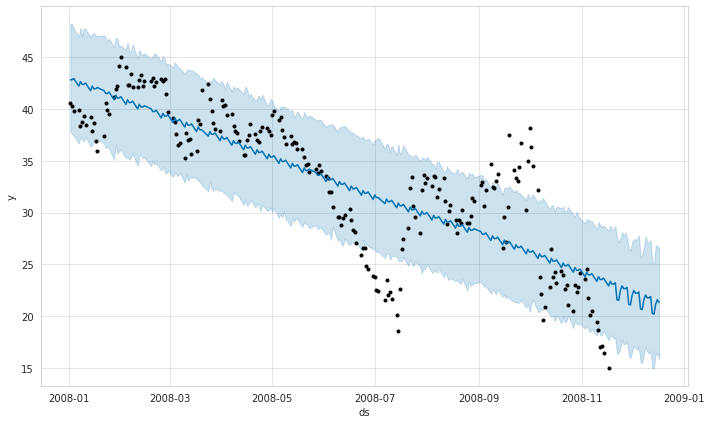


```python
model.plot_components(forecast)
```


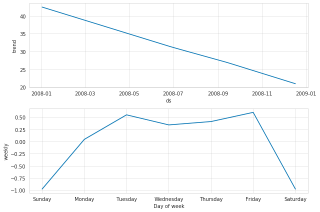


```python
#evaluate model
def make_comparison_df(historical, forecast):
    return forecast.set_index('ds')[['yhat', 'yhat_lower', 'yhat_upper']].join(historical.set_index('ds'))

compare_df = make_comparison_df(df, forecast)
compare_df.head()
```


<div>
<style scoped>
    .dataframe tbody tr th:only-of-type {
        vertical-align: middle;
    }

    .dataframe tbody tr th {
        vertical-align: top;
    }

    .dataframe thead th {
        text-align: right;
    }
</style>
<table border="1" class="dataframe">
  <thead>
    <tr style="text-align: right;">
      <th></th>
      <th>yhat</th>
      <th>yhat_lower</th>
      <th>yhat_upper</th>
      <th>y</th>
    </tr>
    <tr>
      <th>ds</th>
      <th></th>
      <th></th>
      <th></th>
      <th></th>
    </tr>
  </thead>
  <tbody>
    <tr>
      <th>2008-01-02</th>
      <td>42.828524</td>
      <td>37.837860</td>
      <td>48.255621</td>
      <td>40.560001</td>
    </tr>
    <tr>
      <th>2008-01-03</th>
      <td>42.834913</td>
      <td>37.591963</td>
      <td>48.212765</td>
      <td>40.299999</td>
    </tr>
    <tr>
      <th>2008-01-04</th>
      <td>42.961251</td>
      <td>37.437021</td>
      <td>47.799364</td>
      <td>39.849998</td>
    </tr>
    <tr>
      <th>2008-01-07</th>
      <td>42.217693</td>
      <td>36.686227</td>
      <td>47.013116</td>
      <td>39.900002</td>
    </tr>
    <tr>
      <th>2008-01-08</th>
      <td>42.659716</td>
      <td>37.284617</td>
      <td>47.871959</td>
      <td>38.410000</td>
    </tr>
  </tbody>
</table>
</div>


```python
def calculate_forecast_errors(df, prediction_size):
    
    df = df.copy()
    
    df['e'] = df['y'] - df['yhat']
    df['p'] = 100 * df['e'] / df['y']
    
    predicted_part = df[-prediction_size:]
    
    error_mean = lambda error_name: np.mean(np.abs(predicted_part[error_name]))
    
    return {'MAPE': error_mean('p'), 'MAE': error_mean('e')}
```


```python
for err_name, err_value in calculate_forecast_errors(compare_df, prediction_size).items():
    print(err_name, err_value)
```

    MAPE 53.54706882287025
    MAE 7.572244180281827


```python
# Plot forecast with upper and lower bounds
plt.figure(figsize=(17, 8))
plt.plot(compare_df['yhat'])
plt.plot(compare_df['yhat_lower'])
plt.plot(compare_df['yhat_upper'])
plt.plot(compare_df['y'])
plt.xlabel('Time')
plt.ylabel('Average Weekly NOx Concentration')
plt.grid(False)
```


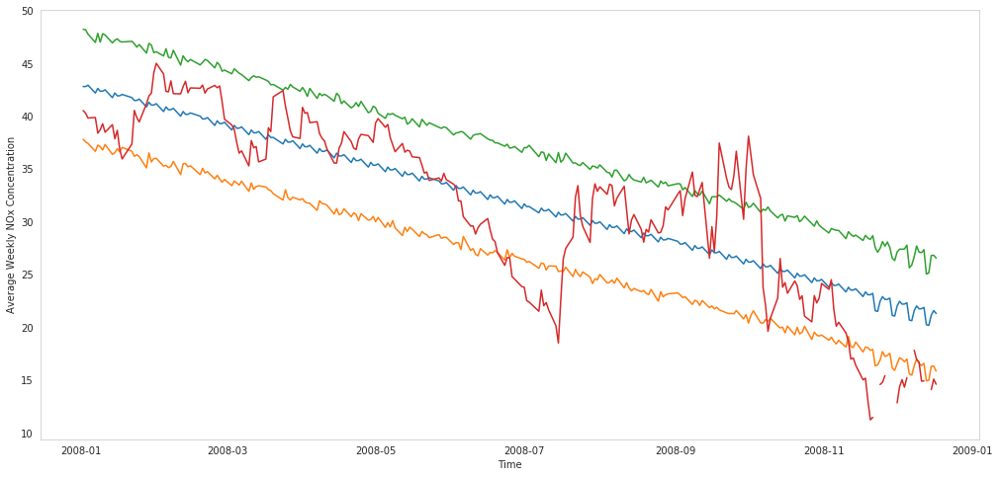


```python

```
